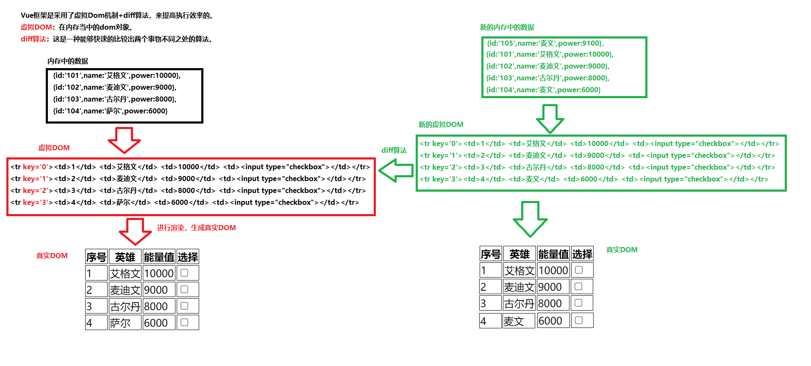
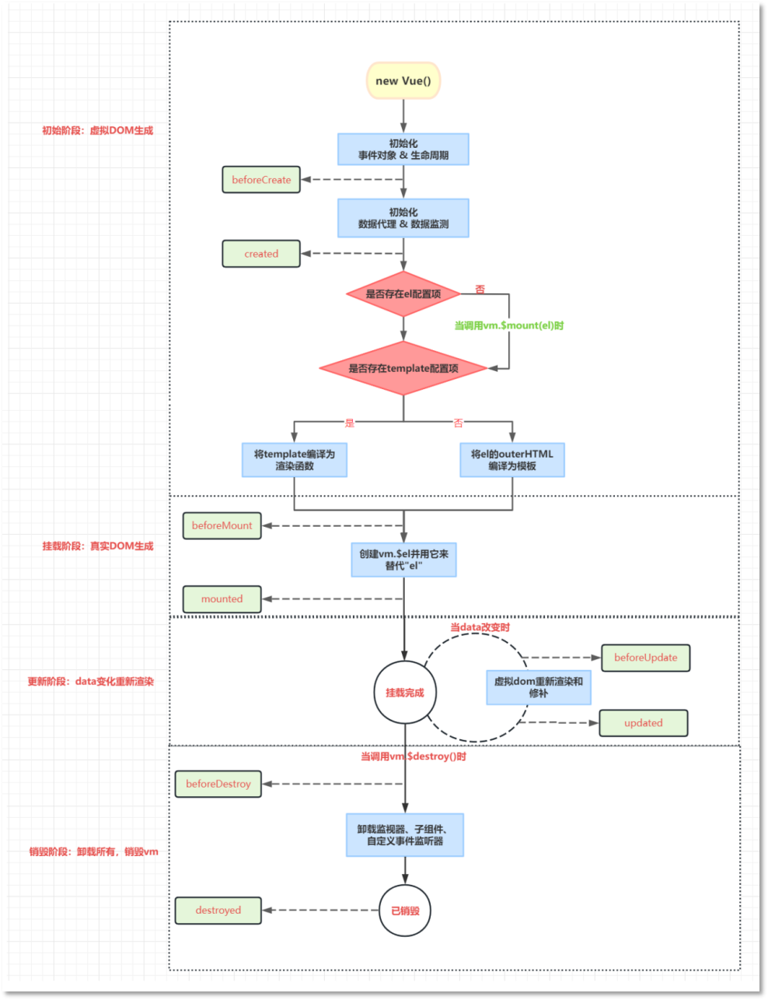
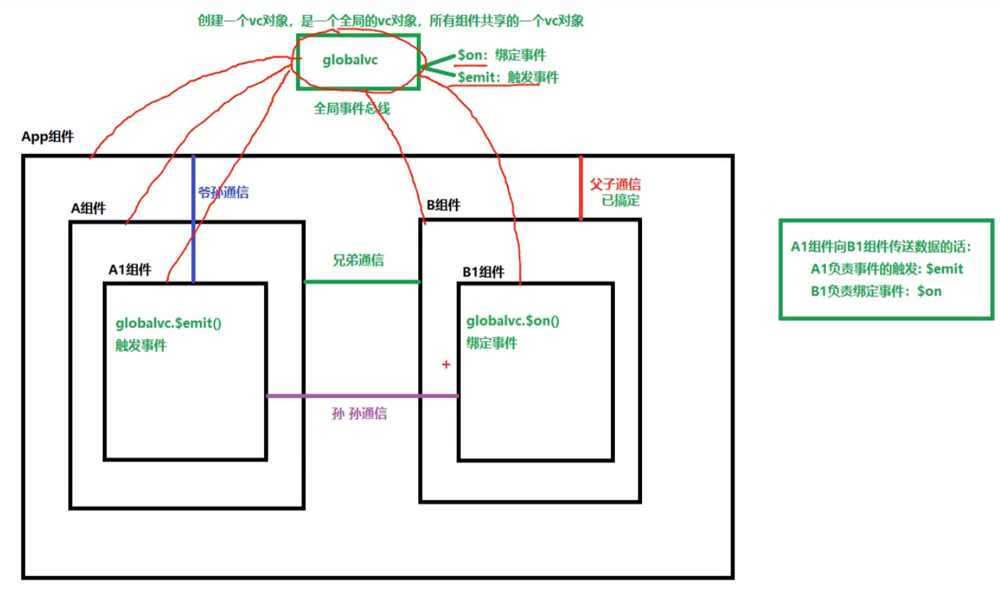
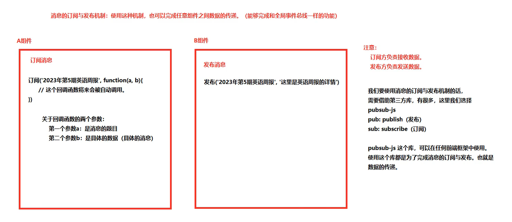
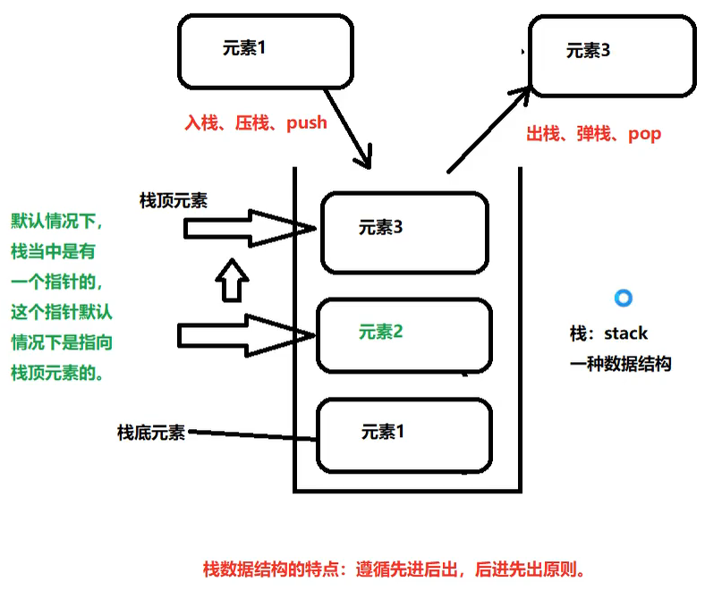
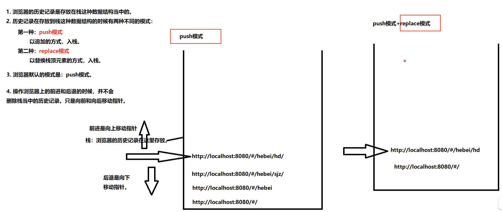
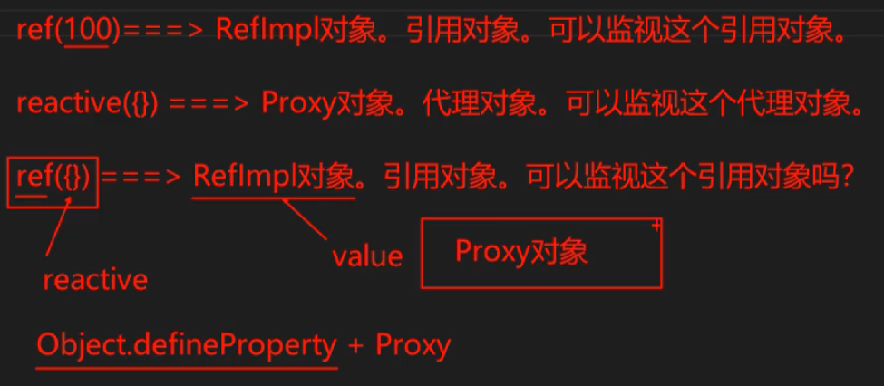
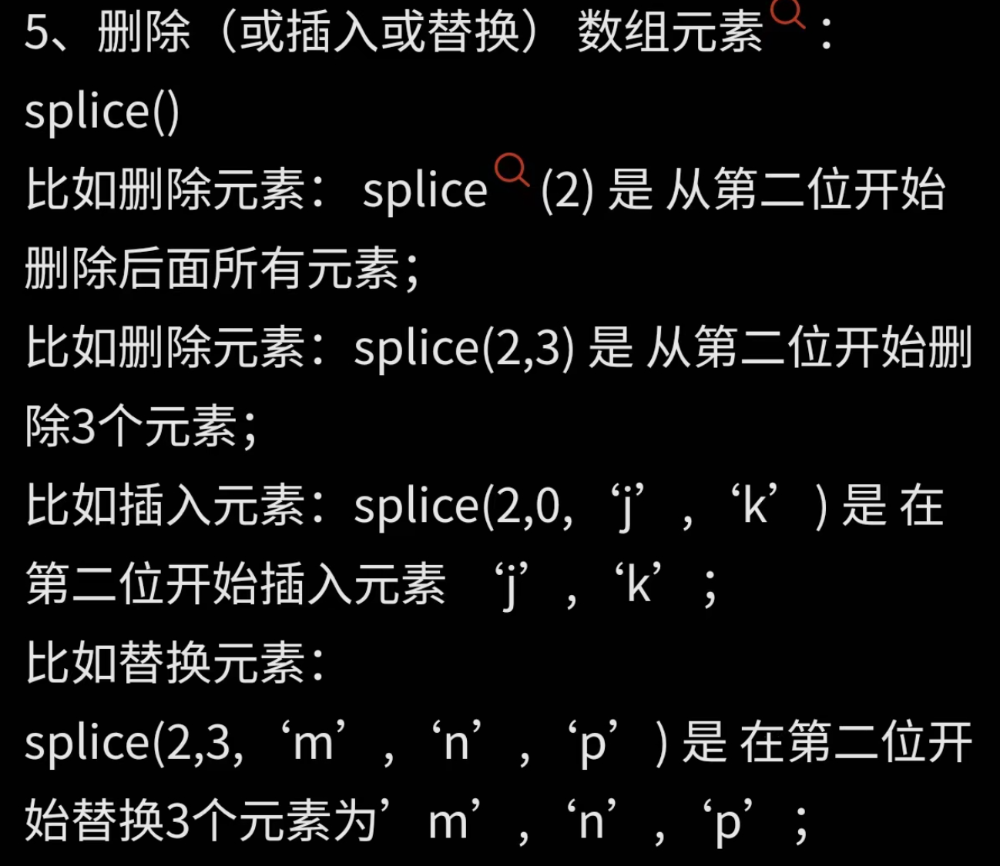

# vue黑马程序员书

## vue环境搭建

1. node.js

2. npm和yarn

   安装node就会自带npm

   yarn：npm install yarn-g（全局安装）

3. 创建一个vite项目

   yarn create vite

4. vue-router

   yarn add vue-router@4 --save

5. Element-plus

   yarn add element-plus --save

6. yarn add @element-plus/icons-vue

## 配置基本的vue

```
//导入创vue实例的函数
import { createApp } from 'vue'
//导入根组件
import App from './App.vue'
const app = createApp(App)
app.mount('#app')
```


## 配置Element-plus

```js
//导入element-plus
import ElementPlus from "element-plus"
import 'element-plus/dist/index.css'
app.use(ElementPlus)
```


## vue环境搭建-搭建的坑

- [yarn安装与使用&yarn : 无法加载文件...因为在此系统上禁止运行脚本_yarn命令加载资源-CSDN博客](https://blog.csdn.net/Imagirl1/article/details/122014743)
- [大多数前端同学在使用 ES6 的 import 语法时都会犯的一个错误 - 知乎 (zhihu.com)](https://zhuanlan.zhihu.com/p/376466867)

## vscode插件


## 第一章

### 声明式渲染

reactive和ref定义，在模板中使用


## 第二章阶段案例- 学习计划表

[VUE里面的export default 是什么-CSDN博客](https://blog.csdn.net/weixin_46129834/article/details/106425246)


## 第五章 路由


# Vue老杜

## 01 初体验vue

>vue的起步
>
>配置项的详解（template， data）

```html
<!DOCTYPE html>
<html lang="en">
<head>
    <meta charset="UTF-8">
    <meta name="viewport" content="width=device-width, initial-scale=1.0">
    <title>Document</title>
    <script src="js/vue.js"></script>
</head>
<body>
    <div id="app"></div>
    <script>
        /*
        1. 为什么要new Vue()，直接调用Vue()函数不行吗?不行，因为直接调用			Vue()函数，不创建实例的话，会出现以下错误:
		   Vue is a constructor and should be called with the  new' 			keyword
        2. 关于Vue构造函数的参数: options ?
			option翻译为选项
			options翻译为多个选项
			Vue框架要求这个options参数必须是一个纯粹的JS对象: {}
			在{}对象中可以编写大量的key:value对。
			一个key:value对就是一个配置项。
			主要是通过options这个参数来给Vue实例指定多个配置项。
        3. 关于template配置项:
			template翻译为:模板。
			template配置项用来指定什么?用来指定模板语句，模板语句是一个字符串形式的。
			什么是模板语句?
				Vue框架自己制定了一些具有特殊含义的特殊符号
				Vue的模板语句是Vue框架自己搞的一套语法规则。
				我们写Vue模板语句的时候，不能乱写，要遵守Vue框架的模板语法规则。
			模板语句可以是一个纯粹的HTML代码，也可以是Vue中的特殊规则。也可以是HTML代码 + Vue的特殊规则。
        */
        const myVue = new Vue({
            template: '<h1>Hello Vue!</h1>'
        })
        /*
        第二步:将Vue实例挂载到id='app"的元素位置。
        1.Vue实例都有一个$mount()方法，这个方法的作用是什么3将Vue实例挂载到指定位置
        2.#app 显然是ID选择器。这个语法借鉴了CSS.
        */
        myVue.$mount("#app")
    </script>
</body>

</html>
```


```
模板语句的数据来源:
1。谁可以给模板语句提供数据支持呢? data选项
2.data选项的类型是什么? object  Function(对象或者函数)2 .
3.data配置项的专业叫法: Vue 实例的数据对象data实际上是给整个Vue实例提供数据来源的。)
4. 对象必须是存粹的对象
5. data数据如何插入到模板语句当中
	{{}} 这是Vue框架自己搞的一套语法，别的框架看不懂的，浏览器也是不能够识别的。
	Vue框架自己是能够看懂的。这种语法在Vue框架中被称为: 模板语法中的插值语法。(有的人把他叫做胡子语法。)怎么用?
	{{data的key}}
```


选项式api书写

element-plus

- 布局组件
- 表单组件
- 按钮组件
- 样式书写 .tagname{ css-code }

ts声明

- declare module 'element-plus'

- declare module 'axios'


## 02 vue核心知识

>表达式(常量, js表达式, vue实例所管理的XX)!!!
>
>指令的"",里面是要写表达式或响应式数据; 里面如果是''表示传一个string类型的常量值

### 语法和指令

#### 插值语法

- `{{}} `只能写在标签体内

#### 渲染指令

- v-once 

  - 只会渲染一次，之后的数据即使更新不在渲染

- v-if="expression" | v-else-if | v-else
  - 表达式的结果必须是true/false; false是直接删除次元素节点
  - else if else 不能断开,必须连起来的写

- v-show
  - 与v-if类似,只不过是通过display进行隐藏

  - 需要经常控制显示隐藏，v-show性能好反之用v-if

  - <template></template>,是vue的一个占位符,类似于div,但是在最终渲染后并不会出现此结构

    ```
    <template v-if="counter === 10">
    	<input type="text"/>
    	<input type="checkbox"/>
    	<input type="radio"/>
    </template>
    
    <div v-if="counter === 10">
    	<input type="text"/>
    	<input type="checkbox"/>
    	<input type="radio"/>
    </div>
    ```

    

- v-bind:参数="表达式" 

  - 效果相当于"写js代码( 表达式, 最后要返回值! )"
  - 参数名可以随便写,但大部分情况是将标签的属性值动态变化
  - 简写是 :参数="表达式"

- v-model 
  - 和bind不同, bind是逻辑-视图的单向绑定;model还可以视图-逻辑的绑定(双向绑定)
  - 只能用于input, select,textarea框
  - 简写是 v-model="表达式"
  - 修饰符
    - v-model:参数名.number
    - .trim
    - .lazy
  - 对于单选框获取的是value, 特别是单选按钮,需要加上value
  - 对于复选框来说,如果没有手动指定value,会获取checked的值作为value

- v-for

  - :key属性(默认以index作为key)是这个dom元素的身份证号/唯一标识 (详见p44)

    

    所有如果往数组第一个位置添加一个新的对象, 还以index默认key的话,全都生成新的虚拟dom没有复用旧的虚拟dom; diff全部比对, 新的真实dom全是新的虚拟dom生成,没用复用旧的真实dom

  - 要写在循环项上

  - 遍历数组

    - `<li v-for="(item,key,index) in items"></li>`
    - `<li v-for="(item,index) in items"></li>`
    - `<li v-for="item in items"></li>`

  - 遍历对象

    - `<li v-for="(value,propertyName) of/in obj"></li>`

  - 遍历指定次数

    - `<li v-for="(item,index) in items"></li>`

#### 事件绑定指令

- v-on:事件名="表达式" 

  - click, keydown, input

  - 所有事件所关联的回调函数，需要在vue实例配置项methods中进行定义

  - 简写是`@事件名="callback()"`

  - 不传参数()可以省略

  - 注意: 调用回调函数的时候,vue会自动传入事件对象(当你没有参数的时候,有自定义参数就不会传). 如果还想传当前的事件对象, 在参数位置上请使用`$event`占位符

  - 事件回调函数的this指向当前vue实例, ,methods中不推荐写回调函数!

    >es6 回调函数没有this, 这个this是从父级作用域中继承下来的

  - **事件修饰符**

    - @click.prevent | .stop | .once | .passive
    - .capture 添加事件监听器使用事件捕获（先添加先执行）从外到内
    - .self

  - 按键修饰符

    - @keyup.enter | .tab(只能触发keydown) | .delete | .esc | .space | .up | .down | .left | .right
    - .a .i 就是键盘上的按键
    - 如何查找案件修饰符?
      - 第一步,获取event.key获取真实名字
      - 第二步,经过kebab-case风格命名(全小写)就是了
    - 自定义按键修饰符
      - Vue.config.keyCodes.huiche = 13

#### $event

event重要属性

```yaml
触发事件的源属性: event.srcElement
srcElement很重要! event.target不能从父类节点里拿到子元素列表
```

$set()

#### 其他指令

- v-text="表达式"和v-html

- v-cloak

  ```html
  <style>  [v-cloack] {display:none;} </style>
  <h1 v-cloak>{{msg}}</h1>//当vue接管的时候,会自动删除v-cloak指令
  ```

- v-once 只渲染一次, 之后视为静态内容

- v-pre 用在没有vue语法的标签, 不对其进行编译

#### directives自定义指令

```js
//局部指令
directives:{
	//1. v-不需要写
    //2. vue官方建议指令的名字全部小写, 多个单词用-衔接
    //3. 这个回调函数执行时机: 
    	//第一次 指令和标签第一次绑定的时候
    	//第二次 模板重新编译的时候(data数据被修改了)
    //4. 第一个参数是指令所在dom元素; 第二个是标签和指令之间绑定关系的对象
    //5. 这种方式属于函数式方式
    'text-danger':function(element,binding){
        // 为什么是null,原因是这个函数在执行的时候,指令和元素完成了绑定,但是只是在内存当中完成了绑定,元素还没有被插入到页面当中
        element.parentNode == null
    }
    //对象式, 比起函数式比较精细
    //1. 三个函数名字只能这么写,将来都会被自动调用
    //2. 在特定时间节点调用特定的函数,这种被调用的函数叫做钩子函数
    'bind-blue':{
        //元素与指令初次绑定的时候,自动调用bind
        bind(element, binding){
            element.value = binding.value
        },
        //元素被插入到页面之后,自动调用
        inserted(element, binding){
            element.parentNode.style.backgroundColor = 'blue'
        },
        //当模板重新解析的时候,自动调用
        update(element, binding){
            element.value = binding.value
        }
    }
}
```

```js
//定义全局指令, 要在在创建vue实例前
//对于自定义指令来说, 函数体内的this指向window
//函数式
Vue.directive('text-danger', function(e,binding){})
//对象式
Vue.directive('bind-blue',{
    bind(e,b){}, inserted(e,b){}, update(e,b){}})
```


### data详解vue框架底层使用了数据代理机制

所有以 $ 都是公开的属性,供程序员使用, 所有以_开头的属性都是私有属性, 给框架使用的

```js
//es5新特性, set get关键字
let phone = {
    color: "red",
    get color() {
        console.log("getter方法执行了");
        return this.color
    },
    set color(param) {
        console.log("setter方法执行了");
        this.color = param
    }
}
//es5新特性 以及enumrable， configurable
Object.defineProperty(
    哪个对象,
    哪个属性,
    {value,
     writable,
     enumrable, 
     configurable,
     set:function(param){
         
     },
     get:function(){
         
     }})
//es6新特性,在对象中的函数或者方法, :function是可以省略
//js对象的属性标准写法是有单引号的
```

- 什么是数据代理机制?

通过访问 代理对象(vm)的属性 来间接访问 目标对象(data)的属性。

Object.defineProperty()实现数据代理机制

```js
let target = {
	name:"张三"
}
let proxy = {}
Object.defineProperty(proxy, "name", {
	get:function(){
		return target.name
	},
	set:function(param){
		target.name = param
	}
})
```

直接控制台打印代理对象,是不能直接看到属性值的,他要调用get方法执行了才能看到

所以这也回答了为什么, 直接vm.msg可以访问data对象的msg属性, 因为vue代理了data这个目标对象

- 为什么vue对于属性的命名一部分以$开头一部分以_开头

  如果你在data中写了一个以$或者_开头的, vue是不会对其做数据代理

  因为如果做代理,会导致框架自己的某些变量值被修改,导致框架无法工作

- p21 源代码解读数据代理机制
  - 通过vm._data,框架可以不走代理,直接获取配置项里的data数据
  - vm.$data和vm._data是一个东西, 我们可以直接使用data而不走代理

- ```
  vm.hehe
  vm._data.hehe
  vm.$data.hehe
  ```

`做了数据代理,可以打通各个配置项的数据, 只需要访问vm(this)就可以获取数据或者方法`

### methods详解

methods对象中的方法可以通过vm去访问吗? --可以

- 如何实现的呢?

```js
 Object.keys(option.methods).forEach((methodName, index)=>{
     this[methodName] = option.methods[methodName]
 })
```

methods对象中的方法有没有做数据代理 --没有(控制台没有带小括号三个点)

- 而是可以看成直接复制了一份函数给vue同名函数！

methods对象中的方法中的this指向谁？

- vue实例自己，因为是由vm调用方法，this就是vm

### computed计算属性

>**计算属性**
>
>案例-反转字符串 来理解反转字符串

- 定义: 关联vue所管理的属性, 经过一系列运算后,得到的新的属性就是计算属性

  - ```js
    computed:{
    	计算属性属性名:{
    		get(){return something},
    		set(val){}//很少用,因为页面不会暴露计算属性,只做显示
    	}
    }
    ```

- getter方法调用时机

  - 第一个时机, 第一次访问这个计算属性时
  - 第二个时机, 该计算属性所关联(`用到的`)的vue原有属性的值发生变化(赋值操作)时,getter会重新调用一次

- 简写-当set不需要的时候

  - ```js
    reverseInfo:{
    	get(){return something}
    }
    reverseInfo(){
    	return something
    }
    ```


### watch侦听器

- 监听属性(多个,vue所管理的属性包括计算属性)的变化

- 定义

  - ```js
    data:{
    	msg:''
        a:{
            b:0
        }
    }
    watch:{
        //监视msg属性
    	msg:{
    		//handler什么时候调用?当监视的属性发生变化时,就会自动调用一次
    		//第一个是改变后的新值,第二个是改变前的旧值
    		handler(newValue, oldValue){},
            immediate:true//表示初始化时,立马调用一次handler()
    	},
        a:{
            deep:true,//启用深度监视,默认关闭
            handler(newValue, oldValue){}
        }
        //如果监视的属性具有多级结构,需要添加单引号'a.b'这样监视(或者深度监视)
    }               
    ```

  - 后期添加监视,调用vueAPI

    ```js
    vm.$watch('被监视的属性',{watch的配置项})
    //简写形式
    vm.$watch('被监视的属性',function(newValue, oldValue){})
    ```

  - 简写形式(当你只有handler回调函数时,才可以这样写)

    ```js
    msg(newValue,oldValue){}
    ```

#### 比较大小案例的结论-computed和watch的选择

- 计算属性和侦听器如果都能完成某个功能,优先computed
- 有一种情况只能用watch, 不能用computed
  - 设置定时器(异步),计算属性的返回值无法返回给vue实例的计算属性, 因为回调函数是javascript引擎调用的, 返回值只会给引擎
  - setTimeout(function(){}, 1000*3) 里面是普通函数
  - setTimeout(()=>{}, 1000*3) 里面是箭头函数
- > **什么时候用箭头函数,普通函数**
  
  - 只要是vue管理的, 统一写普通函数
  - 不是vue管理的, 统一写箭头函数


### 表达式还可以是数组或者对象 :class/:style="表达式"

- :class

  - 动静结合class `<div class='static' :class='表达式'>`

  - 数组
    -  `<div class='static' :class='[c1,c1]'>`
    - `<div class='static' :class='classArray'>`

  - 对象

    - ```
      <div class='static' :class='classObj'>
      data:{
      	classObj:{
      		'text-danger':true
      		'style的属性名':false
      	}
      }
      ```

- :style
  - 详见27-xxxx.html

### filters过滤器

>适用与简单的逻辑处理, 对数据进行格式化显示
>
>使用过滤器需要使用管道语法, 将要过滤的数据通过管道符给过滤器函数(可写多个)
>
>price | filterA | filterB
>
>过滤器第一个参数不用自己传 
>
>局部过滤器filters:{ }
>
>全局过滤器 Vue.filter("", function(){})
>
>vue3已废除

### 生命周期

研究vue实例从创建到销毁， 各个时间节点vue做了什么事，vue调了那些钩子函数

- 四个阶段八个钩子

  - 初始阶段（编译模板-》虚拟dom）

    beforeCreate( )

    >创建前: 数据代理和数据监测的创建之前
    >
    >此时还无法访问data当中的数据。包括methods也是无法访问

    created( )

    >创建后: 数据代理和数据检测创建完毕
    >
    >此时可以访问data和methods了, 并且在内存中生成了虚拟dom

  - 挂载阶段（虚拟dom放到页面当中 -> this.$el真实dom）

    beforeMount( )

    >挂载前:  判断两个条件生成虚拟dom的来源(el和template配置项)
    >
    >el有,template也有, 最终编译template模板语句
    >
    >el有,template没有,最终编译el
    >
    >el没有, 需要手动调用vm.$mount(el) template有, 编译template
    >
    >el没有, 需要手动调用vm.$mount(el) template没有, 编译el模板语句
    >
    >结论
    >
    >​	流程要想继续, el必须存在
    >
    >​	el和template同时存在, 编译template 没有template, 编译el 

    mounted( )

    >这里去修改dom元素,不会被覆盖
    >
    >到此初次渲染完毕, 

  - 更新阶段（data发生变化，页面重新渲染）

    beforeUpdate( )

    update( )

  - 销毁阶段（vm的事件组件等等全部解绑, vm并没有消失!）

    >这里即使修改data数据, 页面不会更新, 监听器,事件监听器(@click...)都用不了
    >
    >高版本vue不管自定义事件监听器还是系统监听器, 监听器都会解绑(active=false)!
    
    beforeDestory( )
    
    destroyed( )

- 

## 03 组件化开发

实现组件需要三步:

 1.  创建组件

     ```js
     /*
     	创建组件的配置项和new Vue({})的配置项大差不差
     	1.第一个细节, 为什么是用template替换了el(为什么不是用el?)
     		如果是el, 就相当于是这个配置项专门给那个容器使用的, 而不是给任意的容器复用
     	2.第二个细节, 为什么是用data()替换data:{}(为什么不是用data:{})
     		如果是data:{}, 这个data内存地址就指向了这个对象, 如果多个vm实例使用这个组件, 这个组件的data只是一份(相当于是静态变量), 这个vm实例修改了, 会影响其他vm实例复用这个组件. 而data(){return {}}, return {}就相当于是新建了一个对象!复用组件的数据, 是每个vm都有各自的一份,而不是共享
     */
     const myFirstComponent = Vue.extend({
         template: `
         	<ul>
                 <li v-for="(user,index) of users" :key="user.id">
                     {{index}},{{user.name}}
                 </li>
             </ul>
         `,
         data(){
             return {
                 users:[
                     {id:'001', name:'jack'},
                     {id:'002', name: 'lucy'},
                     {id:'003', name: 'james'}
                 ]
             }
         }
     })
     const vm = new Vue({
         el:"#app",
         data:{
             msg: '第一个组件',
             data:{
                 users:[
                     {id:'001', name:'jack'},
                     {id:'002', name: 'lucy'},
                     {id:'003', name: 'james'}
                 ]
             }
         }
     })
     ```

     

 2.  注册组件

     ```js
     new Vue({
         //注册组件的配置项
         components : {
             //组件名字:Vue.extend({})
             userlist : myFirstComponent
         }
     })
     ```

     

 3.  使用组件

     ```js
     //在在哪里用, 就以html标签的形式使用
     <div id="app">
         <userlist/>
     </div>
     //小细节
     //1在vue中是可以是自闭合标签的, 但必须在脚手架环境中使用否则多次使用出现一次的效果
     <userlist/>
     //2在创建组件的时候Vue.extend()可以省略, 但底层仍然会调(当你注册组件的时候)
     /*
     //3组件的名字
         //第一种: 全部小写
         //第二种: 首字母大写, 后面都是小写
         //第三种: kebab-case命名发 user-login
         //第四种: CamelCase命名法, UserLogin,但是只允许在脚手架环境下使用
         不要使用HTML内置的标签名作为组件的名字.
         在创建组件的时候,通过配置项配置一个name, 这个name不是组件的名字,是设置vue开发者工具中显示的组件的名字
     */
     
     ```


### 组件嵌套

组件哪里注册，就在哪里使用

- vm和vc

```
new Vue({}) 和 Vue.extend({}) 中的this分别是什么?
vm 是Vue实例, vc是VueComponent实例, vm包含vc

Vue.extend({})的返回值是什么?
是一个构造函数,每次调用都返回新的对象;vue通过这个构造函数来创建vc实例对象

什么时候调用构造函数?
当vue解析到使用组件标签时
```

- 构造函数和原型对象

  >为什么要这样设计？为了代码复用。
  >
  >解决那个诡异的问题--vc的mounted中,this.counter居然访问了Vue的原型对象!
  >
  >`user.prototype.__proto__ === Vue.prototype` true

```js
// 构造函数（函数本身又是一种类型，代表Vip类型）
function Vip(){}

// Vip类型/Vip构造函数，有一个 prototype 属性。
// 这个prototype属性可以称为：显式的原型属性。
// 通过这个显式的原型属性可以获取：原型对象
// 获取Vip的原型对象
let x = Vip.prototype

// 通过Vip可以创建实例
let a = new Vip()
/* let b = new Vip()
let c = new Vip() */
// 对于实例来说，都有一个隐式的原型属性: __proto__
// 注意：显式的(建议程序员使用的)。隐式的（不建议程序员使用的。）
// 这种方式也可以获取到Vip的原型对象
let y = a.__proto__
/* b.__proto__
c.__proto__ */

// 原型对象只有一个，其实原型对象都是共享的。
console.log(x === y) // true

// 这个不是给Vip扩展属性
// 是在给“Vip的原型对象”扩展属性
Vip.prototype.counter = 1000

// 通过a实例可以访问这个扩展的counter属性吗？可以访问。为什么？原理是啥？
// 访问原理：首先去a实例上找counter属性，如果a实例上没有counter属性的话，会沿着__proto__这个原型对象去找。
// 下面代码看起来表面上是a上有一个counter属性，实际上不是a实例上的属性，是a实例对应的原型对象上的属性counter。
console.log(a.counter)
//console.log(a.__proto__.counter)
```


```
可以理解成，java类就是原型，然后只给你构造函数，你就可以用'类.prototype'来获取这个类的本身，也可以用'对象实例.__proto__'的方式来获取
```


## 04单文件组件(创建 注册 使用)

现在变成一个有一个的独立文件，其他组件想要访问，那么这个组件必须先导出/暴露出去

```
//1.
export
分别导出
默认导出
按需导出
import
//2.
写单文件组件
//3.
入口js和入口的html
//4.
需要脚手架帮我们把单文件组件编译成html css js代码
```

### 脚手架结构和为什么使用render函数


### props父组件给子组件传数据

一方传：父组件使用子组件时，以属性键值对的方式传入数据

```html
<Car :brand="宝马x5" :color="黑色" :price="10"></Car>
```

一方收：子组件用props配置项来收

```js
//第一种props简单的接收方式，直接采用数组
props:['brand','price','color']
//第二种: 添加类型限制
props:{
	brand: String,
	price: Number, //父组件使用:price就可以传入数字
	color: String
}
//第三种: 添加类型限制,并且还可以添加默认值, 还可以添加必要性
props:{
	brand:{
		type: String,
		required:true
	},
    color:{
        type: String,
        default: 'red'
    }
}
//注意! props中的数据不要修改,因为父组件重新渲染后,都会被其覆盖
//注意！ 父组件必须:属性名="xx",不使用: 传给子组件是字符串!!!
//传进来后,相当于属性,可以this.xxx访问
//props在子组件中不允许修改,改了也会被覆盖!
//		不允许修改指的是值或者内存空间的指向没有变，如果你修改的对象的属性，那么是不会报错的
```

### $refs从父组件中获得子组件

第一步打标记, 父组件使用子组件, 以属性的方式写上ref="随便"

```html
<Car brand="宝马x5" color="黑色" :price="10" ref="car1"></Car>
ref打在组件上,获取组件
ref打在html元素上, 获取html元素
```

第二步获取, this.$refs.随便

### mixins混入

- 步骤

1. 公共代码提取出来

2. 定义一个对象

3. 把对象暴露出来

4. 在使用的时候,导入(别忘了{mix1}), 使用mixins:[mix1]配置项

- 会不会产生覆盖?
  - 不会, 类似于子类重写父类方法, 优先从子类中寻找方法

- 对于四个周期八个函数来说有特殊处理
  - 会优先执行混入的钩子函数, 再执行自己的钩子
- 全局混入
  - 在main.js中, 使用`Vue.mixin(mixin1)`; 记得导入


### 插件

写一个js文件

封装一个对象,必须写install方法,

导出这个对象


### scope局部样式

```html
vue会把各组件的样式合并, 如果出现同名的样式, 则会出现有些样式不起作用,互相干扰的效果(与优先级有关)
<style scope></style>
根组件的style一般不加scope,因为希望根组件的样式可以全局使用
```


### 自定义事件

- 内置事件的实现步骤

  - 准备事件源
  - 绑定事件源
  - 编写回调函数
  - 等待事件的触发

- 组件的自定义事件的实现步骤

  - 提供事件源（组件）
  - 给组件绑定事件
  - 编写回调函数
  - 等待·事件的触发·，一触发就执行回调函数
    - 对于组件自定义事件来说，想让事件发生，需要执行一段代码
    - 这段代码复杂去触发这个事件，让这个事件发生
    - 这段代码在哪里写？（事件绑定哪个组件，就哪个组件写）
      - `写this.$emit('绑定时事件名') 就是触发自定义事件`
    - 触发事件的同时，可以传入参数！（子传父）

- **自定义事件**的绑定可以使用代码来绑定

  ```js
  this.$refs.user.$on('event1', this.dosome())
  等价于
  v-on:event1="dosome()"
  ```

- 解绑组件**自定义事件**

  ```js
  //this是指向当前的vc实例, 父组件中使用多次(vc不同), 只能解绑当前组件this的事件
  this.$off('event1')
  this.$off(['event1', 'event2'])
  this.$off()
  ```

- 绑定自定义事件的坑

  ```js
  //如果回调函数是普通函数, 数体当中this是子组件实例
  this.$refs.user.$on('event1', function(){
  	console.log(this); // VueComponent!
  })
  //如果回调函数是父组件的方法, 函数体当中的this是父组件实例
  this.$refs.user.$on('event1', this.dosome())//dosome是父组件的方法
  //如果回调函数是箭头函数, 函数体当中的this也是当前父组件实例
  this.$refs.user.$on('event1', ()=>{
  	console.log(this);
  })
  ```


### $bus全局事件总线--解决所有组件之间通信问题!

- 就是自定义事件的升级版！

- `this.$refs.user.$on`的this和子组件中this.$emit()的this是不是同一个?

  是

- 那我能不能在所有组件的外面, 创建一个全局的vc对象, 所有组件共享, 来完成传递数据的功能?

  `这个vc有$on() 也有$emit()`

- >

- 创建全局事件总线

  ```js
  //在main.js中
  beforeCreate(){
  	Vue.prototype.$bus = this
  }
  ```

- 父绑

  ```js
  //有坑, 详见上面自定义事件绑定的坑
  //一般在mounted()绑定
  mounted(){
      this.$bus.$on('event1', this.dosome)
  }
  ```

- 子触

  ```js
  this.$bus.$emit('event1', {})
  ```

- 销毁之前需要手动解绑！

  ```js
  beforeDestroy(){
      this.$bus.$off()
  }
  ```

  

### 目前组件通信

父组件-子组件

- props

子组件-父组件

1. 第一种: 在父中定义方法, 将方法传给子, 然后在子中调用父传过来的方法,这样给父传数据.(这种以后很少用)
2. 第二种: 使用组件的自定义事件的方式 (父绑子触)
   -  App是父组件, User是子组件
   - 子组件向父组件传数据: `在父组件中绑定事件, 在子组件中触发事件`
3. 第三种： 全局事件总线

怎么选？

- 父传子：props

- 子传父： 自定义事件
- 其他：全局事件总线

### pubsub-js消息订阅与发布--与全局事件总线等效



- 发布

  ```js
  import pubsub from 'pubsub-js'
  publicEnglish(){
  	pubsub.publish('23年第一期英语周报', '详细数据')
  }
  ```

- 订阅

  ```js
  import pubsub from 'pubsub-js'
  subscribeEnglish(){
  	this.pid = pubsub.subscribe("23年第一期英语周报", function(messageName， message){
  	//将来消息发布时， 自动调用
  	})
  }
  ```

- 和全局事件总线一样,当组件被销毁前需要需要订阅

  ```js
  beforeDestroy(){
  	pubsub.unsubscribe(this.pid)
  }
  ```


- 订阅的回调函数请使用箭头函数


## 05ajax与跨域

使用axios, 来发送ajax请求

- 安装axios
- 导入axios
- 使用axios
- axios的基地址
- axios的请求拦截器和响应拦截器

### 使用vue的代理服务器, 来解决跨域(工作不常用)

在vue.config.js中

```
devServer:{
	//普通启用方式
	proxy: 'http://localhost:8000'
	//高级启用方式
}
```

## 06Vuex

全局事件总线只是将数据传来传去，并没有做到真正的共享

vuex做到了真正的响应式数据共享

### 基础vuex使用

- 搭建vuex环境 ( vue2 => vuex3 )

  1. yarn add vuex@next --save
  2. 编写store.js (vuex文件夹)

  ```js
  //vuex4写法, 原理都是vm以及所有的vc对象上都会多一个新的属性: $store
  import { createStore } from 'vuex'
  const store = createStore({
      actions:{},
      mutations:{},
      state:{//就是数据对象，具有响应式
          //num:0
      },
      getters:{}
  })
  export default store
  ```

  3. 在main.js导入使用

  ```js
  import {createApp} from 'vue'
  import APP from 'App.vue'
  import store from './vuex/store.js'
  const app = createApp(App)
  app.use(store)
  app.mount('#app')
  ```

- vuex的配置项

  store管理actions，mutations，state, getters

  - `state`对象中存放各种各样的键值对数据, 可以看作vue中的data

    ```js
    const state = {//可以看作vue中的data
    	username:''
    }
    ```

  - `actions`中存放n个action，每一个action都是回调函数

    - 在action中编写复杂的业务逻辑
    - 有个原则：action是专门来处理业务逻辑，或者发送ajax请求的

    ```js
    const actions = {
    	//context是vuex的上下文参数
    	//value是传过来的参数
    	plusOne(context, value){}
    }
    ```

    - 调用action

    ```js
    //在组件的方法中里只写这一行
    this.$store.dispatch('actionName', value)
    //如果actions里需要调用其他的action方法, 请使用context上下文对象
    context.dispatch('otherActionName', value)
    //context可以看成缩小版的store对象
    ```

    - 调用mutation

    ```js
    //业务处理完,执行下一环节
    context.commit('mutationName', value)
    //业务很简单跳过action,可以直接commit执行mutation
    this.$store.commit('mutationName', value)
    ```

  - `mutations`中存放n个mutation，每一个mutation都是回调函数

    - 在mutation中更新state
    - 一般采用全大写_链接单词风格

    ```js
    const mutations = {
        //state参数: 状态对象
        //value参数: 上一环节传过来的数据
    	PLUS_ONE(state, value){
    		
    	}
    }
    ```

  - `getters`中存放n个getter, 每一个getter可以看做一个计算属性

    ```js
    const getters = {
    	//每一个getter方法都会自动接收一个state对象
    	reverseName(state){
    		return state.username.split('').reverse().join('')
    	}
    }
    ```

- 访问vuex, 获取vuex中state的数据

  ```js
  //基本访问方式(在模板中this.可以省略)
  this.$store.state.username
  ```

- 使用的小疑惑

  ```js
  1.可不可以在data里去指向state里的数据?
  --可以但是普通纸会出现使用地更新不了数据的情况
  --建议放到computed中检测state的改变
  ```


### vuex优化

优化第一境界: computed里return this.$store.state.xxx

优化第二境界: 使用mapState... vuex的api

- es6展开运算符

  ```js
  //...obj可以把对象打散
  //用途1: 把对象的属性赋给另一个对象
  let obj1 = {a:1, b:2}
  let obj = {...obj1}//=> let obj = {a:1, b:2}
  ```

- mapState和mapGetters (**双向数据绑定的不能使用mapState**)

  ```js
  //为什么这么写?
  //我不想写这么长! this.$store.state! 麻烦
  computed:{
  	users(){
  		return this.$store.state.users
  	},
  	vips(){
  		return this.$store.state.vips
  	},
      reverseName(){
          return this.$store.getters.reverseName
      }
  }
  //发现这样的计算属性具有一定格式, 格式固定的代码,是可以自动生成的
  //vuex优化了以上的需求,借助mapState帮我们自动生成以上代码
  import {mapState, mapGetters} from 'vuex'
  computed:{
      //mapState函数返回一个对象
      //用...打散对象后,再把他给computed,相当于把对象中的属性给了computed
      ...mapState({users:'users', vips:'vips'})
      //数组简化形式(前提是,要映射的计算属性名和state中的属性名一致)
      ...mapState(['users', 'vips'])
      
      //mapGetters用法一样, 当你的this.$store.getters写烦了就用
  	...mapGetters(['reverseName'])
  }
  ```

- mapActions和mapMutations 

  ```js
  //因为大部分情况只写一行调用代码
  //我不想写这么长! this.$store.patch! 麻烦
  //只需要关注saveUser, 'saveUser', value参数
  methods:{
      saveUser(){
          this.$store.dispatch('saveUser', {id:Date.now(),name:this.username})
      },
      saveVip(){
          this.$store.commit('SAVE_VIP', {id:Date.now(),name:this.username})
      }
  }
  //发现这样的计算属性具有一定格式, 格式固定的代码,是可以自动生成的
  //vuex优化了以上的需求,借助mapActions帮我们自动生成以上代码
  import {mapActions,mapMutations} from 'vuex'
  methods:{
      //对象形式
      //参数在你调用方法的时候传入, vuex会自动把入参传到参数位置上
      ...mapActions({saveUser:'saveUser'})
      //数组形式(前提是,方法名和action名一致)
      ...mapActions(['saveUser'])
      
      //对象形式
      ...mapMutations({saveVip:'SAVE_VIP'})
      //数组形式(前提是,方法名和mutation名一致)
      ...mapMutations(['SAVE_VIP'])
  }
  ```


### Vuex模块化开发（重要）

>如果把每个组件的actions, mutations, state, getters都放到store.js中;
>
>- 这样很混乱, 不好维护
>
>###### vuex建议, 一个功能最好对于一个模块

- 模块化开发store.js的新写法

  ```js
  import {createStore} from 'vuex'
  //a模块
  const a = {
      namespace:true,
  	actions:{ doA1(){} },
  	mutations:{ doA2(){} },
  	state:{a:1},
  	getters:{ computedA(){return 1} }
  }
  //b模块
  const b = {
      namespace:true,
  	actions:{ doB1(){} },
  	mutations:{ doB2(){} },
  	state:{b:1},
  	getters:{}
  }
  export default createStore({
      modules:{
          aModule:a,
          bModule:b
      }
  })
  ```

- 模块化开发后使用vuex的新写法

  访问state

  ```js
  this.$store.state.aModule.a
  ```

  访问action和mutation

  - 如果没开namespace模块中有同名的方法都会执行

  ```js
  //没开namespace的写法
  this.$store.dispatch('doB1', value)
  this.$store.commit('doB2', value)
  //开了namespace的写法
  this.$store.dispatch('bModule/doB1', value)
  this.$store.commit('bModule/doB2', value)
  ```

  访问getters

  ```js
  //没开namespace的写法
  {{$store.getters.computedA}}
  //开了namespace的写法
  {{$store.getters['aModule/computedA']}}
  ```

  使用mapStates, mapActions, mapMutations, mapGetters

  ```js
  //没开namespace的写法
  computed:{
      ...mapState(['a']),
      ...mapGetters(['computedA'])
  },
  methods:{
      ...mapActions(['doA1']),
      ...mapMutations(['doA2'])
  }
  //开了namespace的写法
  computed:{
      ...mapState('aModule', ['a']),
      ...mapGetters('aModule', ['computedA'])
  },
  methods:{
      ...mapActions('aModule', ['doA1']),
      ...mapMutations('aModule', ['doA2'])
  }
  ```

- 一个模块一个js文件

  a.js

  ```js
  export default {
      namespace:true,
  	actions:{ doA1(){} },
  	mutations:{ doA2(){} },
  	state:{a:1},
  	getters:{ computedA(){return 1} }
  }
  ```

  store.js

  ```js
  import { createStore } from 'vuex'
  import aModule from './a.js'
  import bModule from './b.js'
  const store = createStore({
      modules:{
          aModule:aModule,
          bModule:bModule
      }
  })
  export default store
  ```


## 07路由 route

路由和路由器

1. 路由器是来管理路由的
2. 对于一个应用来说, 一般路由器只需要一个,但路由是有多个的

单页应用程序 

1. `路由器会监视路径`, 每一个路径对应一个组件(类似于key-value, 路由器就是一个大map)

2. 路由器一直在做两件事:
   1. 不停的监视路径的变化
   2. 只要路径变化, 路由器就会找到对应路由, 完成路由的切换

### 基本使用

- 搭建vue-router环境( vue2 => vue-router3 )

  1. yarn add vue-router@4

  2. 编写index.js ( router文件夹 )

     ```js
     //vue-router4写法
     import { createRouter, createWebHistory } from 'vue-router'
     import HeBei from '../components/HeBei.vue'
     import HeNan from '../components/HeNan.vue'
     const router = createRouter({
         history:createWebHistory(''),
         //管理路由的配置
         routes : [
             //这就是一个路由
             {
                 //这个可以看作路由的key
                 path:'/hebei',
                 //这个可以看作路由的value
                 component: HeBei,
                 //嵌套路由
                 children:[]
             },
             {
                 //这个可以看作路由的key
                 path:'/henan/:id',
                 //这个可以看作路由的value
                 component: HeNan
             }
         ]
     })
     export default router
     ```

  3. 在main.js中导入

     ```js
     import { createApp } from 'vue'
     import App from './App.vue'
     import router from './router/index.js'
     const app = createApp(App)
     app.use(router)
     app.mount('#app')
     ```

- createRouter的配置项

  1. 嵌套路由

     配置children:[] 子路由开头不需要/(页面使用: /父级路径/子路径)

  2. 路由传参

     所有配置了路由的组件都有一个属性 `$route`取到你配置的路由对象

     路由对象有一个属性 query

     通过 **this.$route.paramName** 取到参数值

     - 采用query方式传参, 使用字符串拼接方式

       ```html
       <router-link :to="/hebei/city?a1=XXX&a2=XXX"></router-link>
       <router-link :to="`/hebei/city?a1=${sjz[0]}&a2=${sjz[1]}`"></router-link>
       ```

     - 采用query方式传参, 使用对象形式( 常用 )

       ```html
       <router-link :to="{
                         path:'/hebei/city',
                         query:{
                             a1:sjz[0],
                         	  a2:sjz[1]
                         }}"></router-link>
       ```

       

     - 采用params方式传参, 使用字符串拼接方式

       ```html
       <router-link :to="/hebei/sjz/XXX/XXX"></router-link>
       ```

       然后需要在路由配置对象里的path改成 path : "sjz/:a1/:a2" (子路由开头/省略)

       然后使用的时候 **this.$route.params.xx**

     - 采用params方式传参, 使用对象形式

       ```html
       <router-link :to="{
                         path:'/hebei/city',
                         params:{
                             a1:sjz[0],
                         	  a2:sjz[1]
                         }}"></router-link>
       ```

     - 采用props方式传参

       ```js
       //跳转的时候
       router-link还是使用对象形式, 随便你用query还是params
       //经过路由对象的时候
       props：{a1:"xxx", a2:"xxx"}//写死的方式
       props($route){//经过路由对象的时候自动传入当前路由对象
       	return {
       		a1:$route.params.a1,
       		a2:$route.params.a2,
       	}
       }
       //开启params自动转换成props模式
       //只支持params方式传参, 不支持query方式
       props: true 
       //目标组件接收的时候
       //用props配置项接收
       props:['a1', 'a2']
       ```

  3. 路由命名

     配置路由对象里的name( 这里的path还是要写的 )

     将来在router-link的时候 path可以替换成name

     router-link必须使用对象形式 

- 页面中使用路由 router-link 和 router-view

  1. 路由方式, 就不能使用超链接a标签, 需要使用vue-router提供的一个标签

     ```html
     //改变地址栏的路径
     <router-link to="path"></router-link>
     //显示路径对应的组件
     <router-view></router-view>
     ```

  2. active-class 激活的样式

- 前进后退功能





```
:replace=true 开启浏览器中栈的repace替换模式
<router-link :replace="true">表示跳转这个地址时,会替换栈顶元素</router-link>
```

- 声明式导航-只适合超链接

- 编程时导航-通过写代码来切换路由

  ```js
  this.$route //获取的是路由对象
  this.$router //获取整个项目的路由器对象
  
  //路由切换=>产生历史记录(栈)=>具体是push入栈还是replace入栈
  this.$router.push({
      //怎么在router-link写的对象形式,这里就怎么写
  })
  this.$router.replace({
      //怎么在router-link写的对象形式,这里就怎么写
  })
  
  this.$router.go()//2, -2
  this.$router.forward()
  this.$router.back()
  
  //在使用编程时导航时, push和replace方法会返回一个Promise对象
  //Promise对象期望你给他两个回调函数(一个成功的回调, 一个失败的回调)
  this.$router.replace({
      //怎么在router-link写的对象形式,这里就怎么写
  }, ()=>{}, ()=>{})
  ```


- 切换路由组件的时候默认会被销毁( beforeDestory() ), 如果想保留组件

  ```html
  <keep-alive>
  	<router-view></router-view>
  </keep-alive>
  
  如果想保留特定组件
  <keep-alive include="路由对象的name">
  	<router-view></router-view>
  </keep-alive>
  数组形式
  <keep-alive :include="['name','name']">
  	<router-view></router-view>
  </keep-alive>
  ```

### 路由组件的钩子函数

普通组件9个钩子( **8个+this.$nextTick(function(){})** ), 路由组件还多了两个钩子函数

- 路由组件被切换到的时候, activated(){} 钩子函数自动调用
- 路由组件被切走的时候, deactivated(){} 钩子函数自动调用

### 路由守卫

不同的守卫本质上就是在不同位置不同时机去写守卫代码

- 全局前置路由守卫

  ```js
  //1.代码写哪里? 在创建号router之后, 以及暴露router之前
  //2.beforeEach(callback)的callback什么时候被调用?
  //	在初始化执行一次,之后每一次切换任意路由组件之前
  //3.callback可以是普通函数也可以是箭头函数
  //4.callback有三个参数: to from next
  //5.from参数: 是一个路由对象, 表示从哪来的(从哪个路由切过来的)
  //6.to参数: 是一个路由对象, 表示到哪去(要切到哪个路由)
  //7.next参数: 是一个函数.调用这个函数之后,表示放行
  router.beforeEach((to, from, next)=>{
      let loginToken = '123'
      if(loginToken === '123'){
          next()
      }
  })
  //路由对象里可以自定义鉴权属性, 来决定有无资格跳转(不然鉴权代码冗余)
  //8.给路由对象添加自定义属性的话, 需要在路由对象的meta(路由元)中定义
  //例如to.meta.isAuth
  ```

- 全局后置路由守卫

  ```js
  document.title
  //1.代码写到哪里?在创建router之后,在暴露router之前
  //2.afterEach(callback)的callback什么时候被调用?
  //	在初始化执行一次,之后每一次切换任意路由组件之后
  //3.回调函数有两个参数 to from
  //4.没必要next参数
  router.afterEach((to, from)=>{
      document.title = to.meta.title || '欢迎光临'
  })
  ```

- 局部路由path守卫

  ```js
  //1.定义在路由对象中
  //2.本身就是一个函数, 参数没有回调函数
  //3.参数仍有三个
  //4.beforeEnter什么时候被调用?进入路由前被调用
  beforeEnter(to, from, next){
      //写的东西跟之前差不多
  }
  //注意没有afterEnter这一说
  ```

- 局部路由component守卫(路由组件守卫)

  ```js
  //1.代码写在哪里?
  //	写在组件里
  //进入路由组件之前,调用
  beforeRouteEnter(to, from, next){
      
  }
  //离开路由组件之前,调用
  beforeRouteLeave(to, from, next){}
  ```

- 守卫执行顺序

  ```
  全局前置=>全局后置=>局部path=>局部component前=>局部component后
  ```

## 08前端项目上线

上线前工作

1. hash和历史模式的不同

   打包后hash刷新页面不会报404

   历史模式刷新页面会报404（因为服务器里并没有这个路径下对应的资源）

   ```
   历史模式的解决方式： nginx的 try_file: index
   当服务器没有找到路径下对应的资源时, 跳转到index页面. 然后因为vue-router会监视路径就会渲染出对应页面
   ```


## 09 Vue3语法

>RefImpl的value是具有响应式的, proxy对象是具有响应式的
>
>proxy可以比Object.definedProperty拦截
>
>	1. 获取目标对象的属性
>	1. 目标对象添加属性和删除属性
>
>因此, vue3使用proxy给对象添加属性删除属性, 通过数组下标访问和修改元素 都是响应式的!!!
>
>

### setup()

```js
setup(){
    //1. 如果想使用data类似效果需要return一个对象
    return {
        //这里面返回的对象的属性和方法就是响应式数据了
    }
}
```

### ref

```
ref('被包裹的数据')
//1. 只有这个引用对象value属性才是具有响应式的
value属性有对应的get和set
//2. 引用对象在{{}}中可以直接使用 不用.value
如果ref包裹的是基本数据类型, ref使用的是Object.defineProperty
如果ref包裹的是json对象, ref底层使用Object.defineProperty和proxy
包裹对象是递归处理的, 不管嵌套多少,都具有响应式
```

### reactive

```
reactive({})用这个函数包裹起来的对象,直接就是一个proxy(不需要.value拆包了) 不管嵌套多少,都具有响应式, 后续添加的属性都具有响应式
ref包裹对象使用Object.defineProperty + proxy(底层自动调用reactive函数完成的, 递归包裹处理);既然包裹的是对象能不能只用proxy完成响应式处理
包裹对象用reactive(),包裹基本数据类型用ref()
```

### props

```
prop 传数据, 收数据还是一样
但是如何setup()函数中使用呢? 其实setup()函数第一个参数就是props, 这个props被包装成立proxy对象,且不需要在setup()中返回它
```

### 生命周期

```
//1. 在beforeCreate前setup先执行
//2. beforeDestroy和destroyed被替换为了beforeUnmount和unmounted
//3. 组合式api的钩子函数,需要导入, 如何在setup调用, 传入一个回调函数
```

### 自定义事件

```
//1. 父组件绑定一个事件
//2. 子组件通过setup的第二个参数(上下文context)  context.emit('eventName', value)
```

### 全局事件总线

>- 移除了全局事件总线, 使用第三方的mitt库代替
>
>  ```
>  yarn add mitt
>  ```
>
>- 封装mitt
>
>  ```js
>  //eventBus
>  import mitt from 'mitt'
>  const emitter = mitt()
>  export default emitter
>  ```
>
>- 绑定事件
>
>  ```js
>  import mitter from "eventBus"
>  mounted(){
>  	mitter.on("事件名", (obj)=>{
>  		
>  	})
>  }
>  ```
>
>- 触发事件
>
>  ```js
>  import mitter from "eventBus"
>  mitter.emit("getWeatherData", this.originWeatherObj)
>  ```
>

### computed计算属性

```
简写形式: computed(()=>{return "就是响应式的了"})返回的就是计算属性return的东西
完整形式: computed({ get(){return ''}, set(val){} })
```

### watch监听属性 

​	侦听ref

```js
watch(属性, (newValue, oldValue)=>{}, {immediate:true, deep:true})
同时监视: watch([属性1, 属性2], (newValue, oldValue)=>{}, {immediate:true, deep:true})
```

​	侦听reactive

```
//1. 侦听reactive对象, oldValue拿不到
//2. 侦听reactive对象, 默认开启深度侦听, 无法关闭
//3. 侦听reactive某一个属性（基本数据类型）, 第一个参数必须是一个回调函数watch(()=>data.counter, (newVal,oldVal)=>{},{immediate:true})
reactive watch监视第一个参数只能是一个响应式对象，如果是一个基本数据类型的数据的话，只能是含返回值函数
同时监视: 和侦听ref写法差不多, 不过第一个参数不一样[()=>data.counter,()=>data.a.b.c.d.counter]
newValue和oldValue能不能拿得到关键是第一个参数是基本数据类型还是对象，对象就不可以
需要取消对象的深度监视，第一个参数要使用回调函数返回对象的写法
```

​	小节

```
监视基本数据类型用ref包裹：
	watch(refImpl, (newV,oldV)=>{},{immediate:true})
```

```
监视对象类型用reactive包裹:
	watch(proxyObj, (newV,oldV)=>{}, {immediate:true})
```

```
watch第一个参数是proxy对象, 
	默认开启深度监视无法关闭
	无法获取oldValue
watch第一个参数是refImpl对象, 
	默认不开启深度监视可以关闭
	可以获取oldValue
```

### watchEffect

```
watchEffect(()=>{ })
//回调函数什么时候执行
	一开始就执行一次
	只要这里面用到的响应式数据一变, 回调函数就会调用一次
```

### 自定义钩子-hook函数

```
和vue2的混入差不多, 目的都是为了复用

写一个functionsum(){return {}} 函数, 内容是setup函数内的东西, 后续将他导入即可使用
```

### 选项式API和组合式API的区别

选项式API 关注一个又一个的配置(关注配置), 维护麻烦

组合式API + hooks 可以封装独立的一个又一个功能(关注功能), 更好维护

### 浅层次响应式

### 深只读和浅只读

```
let data = reactive({})
data = readonly(data)
data = shallowReadonly(data)
```

### 响应式数据判断

```
isRef()
isReactive()
isProxy()
isReadonly()
```

### toRef和toRefs --简化前缀

```
//1. 
如果模板中很多data. data.前缀, 有没有可以省略的办法?
//2. toRefs
let counter1 = toRef(data, 'counter1')
这样就达到了简写前缀, 并且这个counter1属性的修改会改你data里的counter1
//3. toRefs
太多使用toRef也是麻烦, 可以使用toRefs简化
toRefs(data)生成一个对象, 属性名就是键名
//3.1
使用setup语法糖简化后这样写 const {要简化的键名} = toRefs(data) es6解构赋值
```

### 转换为原始 和 标记为原始

```
let obj = reactive({counter})
obj = toRaw(obj) //关联的对象是同一个 修改对象内部数据都会变, 只是没有响应式了;只适用于reactive包裹的对象

obj = markRaw(obj) //标记某个对象使其永远都不具有响应式
```

### Fragment组件

```
在vue2时代, template标签内必须要手动先写一个div根标签包裹再写模板
vue3时代, template标签内可以写多个根标签了, vue3会自动用fragment标签包裹
```

### teleport 组件传送

```html
<teleport to='body'>
    将来这里的模板会瞬移到body下
</teleport>
```

### provide inject 隔代数据传递

```
provide和inject用于祖宗组件给其所有后代组件数据传递
祖宗提供数据 provide('key', value)
后代接受数据 inject('key')
```

### 自定义ref

>实现watch方式 -> 延迟显示

```js
自定义的ref同样具有响应式
// 以下这个代码就是真正的属于自己定义的ref了。
// ref是一个函数，那么我们自定义的ref同样是一个函数。
function useDebouncedRef(value){
    let t
    // 自定义的ref这个函数体当中的代码不能随便写，必须符合ref规范。
    // 通过调用customRef函数来获取一个自定义的ref对象。
    // 调用customRef函数的时候必须给该函数传递一个回调：这个回调可以叫做factory
    // 对于这个回调函数来说，有两个非常重要的参数：track是追踪。trigger是触发。
    const x = customRef((track, trigger) => {
        // 对于这个factory回调来说，必须返回一个对象，并且对象中要有get
        return {
            // 模板语句中只要使用到该数据，get会自动调用。
            get(){
                console.log('get执行了')
                // 告诉Vue去追踪这个value的变化
                track()
                return value
            },
            // 当模板语句中修改该数据的时候，set会自动调用。
            set(newValue){
                console.log('set执行了', newValue)
                clearTimeout(t)
                t = setTimeout(() => {
                    value = newValue
                    // 触发(通知去调用get方法)
                    trigger()  
                }, 1000)
            }
        }
    })

    // 返回自定义的ref对象实例。
    return x
}

// 使用自定义的ref同样具备响应式。
let name = useDebouncedRef('test')
```

### setup语法糖

```
之前没用setup语法糖, 每一个用到的变量(watch,computed...)和方法都需要return ,麻烦
使用了语法糖, 
	1. 会自动将标签内一级的变量和方法return出去
	2. 引用其他vue组件, 只需要import导入, setup语法糖会自动帮你注册组件
```


## vue执行流程和逻辑

1. 首先vue会根据配置项创建vue实例, 每一个实例和其挂载的容器一一对应; vue会开始管理data和methods

2. 配置项的data就是给容器提供响应式数据, 一旦data中的数据发生变化, vue就会重新渲染容器(将新的值显示出来, 如果插值语法里是函数会先调用,再拿到返回值!)

3. 配置项的methods就是封装处理data数据的函数, 事件的回调函数等等

4. `只要配置给了vue，各个配置项之间都可以使用this.xx进行互相访问(this === vm)`

   换句话说, 只要有vue管理的, 普通函数内部的this都指向当前vue实例

5. 容器是直接访问vue所管理属性和方法, 不需要写this

6. 什么时候选择箭头函数或者普通函数?

   只要由vue管理的, 都写普通函数; 反之箭头函数


## vue原理

- 数据代理机制 -> 实现vm直接访问data, 配置项内this指向vm

- 虚拟dom与diff算法 -> 提高执行效率 :key属性的作用 (详见p43,p44)
  - 只有数据变化了虚拟dom才会重新生成

- 响应式与数据劫持(通过数据劫持(set方法)来实现响应式)

  ```js
  Object.defineProperty(this, 'propertyName',{
      //数据代理
      get(){
          return options.data[propertyName]
      },
      //数据劫持
      set(val){
          //1. 修改内存中该对象的属性值
          options.data[propertyName] = val
          //2. 重新渲染页面
      }
  })
  //目前,只有vue里配置的data对象,vue才会做数据代理和数据劫持
  //后期追加的属性希望可以响应式,可以通过Vue.set(目标对象, 属性名, 属性值)
  Vue.set(vm.$data.a, 'email', 'jack@126.com')
  vm.$set(vm.$data.a, 'email', 'jack@126.com')//也可以这样
  //不能直接给vm或者vm.$data后期追加(Vue.set()),这样的数据必须在data预先声明
  
  ```

  - 数组的响应式

    ```js
    data:{
    	//users是做了响应式的
    	//数组下标访问/修改, 默认情况下是没有添加响应式处理的,如何解决?
        //第一套方案
        //	vm.$set(数组对象, 下标, 值)
        //	Vue.set(数组对象, 下标, 值)
        //第二套方案
        //	调用vue提供的7个API 
        //	push() pop() reverse() splice() shift() unshift() sort()
    	users:['a','b','c']
    	vips:[
    		{id:'111',name:'zhangsan'},
    		{id:'112',name:'lisi'}
    	]
    }
    ```


## 老杜涉及案例

- p20-手写vue数据代理机制

- p25-methods实现原理

- p28-反转字符串

- p34-比较大小(computed和watch的分别实现)

- p36-绑定样式class

- p45-列表过滤(computed和watch的分别实现)

- p46-列表排序(英雄能量值。。。)

- p47-表单数据标准收集

- p48-过滤器-如果是不正常的值显示-

- p51-自定义指令

- //

- p62-第一个组件

- p72-props

- p73-从父组件获取子组件

- p74-混入

- p77-组件化综合案例

- p93-自定义事件改造BugList

- p94-全局事件总线改造BugList

- p105-weather案例

  - 高德地图，行政区域和天气的api

    [天气查询-基础 API 文档-开发指南-Web服务 API | 高德地图API (amap.com)](https://lbs.amap.com/api/webservice/guide/api/weatherinfo)

  - 和风天气图标 

    [和风天气图标 ~ 开源、漂亮的天气图标库，支持SVG和Web Font，兼容和风天气API，适用于任何需要天气图标的项目。 (qweather.com)](https://icons.qweather.com/)


- p114vuex多组件共享数据

## 吴悠todo案例


>自定义事件
>事件修饰符
>css复选框变大，按钮框变大
>vue数组操作splice
>css删除线
>
>css按钮背景色
>vue事件
>
>
>
>nodeName: "SPAN"
>
>//看视频后的笔记
>
>绑定样式(对象启用方式)
>
>mount()
>
>window.location.hash

# 全局配置

- 全局指令

- 全局过滤器

- 全局注册组件

  ```js
  Vue.component('componentName', componentObj)
  ```


- this.$set(obj, '', value)
- 获取页面dom元素 ref
- this.$nextTick(callback) 在下一次dom全部渲染完毕后被调用


# 打包vue

[Vue CLI 设置 publicPath：打包后的应用可部署在任意路径_vue 生产环境 output publicpath-CSDN博客](https://blog.csdn.net/sinat_31213021/article/details/135127094)

vue3打包方式--嵌入到任意路径下

```js
export default defineConfig({
  plugins: [vue()],
  base:'./',
  // publicDir:'./',
  // build:{
  //   assetsDir:'./'
  // }
})
```


# js语法回顾

- 数组过滤 filter语法

  ```js
  let arr = [1,2,3,4,5,6,7]
  let newArr = arr.filter((num)=>{
  	return num > 5
  })
  ```

- str.indexOf(''), 返回''在str第一次出现的位置; 如果没有返回-1

- 数组排序 sort语法

  ```js
  let arr = [1,2,3,4,5,6,7]
  arr.sort((a, b)=>{//修改原数组,这点不同与filter 
      return a - b //a-b升序, b-a降序
  })
  ```


- 对象转成json

  ```js
  JSON.stringify(obj)
  ```

- 保留x位小数

  ```js
  val.toFixed(x)
  ```

- dom获取cookie

  ```js
  document.cookie
  ```

- 遍历对象

  ```js
  Object.keys(obj).forEach((propertyName,index)=>{
      
  })
  ```
  
- 字符串反转操作

  ```js
  rawStr.split('').reverse().join('')
  ```


- 原型

  ```js
  prototype和__proto__
  显式的原型属性
  ```


- 函数也是对象!

- es6数组的reduce方法,对数组条件统计

  ```
  arr.reduce(回调函数(a,b), 统计起点)
  //统计起点可以从0开始
  //元素有几个回调函数调几次
  //回调函数必须要有返回值
  //a是上一次调用的返回值
  //b是当前元素对象
  ```

- 使元素获得焦点

  ```js
  event.target.nextElementSibling.focus()
  ```

- 判断对象有没有xx属性

  ```js
  obj.hasOwnProperty('editState')
  ```


- 函数接收多个参数-缺省参数

  ```js
  do(name, ...params) //params可以看成一个数组
  ```

- es6扩展运算符

  ```js
  ```

- es6 模板字符串 -- 字符串插值

  ```js
  let str = "world"
  `hello ${str}`
  ```

  


debugger断点


# axios

配置基地址

请求拦截器的封装token


Element-plus


[vue keep-alive 缓存 不生效解决方案_keep-alive keepalive:true, 缓存不生效-CSDN博客](https://blog.csdn.net/qq_36131788/article/details/107559632)


# 坑

当你要绑定的数据，有很多要嵌套，记住`只需要写出上一级,下一级可以省略`
