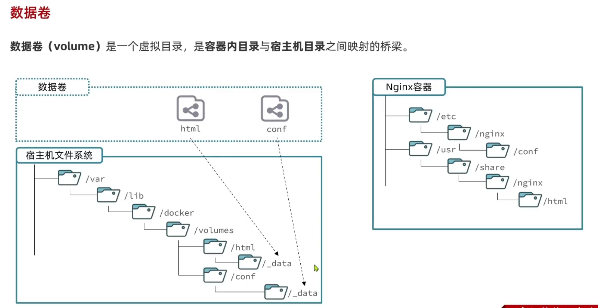
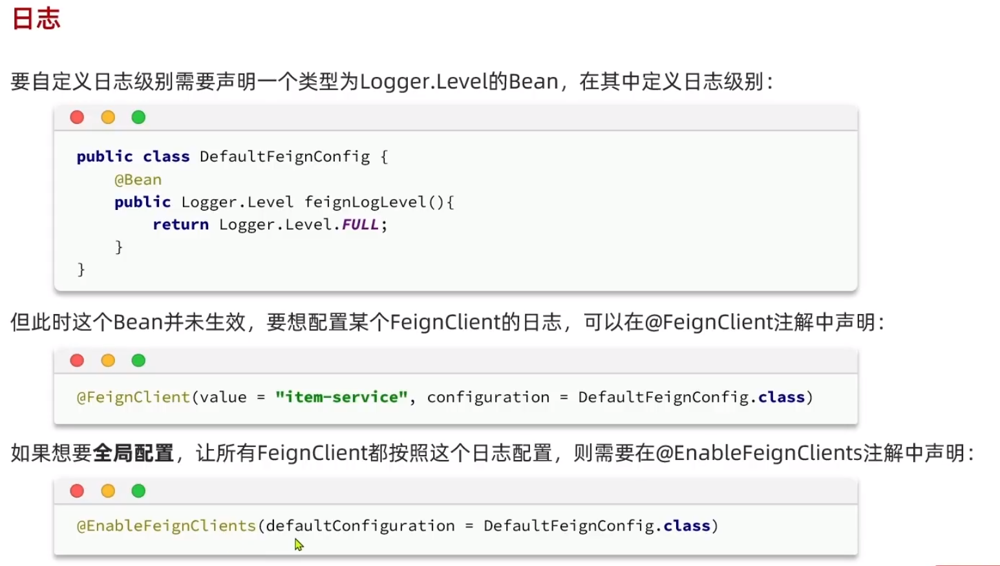

在线文档地址: [day04-微服务02 - 飞书云文档 (feishu.cn)](https://b11et3un53m.feishu.cn/wiki/UMgpwmmQKisWBIkaABbcwAPonVf)

## Docker

快速构建, 运行, 管理应用的工具; 

对于单体项目, 部署方式也就是打包,部署,运行linux命令启动. 

但是现在对于微服务而言, 每个业务都是独立可打包部署的, 传统部署方式太麻烦了

### docker安装

>uname -r #通过 uname -r 命令查看你当前的内核版本
>
>Docker要求CentOS系统的内核版本高于3.10

1. 卸载旧版

   ```
    sudo yum remove docker \
                     docker-client \
                     docker-client-latest \
                     docker-common \
                     docker-latest \
                     docker-latest-logrotate \
                     docker-logrotate \
                     docker-engine
   ```

2. 配置docker的yum库

   安装yum工具

   ```bash
   sudo yum install -y yum-utils
   ```

   映射仓库地址

   ```
   ## 建立Docker仓库 (映射仓库地址)
   sudo yum-config-manager --add-repo https://download.docker.com/linux/centos/docker-ce.repo
   ```

3. 安装docker

   ```
   sudo yum install docker-ce docker-ce-cli containerd.io
   ```

4. 启动和校验

   启动docker

   ```
   sudo systemctl start docker
   //停止docker
   sudo systemctl stop docker
   //重启
   sudo systemctl restart docker
   //设置开机自启
   sudo systemctl enable docker
   //执行docker ps命令， 不报错说明安装启动成功
   docker ps
   ```

    测试是否安装正常

    ```
    sudo docker run hello-world
    ```

5. 配置镜像加速

   注册阿里云账号

   开通镜像服务

   配置镜像加速
   
   ```
   1. 安装／升级Docker客户端
   推荐安装1.10.0以上版本的Docker客户端，参考文档docker-ce
   
   2. 配置镜像加速器
   针对Docker客户端版本大于 1.10.0 的用户
   
   您可以通过修改daemon配置文件/etc/docker/daemon.json来使用加速器
   
   sudo mkdir -p /etc/docker
   sudo tee /etc/docker/daemon.json <<-'EOF'
   {
     "registry-mirrors": ["https://gnsr8ejh.mirror.aliyuncs.com"]
   }
   EOF
   sudo systemctl daemon-reload
   sudo systemctl restart docker
   ```
   
   

### docker基础

为什么docker部署mysql, 在下载东西, 然后就可以跑起来了? 

- 和传统安装软件一样, 你先下载安装包然后安装, 最后生成了一堆磁盘文件, 就可以跑起来; 如果我直接把最后的磁盘文件全部下载好(绿色免安装版), 不就可以直接运行了
- 其次, 关于配置文件的问题, 如果我下载好后, 做了配置; 然后我换了机器, 我只需要把(磁盘文件+配置文件)(镜像)全部给你, 这样你也可以跑起来, 这个例子就简要说明了docker的基本原理

docker安装应用的时候, 会自动搜索镜像并使用`镜像`. 镜像=应用+运行环境+配置+系统函数库...; 当你运行镜像的时候会创建一个隔离的环境(联想VMware运行多个虚拟的系统!),称为`容器`

`镜像仓库`: 存储和管理镜像的平台, Docker官方维护了一个公共仓库: Docker Hub

`镜像`: 镜像名字是唯一的, 如果本地运行时没有这个镜像, 就回去镜像仓库寻找并下载

`容器`: 有独立的文件, 网络系统...来运行镜像; 容器只有必备的资源确保镜像运行


#### 常见命令


从镜像仓库拉去镜像 docker pull

查看本地镜像 docker images

删除镜像 docker rmi #镜像记得带上版本号

自定义镜像 docker build

将镜像打包成tar docker save

读取tar作为本地镜像 docker load -i jdk.tar

推送镜像至镜像仓库(可以是官方的镜像仓库/私服仓库) docker push

运行镜像 `docker run  -d -name "" -p "":"" -v "":"" --network "" image`  #注意这步是给镜像生成容器并运行

停止运行镜像 `docker stop 容器名`

启动已停止的镜像 `docker start 容器名`  #容器还在, 只不过是停止了

查看运行中/已停止的容器 `docker ps`

删除容器 `docker rm -f 容器名`

查看容器日志 `docker logs -f 容器名`

执行命令至容器内部 `docker exec [-it nginx bash]`

查看容器信息 `docker inspect 容器名`

命令帮助提示符 --help


查看容器命令的优化

```
vi ~/.bashrc
docker ps --format "table {{.ID}}\t{{.Image}}\t{{.Ports}}\t{{.Status}}\t{{.Names}}"
source ~/.bashrc
```


#### 数据卷

##### 案例引入


1. 先去找到html目录(容器内目录), 官方镜像的文档
2. docker run -v 数据卷:容器内目录

##### 什么是数据卷



- 是虚拟的目录, 逻辑目录
- linux版docker是在`/var/lib/docker/volumes`下
- 一旦创建了这个映射关系, docker会把容器内目录和宿主机目录进行双向数据绑定!

##### 怎么使用数据卷


##### 怎么去挂载数据卷到容器上

- ==在执行docker run命令时, 使用-v 数据卷:容器内目录 就可以完成数据卷挂载==
- 当创建容器时, 如果挂载数据卷且数据卷不存在, 则会自动创建数据卷

##### 挂载到任意你想要的目录下


- mysql采用的时`匿名卷`每次迁移数据, 目录又深又不好找
- 

#### 自定义镜像

>自己开发了java应用，也要部署，也要在docker上使用；必须自己做一个镜像

镜像就是包含了应用程序、程序运行的系统函数库、运行配置等文件的文件包。构建镜像的过程其实就是把上述文件打包的过程。

生成java镜像的步骤：

1. linux环境
2. jre
3. jar包
4. 启动脚本

生成镜像的结果,不是一个包,而是多个层的压缩包, 这些层构成了一个镜像; 当你制作镜像时, 出现重复的层, 就无需再次下载了


##### Dockerfile

> 描述镜像结构

写dockerfile


例如: 

```
#指定基础镜像
FROM ubuntu:16.04
# 配置环境变量，JDK的安装目录、容器内时区
ENV JAVA_DIR=/usr/local
# 拷贝jdk和java项目的包
COPY ./jdk8.tar.gz $JAVA_DIR/
COPY ./docker-demo.jar /tmp/app.jar
# 安装JDK
RUN cd $JAVA_DIR \ && tar -xf ./jdk8.tar.gz \ && mv ./jdk1.8.0_144 ./java8
#配置环境变量
ENV JAVA_HOME=$JAVA_DIR/java8
ENV PATH=$PATH:$JAVA HOME/bin
# 入口，java项目的启动命令
ENTRYPOINT ["java", "-jar", "/app.jar"]
```

```
#指定基础镜像
FROM openjdk:11.0-jre-buster
#
COPY docker-demo.jar /app.jar
#
ENTRYPOINT ["java", "-jar", "/app.jar"]
```

构建镜像

```
#-t 是给镜像起名
#. 代表当前目录下找dockerfile
docker build -t myImage:1.0 .
```

小结: 镜像的结构是怎样的, dockerfile是做什么的, 构建镜像的命令是社么

##### 根据Dockerfile构建镜像

docker build -t 镜像名:版本号 -f dockerfile名字 . # .代表context


#### 容器网络

>解决容器之间通信的问题

docker有一个默认网桥(网卡), 它会分配每个容器ip地址, 但是存在ip地址变更的麻烦

所以自定义网络出现了: 加入自定义网络后, 通过容器名访问


### 项目部署

#### 部署java


```
docker build -t hmall .
docker run -d --name hm -p 8080:8080 --network heima hmall
```


#### 部署前端


```
docker run -d \
--name nginx
-p 18080:18080 \
-p 18081:18081 \
-v /root/nginx/html:/usr/share/nginx/html \
-v /root/nginx/nginx.conf:/etc/nginx/nginx.conf \
--network heima \
nginx
```


#### Docker-Compose

>前两个项目部署需要自己去打包构建镜像, 以及各种中间件的部署,加入网络都是比较分散的!
>
>Docker Compose通过一个单独的docker-compose.yml 模板文件(YAML格式)来定义一组相关联的应用容器，帮助我们实现多个相互关联的Docker容器的快速部署。


对比理解docker-compose.yml文件其实每一个service和一个docker run容器命令是很相似的!!!


使用DockerCompose

还有最后面加 -d 后台运行 


### nginx和mysql容器内目录

nginx conf: /etc/nginx/nginx.conf

nginx html: /usr/share/nginx/html

mysql镜像的配置目录: /etc/mysql/conf.d 

mysql初始化脚本目录: /docker-entrypoint-initdb.d

mysql数据目录: /var/lib/mysql


## 单体项目和微服务的特征和区别

单体项目适合小型项目


微服务(拆出来n个单体项目)适合大型项目, 性能更好


微服务拆了之后, 出现的问题, 开发和运维的复杂度提升了, 可以通过微服务的架构来解决


## SpringCloud

课程介绍


SpringCloud 是集成了不仅有自己的组件以及集成很多家的组件


springcloud 是标准的制定者, 定义了大量的规范和接口

### 微服务拆分

微服务项目结构

- 独立project, 每一个微服务都是独立的文件夹, 都放在同一个文件夹上(大型项目比较合适, 增加管理负担)
- maven聚合, 每一个微服务都是一个module, 运行时独立分开的, 代码写在一起(适合中小型项目)

#### 什么时候拆分

- 创业型项目, 先快速开发单体项目, 后期再过度到微服务(后期拆分麻烦)
- 大型项目, 上来就只用微服务, 没有后续拆分的麻烦

#### 如何拆分

什么叫高内聚(目标)

- 当你日后改代码更新迭代的时候, 大部分是在这个微服务内部的, 而几乎不去动其他服务

什么叫低耦合(目标)

- 核心业务服务内部完成, 不要调用或依赖其他服务(除非负责/跨服务业务)

有哪些拆分方式(做法)

- 按照业务模块来拆分(纵向拆分)
- 抽取公共服务, 提高复用性(横向拆分)

#### 拆分后遇到的第一个问题(远程调用)

微服务拆分后，数据和服务都是隔离的。当你去使用购物车服务的时候，需要查询最新的商品信息。但是服务之间是不能直接访问对方的数据库的

使用RestTemplate发生http请求（远程调用）

```java
//1. exchange（）
ResponseEntity<List<ItemDTO>> response = restTemplate.exchange(
    "http://localhost:8081/items?ids={ids}",
    HttpMethod.GET,
    null,
    new ParameterizedTypeReference<List<ItemDTO>>() {},
    Map.of("ids", CollUtil.join(itemIds, ","))
);
//2. getStatusCode() is2xxSuccessful()
response.getStatusCode().is2xxSuccessful()
```

>@RequiredArgsConstructor给必要的字段(final)加构造函数
>
>泛型没有字节码, 但是对象里的泛型可以通过反射获得
>
>hutool的CollUtil.join(itemIds,",")和 org.apache.commons.lang3的StringUtils.join一样

### 服务治理

>之前使用restTemplate去做远程调用, 其实不太好用; 
>
>如果某个服务是一个集群, ip地址和端口都比较难确定, 以及不好分配请求给集群; (==不好确定被调用服务的地址==, ==如果被调用服务挂了如何感知?== ==多个实例,消费者该选择哪一个?== 等等使用中会出现的问题)

#### 注册中心原理

有天你(==服务调用者==)需要家政服务, 你不可能路上找一个大妈(==服务提供者==)给你干活, 应该直接去找家政公司(==注册中心==)!


1. 服务提供者注册服务信息到注册中心; 后续提供者需要对注册中心进行心跳续约

2. 服务调用者订阅某个服务的信息; 后续注册中心会推送变更给调用者

3. 服务调用者对服务挑选(负载均衡);

4. 服务调用者远程调用那个服务;

#### Nacos注册中心

>eruka、nacos都是注册中心的组件，都实现springcloud的规范(大差不差)

nacos镜像安装

```bash
docker run -d \
--name nacos \
--env-file ./nacos/custom.env \
-p 8848:8848 \
-p 9848:9848 \
-p 9849:9849 \
--restart=always \
nacos/nacos-server:v2.1.0-slim
```

nacos的访问地址: http://192.168.224.128:8848/nacos

用户名密码都是nacos

#### 服务注册

1. 引入依赖

   ```xml
   <!--nacos 服务注册发现-->
   <dependency>
       <groupId>com.alibaba.cloud</groupId>
       <artifactId>spring-cloud-starter-alibaba-nacos-discovery</artifactId>
   </dependency>
   ```

2. 配置nacos地址

   ```yaml
   spring:
     application:
       name: item-service
     cloud:
       nacos: 
         server-addr: 192.168.224.128:8848
   ```

#### 服务发现

1. 引入依赖

   ```xml
   <!--nacos 服务注册发现-->
   <dependency>
       <groupId>com.alibaba.cloud</groupId>
       <artifactId>spring-cloud-starter-alibaba-nacos-discovery</artifactId>
   </dependency>
   ```

2. 配置nacos地址

   ```yaml
   spring:
     application:
       name: item-service
     cloud:
       nacos: 
         server-addr: 192.168.224.128:8848
   ```

3. 服务发现

   ```
   //springCloud定义的规范接口,
   注入DiscoveryClient接口，获取服务实例
   ```

   

### OpenFeign

>如果直接使用resttemplate和nacos, 发现还是比较麻烦, 一个调用服务的代码太多行了.
>
> openfeign则是来简化发送http的请求

#### 快速入门

- 是一个声明式的http客户端，是springcloud在eureka公司开源的feign基础上改造而来的
- 基于springmvc常见注解，优雅的实现http请求的发送

1. 引入依赖

   ```xml
   <!--openFeign-->
   <dependency>
       <groupId>org.springframework.cloud</groupId>
       <artifactId>spring-cloud-starter-openfeign</artifactId>
   </dependency>
   <!--负载均衡器-->
   <dependency>
       <groupId>org.springframework.cloud</groupId>
       <artifactId>spring-cloud-starter-loadbalancer</artifactId>
   </dependency>
   ```

2. 调用者启动类加上@EnableFeignClients注解, 启用OpenFeign功能

3. 编写FeignClient

   ```java
   @FeignClient("item-service")
   public interface ItemClient {
   
       @GetMapping("/items")
       List<ItemDTO> queryItemByIds(@RequestParam("ids") Collection<Long> ids);
   }
   ```

4. 使用FeignClient

   ```
   把这个接口注入到service中，调用方法即可
   ```

服务拉取, 负载均衡, 发请求都整合一起了

追底层原理: 看invokationHandler  FeignBlockingLoadBalancerClient

#### 连接池

> OpenFeign默认使用的是HttpURLConnection, 不支持连接池, 性能不高. 需要用其他的连接池替换

1. 调用者引入依赖

   ```xml
   <!--OK http 的依赖 -->
   <dependency>
       <groupId>io.github.openfeign</groupId>
       <artifactId>feign-okhttp</artifactId>
   </dependency>
   ```

2. 调用者开启连接池功能

   ```
   # OpenFeign连接池
   feign:
     okhttp:
       enabled: true
   ```

#### 最佳实践

- 微服务里再分出三个模块, 其他微服务模块要用到dto, api直接引入坐标

- 新建一个api模块, 将所有需要暴露接口, dto写到这个类里

使用hm-api时, 需要让调用者的启动类扫描hm-api

#### 日志输出

远程调用的时候, 想看输出日志怎么办?

OpenFeign只会在FeignClient所在包日志级别为debug时, 才会输出日志; 而且他自己也有日志级别NONE、BASIC、HEADERS、FULL（默认NONE）



一般只有调试的时候，才会去输出日志，不然太多输出内容了

### 网关

>UserContext的getUser()获取id, 应该如何在各个服务之间流通?
>
>在单体项目前端访问后端时, ip和端口都是固定不变的变得只是路径。但是现在每个服务都有自己ip自己得端口，前端应该如何访问呢？

负责请求得路由、路由转发、身份校验

网关从注册中心拉取所有服务信息

#### 快速入门

1. 依赖

   ```xml
   <dependencies>
       <!--common-->
       <dependency>
           <groupId>com.heima</groupId>
           <artifactId>hm-common</artifactId>
           <version>1.0.0</version>
       </dependency>
       <!--网关-->
       <dependency>
           <groupId>org.springframework.cloud</groupId>
           <artifactId>spring-cloud-starter-gateway</artifactId>
       </dependency>
       <!--nacos discovery-->
       <dependency>
           <groupId>com.alibaba.cloud</groupId>
           <artifactId>spring-cloud-starter-alibaba-nacos-discovery</artifactId>
       </dependency>
       <!--负载均衡-->
       <dependency>
           <groupId>org.springframework.cloud</groupId>
           <artifactId>spring-cloud-starter-loadbalancer</artifactId>
       </dependency>
   </dependencies>
   <build>
       <finalName>${project.artifactId}</finalName>
       <plugins>
           <plugin>
               <groupId>org.springframework.boot</groupId>
               <artifactId>spring-boot-maven-plugin</artifactId>
           </plugin>
       </plugins>
   </build>
   ```

2. 启动类

   ```
   @SpringBootApplication
   public class GatewayApplication {
       public static void main(String[] args) {
           SpringApplication.run(GatewayApplication.class, args);
       }
   }
   ```

3. 配置路由规则 (重点)

   ```yaml
   server:
     port: 8080
   spring:
     application:
       name: gateway
   # 注册中心地址
     cloud:
       nacos:
         server-addr: 192.168.224.128:8848
       gateway:
         routes:
           - id: item-service
             uri: lb://item-service
             predicates:
               - Path=/items/**,/search/**
   #            - Path=/search/**
           - id: user-service
             uri: lb://user-service
             predicates:
               - Path=/users/**,/addresses/**
           - id: pay-service
             uri: lb://pay-service
             predicates:
               - Path=/pay-orders/**
           - id: trade-service
             uri: lb://trade-service
             predicates:
               - Path=/orders/**
           - id: cart-service
             uri: lb://cart-service
             predicates:
               - Path=/carts/**
   ```


#### 路由属性

网关路由对应得java类型是RouteDefinition, 常见属性

- id
- uri
- predicates: 路由断言
- filters: 路由过滤器, 对请求或响应做特殊处理
  - default-filters: 

#### 网关登录校验

如何在转发请求前, 进行登录校验?

- 自定义一个GlobalFilter过滤器 (自定义GatewayFilter过滤器日后用到再看-p60)

  ```java
  @Component
  public class MyGlobalFilter implements GlobalFilter, Ordered {
      @Override
      public Mono<Void> filter(ServerWebExchange exchange, GatewayFilterChain chain) {
          //TODO 模拟登录校验逻辑
          ServerHttpRequest request = exchange.getRequest();
          HttpHeaders headers = request.getHeaders();
          System.out.println(headers);
          
          return chain.filter(exchange);
      }
      @Override
      public int getOrder() {
          return Ordered.HIGHEST_PRECEDENCE;//值越小,优先级越高
      }
  }
  ```

- 过滤器在NettyRoutingFilter之前, 

  ```java
  //查看NettyRoutingFilter等等GlobalFilter实现类过滤器 还实现了Ordered接口！
   @Override
   public int getOrder() {
   	return Ordered.HIGHEST_PRECEDENCE;//值越小,优先级越高
   }
  ```

- 编写校验逻辑

  ```java
  public Mono<Void> filter(ServerWebExchange exchange, GatewayFilterChain chain) {
      //1.判断是否需要做登录拦截
      ServerHttpRequest request = exchange.getRequest();
      if(isExclude(request.getPath().toString())){
          return chain.filter(exchange);
      }
      //2.获取请求的token
      String token = null;
      List<String> headers = request.getHeaders().get("authorization");
      if (!ObjectUtils.isEmpty(headers)){
          token = headers.get(0);
      }
      //3.校验并解析token
      Long userId = null;
      try{
          userId = jwtTool.parseToken(token);
      }catch (Exception e){
          //拦截并且设置响应状态码
          ServerHttpResponse response = exchange.getResponse();
          response.setStatusCode(HttpStatus.UNAUTHORIZED);
          //直接结束请求不再走过滤器
          return response.setComplete();
      }
      //4.用户信息加入到请求头上
      System.out.println("userId = "+ userId);
      String userInfo = userId.toString();
      ServerWebExchange swe = exchange.mutate()
          .request(builder -> builder.header("user-info", userInfo))
          .build();
      return chain.filter(swe);
  }
  
  private boolean isExclude(String path) {
      for (String pathPattern : authProperties.getExcludePaths()){
          //判断path是否和通配符pathPattern匹配
          //第一个是pathPattern, 第二个是要判断的path
          if(antPathMatcher.match(pathPattern, path)){
              return true;
          }
      }
      return false;
  }
  ```

- 在请求头中保存用户信息

  ```
  ServerWebExchange swe = exchange.mutate()
      .request(builder -> builder.header("user-info", userInfo))
      .build();
  return chain.filter(swe);
  ```

  

##### 自定义过滤器

GatewayFilter: 路由过滤器, 作用指定路由, 配置到路由才生效

GlobalFilter: 全局过滤器, 作用全部路由, 声明自动生效

filter方法: Mono就是回调函数(非阻塞), Post阶段会调用


##### 实现登录校验

```java
public Mono<Void> filter(ServerWebExchange exchange, GatewayFilterChain chain) {
    //1.判断是否需要做登录拦截
    ServerHttpRequest request = exchange.getRequest();
    if(isExclude(request.getPath().toString())){
        return chain.filter(exchange);
    }
    //2.获取请求的token
    String token = null;
    List<String> headers = request.getHeaders().get("authorization");
    if (!ObjectUtils.isEmpty(headers)){
        token = headers.get(0);
    }
    //3.校验并解析token
    Long userId = null;
    try{
        userId = jwtTool.parseToken(token);
    }catch (Exception e){
        //拦截并且设置响应状态码
        ServerHttpResponse response = exchange.getResponse();
        response.setStatusCode(HttpStatus.UNAUTHORIZED);
        //直接结束请求不再走过滤器
        return response.setComplete();
    }
    //4.用户信息加入到请求头上
    System.out.println("userId = "+ userId);
    String userInfo = userId.toString();
    ServerWebExchange swe = exchange.mutate()
        .request(builder -> builder.header("user-info", userInfo))
        .build();
    return chain.filter(swe);
}

private boolean isExclude(String path) {
    for (String pathPattern : authProperties.getExcludePaths()){
        //判断path是否和通配符pathPattern匹配
        //第一个是pathPattern, 第二个是要判断的path
        if(antPathMatcher.match(pathPattern, path)){
            return true;
        }
    }
    return false;
}
```


##### 网关传递用户(网关服务之间)


1. 保存用户到请求头

   ```java
   ServerWebExchange swe = exchange.mutate()
       .request(builder -> builder.header("user-info", userInfo))
       .build();
   return chain.filter(swe);
   ```

2. 在common模块编写拦截器

   ```java
   public class UserInfoInterceptor implements HandlerInterceptor {
       @Override
       public boolean preHandle(HttpServletRequest request, HttpServletResponse response, Object handler) throws Exception {
           //1. 获取登录用户信息
           String userInfo = request.getHeader("user-info");
           //2. 判断是否获取了用户, 是存入ThreadLocal
           if (StringUtils.hasText(userInfo)){
               UserContext.setUser(Long.valueOf(userInfo));
           }
           //3. 放行
           return true;
       }
   
       @Override
       public void afterCompletion(HttpServletRequest request, HttpServletResponse response, Object handler, Exception ex) throws Exception {
           //业务结束后清除userInfo
           UserContext.removeUser();
       }
   }
   ```

   配置类

   ```java
   @Configuration
   @ConditionalOnClass(DispatcherServlet.class)//网关没有这springmvc, 网关不扫这个,其它服务扫（只要扫到了这个类，就启用）
   public class MvcConfig implements WebMvcConfigurer {
   
       @Override
       public void addInterceptors(InterceptorRegistry registry) {
           //使用拦截器
           registry.addInterceptor(new UserInfoInterceptor());
       }
   }
   ```

3. 确保mvcConfig被扫到

   /resources/META-INF/spring.factories

   ```
   org.springframework.boot.autoconfigure.EnableAutoConfiguration=\
     com.hmall.common.config.MyBatisConfig,\
     com.hmall.common.config.JsonConfig,\
     com.hmall.common.config.MvcConfig
   ```

   ```
   @ConditionalOnClass(DispatcherServlet.class)//网关没有这springmvc, 网关不扫这个,其它服务扫
   ```
   
   >补充知识-解决这里的疑惑: 
   >
   >- 为什么UserContext类在另外一个包(hm-common包), 却其他包仍然可以使用其方法?
   >- spring.factories是什么? 和拦截器起作用、自动装配有什么关系？ 
   >
   >首先对于第一个问题, 需要思考依赖的本质和运行时类的创建(静态)
   >
   >其次对于第二个问题, 需要思考

##### OpenFeign传递用户(服务之间)

>OpenFeign 微服务之间的相互调用，因为不是在同一个Tomcat 下，所以拿到不ThreadLocal中的用户信息，需要在调用接口时通过OpenFeign 的拦截器将调用方中ThreadLocal 中保存的用户信息通过请求头的方式发送至下游，下游通过配置的Mvc 拦截器获取到请求头中的值，将用户信息放入自己的ThreadLocal中使用

服务与服务调用的时候，需要传递userId

为什么被调用的服务没有userId，我不是已经写了一个拦截器了吗？注意你的拦截器没错，每个请求进来都会栏一下，但是这个请求头上没有user-info，即使栏了也取不出数据。所以现在问题的关键是==如何在服务发起远程调用的时候给请求加一个请求头==

OpenFeign提供了一个拦截器接口(RequestInterceptor)， 所有OpenFeign发起的请求都会先调用这个拦截器处理请求

1. 编写openfeign拦截器

```java
@Bean
public RequestInterceptor usInfoRequestInterceptor(){
    return new RequestInterceptor() {
    @Override
    public void apply(RequestTemplate template) {//template.header()添加请求头
        template.header("user-info", UserContext.getUser().toString());
        }
    };
}
```

2. 在DefaultFeignConfig里去创建bean

3. 在其他使用openfeign服务的启动类上, 配置defaultConfiguration

   ```java
   @EnableFeignClients(basePackages = "com.hmall.api.client", defaultConfiguration = DefaultFeignConfig.class)
   ```

   

### 配置管理

>现在你可以发现, 每个微服务配置文件都是从hm-service里的配置文件copy过来的, 修改了部分,大部分是一样的, 这样就重复配置了! 每次配置变更都需要重启服务! 网关路由写死了一变又要重启!

好消息 nacos不但具有注册中心的能力, 还有配置管理的能力

#### 共享通用配置

1. 把需要共享的配置写到nacos

   ==Data ID: 需要写后缀名==

2. springcloud的共享的配置文件和springboot配置文件先后顺序

   bootstrap.yml是为了解决, nacos地址是先写在application.yml中的, 但是你却先拉去nacos配置, 这样肯定是拉取不到的, 因此又引入了bootstrap.yml来解决这个矛盾

3. 读取bootstrap.yml和拉去nacos的配置, 并不是自己写, 只需要引入两个新的依赖
   
   ```xml
   <!--nacos配置管理-->
   <dependency>
       <groupId>com.alibaba.cloud</groupId>
       <artifactId>spring-cloud-starter-alibaba-nacos-config</artifactId>
   </dependency>
   <!--读取bootstrap文件-->
   <dependency>
       <groupId>org.springframework.cloud</groupId>
       <artifactId>spring-cloud-starter-bootstrap</artifactId>
   </dependency>
   ```
   
4. 定义bootstrap.yml

   ```yaml
   spring:
     profiles:
       active: dev
     application:
       name: cart-service
     cloud:
       nacos:
         server-addr: 192.168.224.128:8848
         config:
           file-extension: yml
           shared-configs:
             - data-id: shared-jdbc.yml
             - data-id: shared-log.yml
             - data-id: shared-swagger.yml
             - data-id: shared-okhttp.yml
   ```

#### 热更新


1. 配置properties类

   ```java
   @Data
   @ConfigurationProperties(prefix = "hm.cart")
   @Component
   public class CartProperties {
       private int maxItems;
   }
   ```

2. 由于nocas在读取配置文件时, 会默认尝试读取与服务名有关的配置文件(上图), 只需要在nacos后台新增一个有关的配置文件, 这个配置文件和你运行时的配置文件就进行了绑定, 修改nacos后台配置文件就可以做到配置热更新而不需要重启服务

#### 动态路由

相比于热更新，路由一旦读取后是被缓存到内存中了，如果更新配置文件，仍然需要重启。但是我们不允许它重启该怎么办？

1. 需要监听配置变更

   

   官方文档是这样写的，但是别忘了我们使用了nacos-config依赖，他会在服务创建前自动连接nacos。我们编写拦截器的时候不需要再去连接nacos，直接拿就好；那我们怎么拿呢？

   ==通过看config的自动装配源码，有一个叫nacosConfigManager的Bean，其中会创建configService，并且还可以getConfigService()拿到==

   其次我们需要先调用getConfig(dataId,group,5000)先拉取第一次的配置，不然第一次启动会没有路由信息。然后我们需要去添加监听器。其实两步可以合成一步！那我们怎么操作呢？

   ==通过看nacosConfigManager中的ConfigService接口，他其实有一个方法叫getConfigAndSignListener(),就可以实现第一次拉取配置以及注册监听器==

   最终简化成这个样子

   ```java
   @Component
   @Slf4j
   public class DynamicRouteLoader {
   
       @Resource
       private NacosConfigManager nacosConfigManager;
   
       private String dataId = "";
       private String group = "";
   
       @PostConstruct
       public void initRoute() throws NacosException {
           //1. 项目启动时先拉取一次配置， 并且添加配置监听器
           nacosConfigManager.getConfigService()
                   .getConfigAndSignListener(dataId, group, 5000, new Listener() {
                       @Override
                       public Executor getExecutor() {
                           return null;
                       }
   
                       @Override
                       public void receiveConfigInfo(String s) {
                           //2. 添加监听器,监听到配置变更, 需要去更新路由表
                       }
                   });
           //3. 第一次读取到配置也要读取到路由表
       }
   
       public void updateConfigInfo(String configInfo){
           //TODO 更新路由表
       }
   }
   ```

   

2. 当你监听到了后，需要更新路由表信息

   问题来了我如何取更新路由表信息?

   1. 解析配置文件; 使用json格式, 解析方便

      ```json
      [
          {
              "id": "item",
              "predicates": [{
                  "name": "Path",
                  "args": {"_genkey_0":"/items/**", "_genkey_1":"/search/**"}
              }],
              "filters": [],
              "uri": "lb://item-service"
          },
          {
              "id": "cart",
              "predicates": [{
                  "name": "Path",
                  "args": {"_genkey_0":"/carts/**"}
              }],
              "filters": [],
              "uri": "lb://cart-service"
          },
          {
              "id": "user",
              "predicates": [{
                  "name": "Path",
                  "args": {"_genkey_0":"/users/**", "_genkey_1":"/addresses/**"}
              }],
              "filters": [],
              "uri": "lb://user-service"
          },
          {
              "id": "trade",
              "predicates": [{
                  "name": "Path",
                  "args": {"_genkey_0":"/orders/**"}
              }],
              "filters": [],
              "uri": "lb://trade-service"
          },
          {
              "id": "pay",
              "predicates": [{
                  "name": "Path",
                  "args": {"_genkey_0":"/pay-orders/**"}
              }],
              "filters": [],
              "uri": "lb://pay-service"
          }
      ]
      ```

      

   2. 更新路由表; 使用RouteDefinationWriter

      ```java
      private final Set<String> routeIds = new HashSet<>();
      
      @Resource
      private RouteDefinitionWriter writer;
      
      public void updateConfigInfo(String configInfo){
          log.debug("监听到路由配置信息: {}", configInfo);
          //1. 解析配置信息, 转为RouteDefinition
          List<RouteDefinition> routeDefinitions = JSONUtil.toList(configInfo, RouteDefinition.class);
          //2. 删除旧得路由表
          for (String routeId : routeIds){
          	writer.delete(Mono.just(routeId)).subscribe();
          }
          routeIds.clear();
          //3. 更新路由表
          for (RouteDefinition routeDefinition: routeDefinitions){
              //1. 更新路由表
              writer.save(Mono.just(routeDefinition)).subscribe();
              //2. 记录路由表id, 方便下一次更新前删除
              routeIds.add(routeDefinition.getId());
          }
      }
      ```

   3. 最终代码如下

      ```java
      @Component
      @Slf4j
      public class DynamicRouteLoader {
      
          //用于监听路由的api
          @Resource
          private NacosConfigManager nacosConfigManager;
          //要监听得配置文件
          private static final String dataId = "gateway-routes.json";
          //要监听得配置文件的分组
          private static final String group = "DEFAULT_GROUP";
          //用于记录旧路由id的集合
          private final Set<String> routeIds = new HashSet<>();
          //更新路由表的工具api
          @Resource
          private RouteDefinitionWriter writer;
      
          @PostConstruct
          public void initRoute() throws NacosException {
              //1. 项目启动时先拉取一次配置， 并且添加配置监听器
              String configInfo = nacosConfigManager.getConfigService()
                      .getConfigAndSignListener(dataId, group, 5000, new Listener() {
                          @Override
                          public Executor getExecutor() {
                              return null;
                          }
      
                          @Override
                          public void receiveConfigInfo(String configInfo) {
                              //2. 添加监听器,监听到配置变更, 需要去更新路由表
                              updateConfigInfo(configInfo);
                          }
                      });
              //3. 第一次读取到配置也要读取到路由表
              updateConfigInfo(configInfo);
          }
      
          public void updateConfigInfo(String configInfo){
              log.debug("监听到路由配置信息: {}", configInfo);
              //1. 解析配置信息, 转为RouteDefinition
              List<RouteDefinition> routeDefinitions = JSONUtil.toList(configInfo, RouteDefinition.class);
              //2. 删除旧得路由表
              for (String routeId : routeIds){
                  writer.delete(Mono.just(routeId)).subscribe();
              }
              routeIds.clear();
              //3. 更新路由表
              for (RouteDefinition routeDefinition: routeDefinitions){
                  //1. 更新路由表
                  writer.save(Mono.just(routeDefinition)).subscribe();
                  //2. 记录路由表id, 方便下一次更新前删除
                  routeIds.add(routeDefinition.getId());
              }
          }
      }
      ```

      

## 服务保护(Sentinel)

到此已经可以开发百分之99的微服务了， 接下来的内容是对微服务的优化升级（中高级！）

某个服务异常缓慢，导致调用者长时间等待；当调用者资源耗尽后无法接收正常服务的请求，然后影响不断扩大导致整个微服务集群雪崩 --雪崩问题

雪崩问腿解决思路：请求限流、线程隔离、服务熔断、失败处理

### Sentinel快速入门

dashboard控制台安装

```
sentinel-dashboard.jar启动
java -Dserver.port=8090 -Dcsp.sentinel.dashboard.server=localhost:8090 -Dproject.name=sentinel-dashboard -jar sentinel-dashboard-1.8.6.jar
localhost:8090访问账号密码都是sentinel
```

微服务中加入到sentinel控制台

1. 引入依赖

   ```
   <!--sentinel-->
   <dependency>
       <groupId>com.alibaba.cloud</groupId> 
       <artifactId>spring-cloud-starter-alibaba-sentinel</artifactId>
   </dependency>
   ```

2. 在application.yml中配置控制台的地址

   ```yaml
   spring:
     cloud: 
       sentinel:
         transport:
           dashboard: localhost:8090
   ```

3. 只要你去访问了受sentinel监控的接口, 都可以被监测, 统计信息


- 簇点链路里, 好像只有一个/cart, 我想监听/carts下所有的接口怎么办?

你就要去修改簇点资源名称

```yaml
# 所谓簇点链路，就是单机调用链路，是一次请求进入服务后经过的每一个被Sentinel监控的资源。默认情况下，Sentinel会监控SpringMVC的每一个Endpoint（接口）。
# 默认情况下Sentinel会把路径作为簇点资源的名称，无法区分路径相同但请求方式不同的接口，查询、删除、修改等都被识别为一个簇点资源，这显然是不合适的。
# 所以我们可以选择打开Sentinel的请求方式前缀，把请求方式 + 请求路径作为簇点资源名：
spring:
  cloud:
    sentinel:
      transport:
        dashboard: localhost:8090
      http-method-specify: true # 开启请求方式前缀
```

### 请求限流

给簇点新增流控规则, 阈值类型选QPS 单机阈值选6 意思就是qps为6

### 线程隔离

给簇点新增流控规则, 阈值类型选并发线程数(线程只能用5个) 单机阈值选5 (如果单线程qps为2, 5线程qps就是10)

模拟当某个服务繁忙时, 调用服务者会耗尽tomcat资源, 导致正常服务无法访问

给itemservice, 睡500毫秒

给cartservice, tomcat设置最大线程上限为50 允许排队等待的线程为50 最大连接为100

### Fallback

当某个服务繁忙, 无法提供服务, 服务调用者无法完成业务会报错. 于是服务调用者 提供一些默认数据给前端

1. 将服务调用者的feign作为sentinel的簇点资源

   ```
   feign:
     sentinel: 
       enabled: true
   ```

2. 在hm-api, 写一个ItemClientFallback 实现`FallbackFactory<ItemClient>`

   ```java
   @Slf4j
   public class ItemClientFallback implements FallbackFactory<ItemClient> {
       @Override
       public ItemClient create(Throwable cause) {
           return new ItemClient() {
               @Override
               public List<ItemDTO> queryItemByIds(Collection<Long> ids) {
                   log.error("远程调用ItemClient#queryItemByIds方法出现异常，参数：{}", ids, cause);
                   return CollUtils.emptyList();
               }
   
               @Override
               public void deductStock(List<OrderDetailDTO> items) {
                   // 库存扣减业务需要触发事务回滚，查询失败，抛出异常
                   throw new BizIllegalException(cause);
               }
           };
       }
   }
   ```

3. 在DefaultFeignConfig 注册bean

   ```java
   @Bean
   public ItemClientFallback itemClientFallback(){
   	return new ItemClientFallback();
   }
   ```

4. 在对应的ItemClient上加注解启用这个falllback

   ```java
   @FeignClient(value = "item-service", fallbackFactory = ItemClientFallback.class)
   public interface ItemClient {
   
       /**
        * 根据id查询商品
        * @param ids
        * @return
        */
       @GetMapping("/items")
       List<ItemDTO> queryItemByIds(@RequestParam("ids") Collection<Long> ids);
   
       /**
        * 批量扣减库存
        * @param items
        */
       @PutMapping("/items/stock/deduct")
       void deductStock(@RequestBody List<OrderDetailDTO> items);
   }
   ```

### 服务熔断

根据比例, 超出阈值不再远程调用服务, 走fallback

断路器状态机原理: closed  open  half-open

添加熔断规则

## 分布式事务


## 稍后了解

@RequiredArgsConstructor

@ConfigurationProperties 和 @EnableConfigurationProperties

@ConditionalOnClass

springboot自动装配

spring.factories

@RequiredArg

@PostConstruct bean创建好后执行
