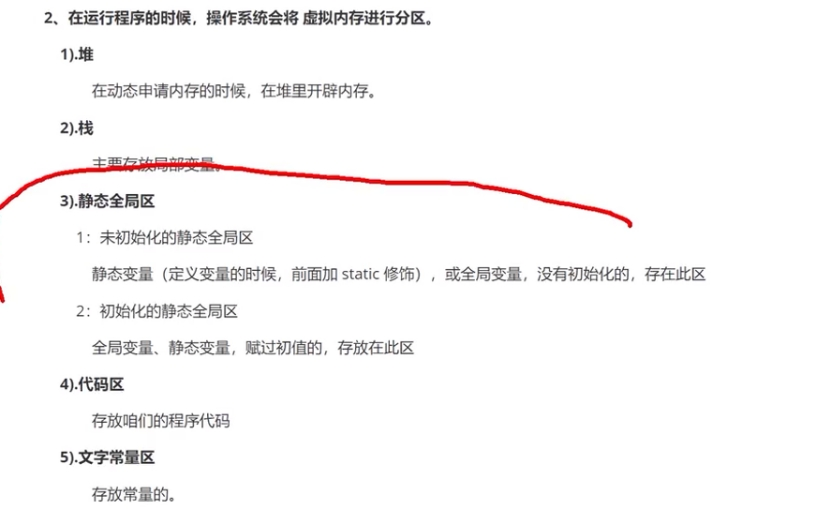

## 鹏哥初始C语言

### 快速入门

main

- ==一个工程内,只允许有一个main方法!==

```c
//main()函数是c源程序的入口
//#include <stdio.h> 是c语言的导包语法，由于printf()是库函数里面，非自带，因此要导入这个包包(引用头文件)
//return 0;  是为了保证语法完整，这个和java的有点类似，java的方法（函数）如果你有返回值也要声明数据类型
//vs2019 编译+运行快捷键  ctrl+f5
```


定义和使用变量

```c
//	int age = 10;
//	float weight = 23.3f;//浮点型常量要加f，如果不加f会有“从double到float”
//	printf("%f", weight);//只要打印输出double类型数据，必须用%lf
```

各类型的大小

```c
//	printf("%d\n", 100);//不用%d，打印的实际上是char形
//	//sizeof - 关键字 - 操作符，返回一个整形数值（单位是字节）
//	printf("%zd\n", sizeof(char));//1
//	printf("%zd\n", sizeof(short));//2
//	printf("%zd\n", sizeof(int));//4
//	printf("%zd\n", sizeof(long));//4
//	printf("%zd\n", sizeof(long long));//8
//	printf("%zd\n", sizeof(float));//4
//	printf("%zd\n", sizeof(double));//8
```

scanf获取用户输入

```c
#define _CRT_SECURE_NO_WARNINGS
#include <stdio.h>
//	//scanf获取用户输入(vs会报错的)
//	int a = 0;
//	int b = 0;
//	int sum = 0;
//	scanf("%d %d", &a, &b);//输入的顺序要和表达式一样，然后分别给a b
//	sum = a + b;
//	printf("%d\n", sum);
```


### 作用域和生命周期

```c
#define _CRT_SECURE_NO_WARNINGS
#include <stdio.h>

//作用域和生命周期
//1.局部变量和全局变量（main函数内外）
//2.用在main（）{}内部再用{}框定变量的范围
//3.变量定义是可以放在main函数外面，执行性代码要在函数中使用
//4.局部变量：变量所在的局部范围
//5.全局变量：整个工程，若要跨文件使用，需要extern去声明我引用类那个全局变量

//生命周期
//变量的生命周期：变量创建到销毁的时间段
//1.局部变量：进入局部范围开始到出局部范围结束
//2.全局变量：就是程序的生命周期（main的开始和结束）
int b = 100;
extern double test_var;
int main() {
	printf("hi\n");
	int b = 10;
	printf("%lf\n", test_var);

	//=======================
	printf("%d在main（）{}内部再用{}框定变量的范围\n", a);
	{
		int a = 10;
		printf("%d在main（）{}内部再用{}框定变量的范围\n", a);
	}
	printf("%d在main（）{}内部再用{}框定变量的范围\n", a);
	return 0;
}
```

### 常量

```c
#define _CRT_SECURE_NO_WARNINGS
#include <stdio.h>

#define MAX 20000
int main() {
	//1。字面常量
	3.14;
	10;
	'a';
	"abdc";
	//2. const修饰的常变量
	const int num = 10;//num就是常属性-具有常属性（不能被改变的属性），本质还是变量
	//num = 10;//左值指定const对象
	printf("num=%d\n", num);

		//怎么证明常变量不是常量
	/*const int n = 10;
	int arr[n] = { 0 };*/
	//以上可知就算你加了const，编译器还是告诉你要常量值，所以常变量不是常量

	//3.#define定义的常量({}内外都可以定义)
	int n = MAX;
	printf("n=%d\n",n);
	
	//4.枚举常量
	enum Sex {MALE=3,FEMALE,SECRET};
	enum Sex s = MALE;
	printf("%d\n",MALE);
	printf("%d\n",FEMALE);
	printf("%d\n",SECRET);
	return 0;
}
```

### 字符串

```c
#define _CRT_SECURE_NO_WARNINGS
#include <stdio.h>
#include <string.h>

int main() {
	"hello world";
	//2.怎么证明字符串结束的标志是\0 --对arr用vs监视
		//字符数组-数组是一组相同数据类型的元素
	char arr[] = "hello";//不写大小会根据值来开辟大小
		//字符串在结尾的位置隐藏了一个\0的字符
		//\0是字符串结束的标志，printf("%s",String)输出字符串
		//字符串内容由多个字符组成
	char arr1[] = "abc";
	char arr2[] = { 'a','b','c' };
	printf("%s\n",arr1);
	printf("%s\n",arr2);//乱码是因为没有结束标志，输出了不知道什么东西
	char arr3[] = { 'a','b','c','\0'};
	printf("%s\n", arr3);
		//用strlen（）
	printf("%d\n",strlen(arr1));
	printf("%d\n", strlen(arr2));

	//3.求字符串的长度(结束标志不算在长度里面)
	int len = strlen("abc");//strlen()警告是因为没有引入<string.h>
	printf("%d\n",len);
	return 0;

}
```


后续是kerwin老师的

## 变量和常量

常量值：10，1.1，”abc”,

变量的定义（初次赋值）语法：修饰符 变量名 = 常量值;

变量二次赋值

 

%d 非浮点类型数据占位符，格式化字符串

## 整形数据和实型

### 整形（整形数据）

 

 

（有符号省略了signed）

整形：short（2byte） int(4byte)  long(4byte)(windows-64位下就是4个字节)

数据溢出（你设定的数据类型装不下你给的数据）规律：超过最大范围从最开始再算

sizeof() 计算数据类型所占字节数

 

自动类型转换机制

 

Unsigned无符号

Unsigned int  /  unsigned short  /  unsigned long :字节还是同原来一样，把负的范围拿

去给补充整数了

%d 十进制的（有符号（±号）的）整形输出

%u 十进制的（无符号的）整形输出

%o 八进制的整形输出----变量定义0123（八进制）-输出用%d的话实际上是八->十

%x 十六进制整形输出

没有专门输出二进制的，所有这里涉及考题-给你10进制数，给我显示成2进制

 

0b

0

0x


### 浮点型（实型）

变量没有赋值居然有默认的随机值（调试发现的）

计算机存小数的特性

 

%f 输出十进制的单精度浮点型数（float）----5f

%lf 输出十进制的双精度浮点型数

 

自动类型转换！

高精度转低精度可能会丢失一些数据, 不准


## 字符型

%c 输出字符类型数据

Char占一个字节 -128--127

char = ‘a’;//单引号里面只能放一个字符

char = “a”;//双引号的char其实是两个字符。占用两个字节a \0(结束标识，隐藏的有但不计入字符串长度)

 

1. %d输出的数值 跟 字符 有什么关联？
2. Char能不能存储汉字？1个汉字占两个字节
3. 多个字符？

 

 

1. 怎么定义字符串？

char str[ ] = “abandon”;

2. 怎么输出字符串？

%s，printf(“%s”, str);

## 运算符

//右结合性

//优先级常用的运算符和java一样

//	//1.单独一句自增自减没有先赋值再自增减说法
//	//2.放在其他语句使用时，则有

## 分支语句

if分支, switch分支跟java一样理解

## 循环语句

while循环、do while循环、for循环跟java一样理解

## 函数

>从这里开始c语言才开始上难度

定义函数

函数的声明

```c
//#include"声明函数.h"

//声明语法--"关键字 函数名();" 或者 "返回类型 函数名 形参列表;"
// 1. 在外部程序定义了函数，在本程序用extern 声明那个函数extern void _print();
// 2. 在头文件定义函数，在本程序导入#include"headfile.h"
// 3. 在本文件定义函数，在main()之前声明或者定义好： 返回类型 函数名 形参列表；
void _print(); //在本文件main方法之后定义函数，需要提前声明
extern bool isBool(int a);  //调用其他文件中的函数，需要extern并在main方法之前声明
```

- 在函数声明中，参数的名称并不重要，只有参数的类型是必需的，因此下面也是有效的声明：

  ```c
  extern void show(int, int);
  ```

- 如果你想调用别人的函数
  1. 首先导入那个函数所在的库文件
  2. 用`extern`关键字声明那个函数

- 如果你想在main方法之后定义函数,
  - 在main()方法之前`声明void _print();`或者`定义好函数`： 返回类型 函数名 形参列表
- 被调用的函数==必须定义/声明==在调用者函数之前

## 再识变量

分成 堆栈 静态全局区 代码区 文字常量区

 

编译器会在当前工程下扫描，你所声明的文件

### 普通全局变量：

- 定义在函数或者main（）外面，不用用static修饰

- 不赋初值，是由默认值的

- 整个工程都能用（引入头文件，或者extern声明全局变量）

 

%p输出地址配合&（取地址符）

 

 

### 静态全局变量：

- 定义在函数或者main（）外面，并且用static修饰

- 由于有默认值，所以即使不赋值也能保证有值

- 只能在当前c文件内使用

​	

 

### 普通局部变量：

- 定义在{}内，函数以及main（）或者自己写一个{}内使用

- 只存活在{}中

### 静态局部变量：

- 定义在{}内，函数以及main（）或者自己写一个{}内使用。

- 由于没有默认值，所以定义时必须给常量值，有值的变量都不行

- 静态局部变量的值在函数调用结束后不消失而保留原值，即其占用的存储单元不释放

  ```c
  for (int i = 1; i <= 3; i++) {//
  
  	static int i3 = 0;
  
  	i3 += i;
  }
  printf("%d\n", i3);//for循环出来i3仍然存在!
  ```


小结：

- extern声明变量，哪里位置引入的，会把他看成局部还是全局变量的作用域	

- include 引入头文件


 include导入头文件

1. 头文件是c语言库函数用<> 例如：<stdio.h>
2. 自己的文件时用"headfile.h"

### 变量重名和函数重名

变量重名: 

- 普通全局和静态全局变量重名了但如果在不同文件则可以共存

- ==程序是线程从上到下执行的: 就近寻找变量原则==

静态函数

- 外部函数：整个工程都能用，外部函数的引用声明即可

- 静态函数：用static修饰。当前c文件才能用，外部无法访问

- ==静态的变量/函数都不能给其他c文件声明和引用==


## 数组

数组占用字节：int a[5], 一个int4个字节，如何有五个数据，4*5=20个字节。连续申请了5个int的数据空间。

 

1. 数组占用字节和sizeof的应用
2. 与定义数组类型不一样的类型的元素，会被强制转换（类型上不同时）
3. 超出定义数组类型的范围是，会重新循环输出（范围上不同时）

### 定义数组

```c
//第一种方式
int arr[5];
//定义二维数组
int arr1[5][5];
```

字符串本质就是一系列的char

### 遍历数组

不像java的数组, 可以`数组.length`取出长度. 需要你去计算`sizeof(arr)/sizeof(arrType)`出来

### 打印数组

```c
int a;
scanf_s("%d", &a); // 2 如果不加& 会提示需要一个 int * 类型的数据,而数组不需要&不会报错
printf("%d\n", a);

printf("%p\n", &a); // 3 %p 打印地址

// 4 数组是引用类型
```

### 排序算法

冒泡排序

选择排序


## 指针

### &取地址

scanf_s是安全的, 安全在哪里? 多一个长度参数, 超过这个长度不会接收

引用类型(数组)和基本数据类型: 你写的变量存的东西不一样, 引用类型变量里存的就是地址, 基本数据类型变量存的是数据! 这也就导致scanf_s("%d", 数组/基本数据类型变量, 长度) 录给数组的时候可写可不写&, 录给基本数据类型变量的时候, 必须写上&

%p打印地址的占位符
