## 配置C语言环境


下载MinGw-w64 [MinGW-w64 - for 32 and 64 bit Windows - Browse Files at SourceForge.net](https://sourceforge.net/projects/mingw-w64/files/)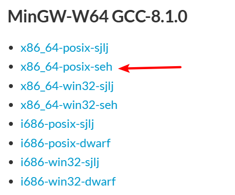


gcc命令: [Linux环境下GCC基本使用详解（含实例）_linux gcc-CSDN博客](https://blog.csdn.net/qq_39872252/article/details/133309120)

## 配置vscode

>[vscode安装配置c/c++教程vscode安装使用教程vscode配置c/c++vscode配置Visual Studio Code使用方法Visual S_哔哩哔哩_bilibili](https://www.bilibili.com/video/BV1BQ4y1j7fY/?spm_id_from=333.880.my_history.page.click&vd_source=d179dd0d9ece5a3d72eb7942bd195cb8)

1. 装c/c++插件
2. code文件夹下,写一个c文件
3. 设置编译选项
   1. ctrl shift p 配置c/c++（UI）
   2. 编译器路径
   3. IntelliSense 模式 选gcc-x64
4. 终端->配置任务， 这样就配置执行任务
5. 在终端, 点击运行任务或者运行生成任务就可以生成编译c文件成exe文件啦
6. 装code runner插件, 右键就可以运行啦[VScode配c/c++环境，可直接调试项目_c++ runner-CSDN博客](https://blog.csdn.net/weixin_44356536/article/details/118466031)

### 修改cmd编码

[windows修改cmd命令行窗口UTF-8编码（临时、永久）_cmd utf-8-CSDN博客](https://blog.csdn.net/qq_45796667/article/details/126107300)

[更改cmd powershell默认编码为utf-8 更改windows默认编码格式为UTF-8，解决控制台cmd乱码，设置应用默认编码为UTF-8_powershell编码改为utf8-CSDN博客](https://blog.csdn.net/qq_43780850/article/details/129122210)

思路 (powershell的修改utf8太麻烦)

1. 修改cmd的注册表 autorun=chcp 65001
2. 修改vscode的集成终端为cmd

### 修改code runner配置

- 让生成的exe文件统一放在out目录下, (你需要当前源文件下创建out目录)

  ```json
  "c": "cd $dir && gcc $fileName -D LOCAL -o .\\out\\$fileNameWithoutExt.exe && .\\out\\$fileNameWithoutExt.exe",
  ```


- 无法输入scanf没反应，coderunner配置成run in terminal

## 指针

普通变量存的是数值，同时这个变量有一个独一无二的地址。访问变量都只是访问数值，除非你用取地址符拿到的才是地址

指针变量存的是地址


定义指针变量: `类型名 *指针变量名` 例如 int *p;

如果需要获取某个变量的地址,可以使用取地址运算符`&`

如果需要访问指针变量指向的数据, 可以使用取值运算符`*`

避免访问未初始化的指针

## 指针与数组

### 两者关系

- 指针和数组关系密切但不是相等关系

### 数组的本质

- 输入流sanf时, 如果你要将读到的值给某一个变量, 你需要&取址运算符修饰; 数组抑或是字符数组不需要&修饰就可以完成相同功能

- 数组名其实是数组第一个元素的地址; 数组元素的内存地址是紧密排列在一起的有序

例如

数组是一口气向操作系统申请了很多内存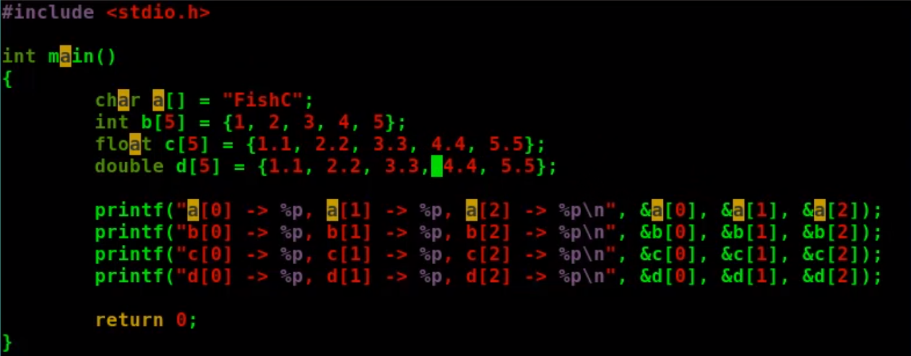

char a[] = "FishC";长度为5,会向操作系统一口气申请5个连续char空间占用==5*sizeof(char)=1个字节==

每一个空间类似于以下的表格, 每一行就代表占用一个字节

| 地址   | char空间 |
| :----- | :------- |
| 0x1000 | F        |
| 0x1001 | i        |
| 0x1002 | s        |
| 0x1003 | h        |
| 0x1004 | C        |

int b[5] = {1,2,3,4,5};长度为5,会向操作系统一口气申请5个连续int空间占用==5*sizeof(int)=4个字节==

| 地址        | int空间           |
| ----------- | ----------------- |
| 0x1000      | 1                 |
| 0x1001      | 1所占用的其余空间 |
| 0x1002      | 1所占用的其余空间 |
| 0x1003      | 1所占用的其余空间 |
| 0x1004      | 2                 |
| 0x1005      | 2所占用的其余空间 |
| 0x1006      | 2所占用的其余空间 |
| 0x1007      | 2所占用的其余空间 |
| ...以此类推 | ...以此类推       |

float c[5] = {1.1, 2.2, 3.3, 4.4, 5.5};长度为5,会向操作系统一口气申请5个连续float空间占用==5*sizeof(float)=4个字节== 

double d[5] = {1.1, 2.2, 3.3, 4.4, 5.5};长度为5,会向操作系统一口气申请5个连续double空间占用==5*sizeof(double)=8个字节==

输出

### 指针指向数组

- 新的方式取数组元素, `*(数组指针+1) 等价于 arr[1]` ==注意默认的指针指向数组第一个元素的地址== 

- 如果用一个指针指向数组应该怎么做呢?

```c
//a是数组名也就是数组第一个元素的地址
char *p;
p = a;
p = &a[0];
```

### 指针运算

- 当指针指向数组元素的时候，我们可以对指针变量进行加减运算，这样做的意义相当于指向距离指针所在位置向前或向后第n个元素。

- 对比标准的下标法访问数组元素，这种使用指针进行间接访问的方法叫做指针法。

- 需要郑重强调的是: p+1并不是简单地将地址加1而是指向数组的下一个元素。

  ```c
  //为什么编译器这么聪明呢?
  //其实是因为你已经告诉编译器了
  char *p = arr; //你告诉他一个单位是1字节 char
  int *p = arr; //你告诉他一个单位是4个字节 int
  //这样编译器就知道p+几, 再给地址做加法的时候实际上加的是几个单位的积(几*单位)
  ```

  

## 指针数组和数组指针

指针和数组到底有什么区别

>左值是地址且可以改变，数组地址不可以改变，所以他不是左值，右值是操作数据可以改变

数组名只是一个地址常量, 不是左值

指针是左值

### 什么是指针数组和数组指针

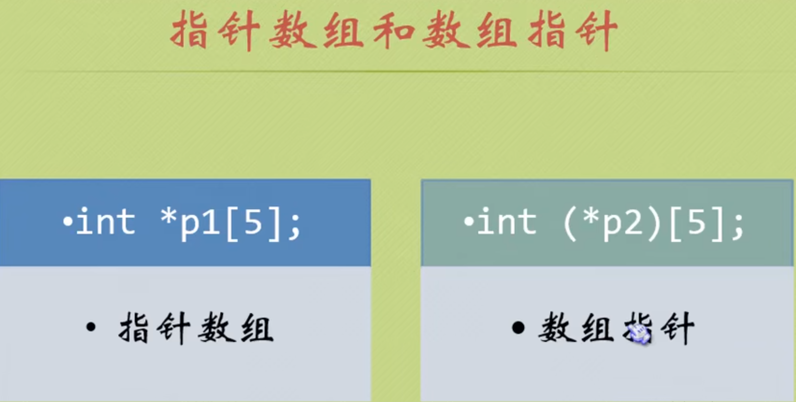

注意从运算符优先级来分辩, *取值运算符优先级是2, [ ]数组下标运算符优先级是1, ()运算符优先级也是1;

1优先级的结合性是左->右

2优先级的结合性是右->左


#### 指针数组

指针数组是一个数组, 其元素全为指针(数组元素全为指针的数组称为指针数组)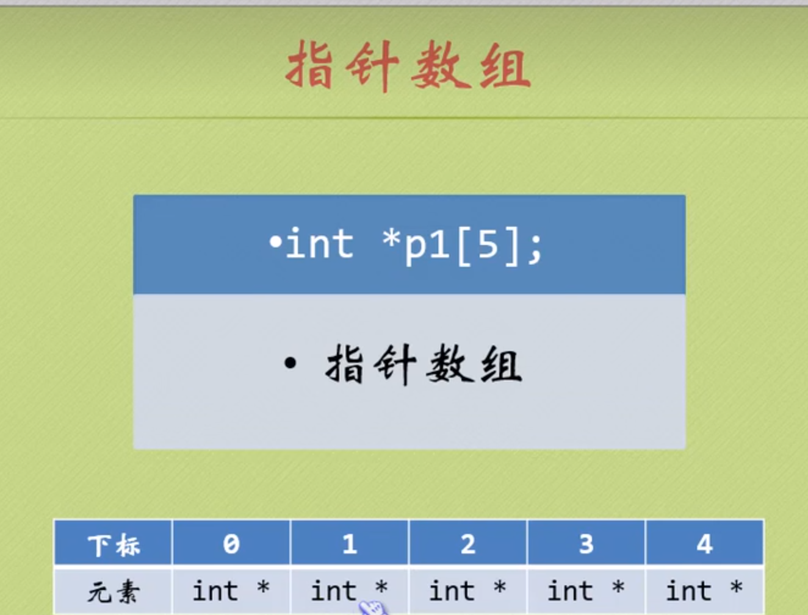

正确定义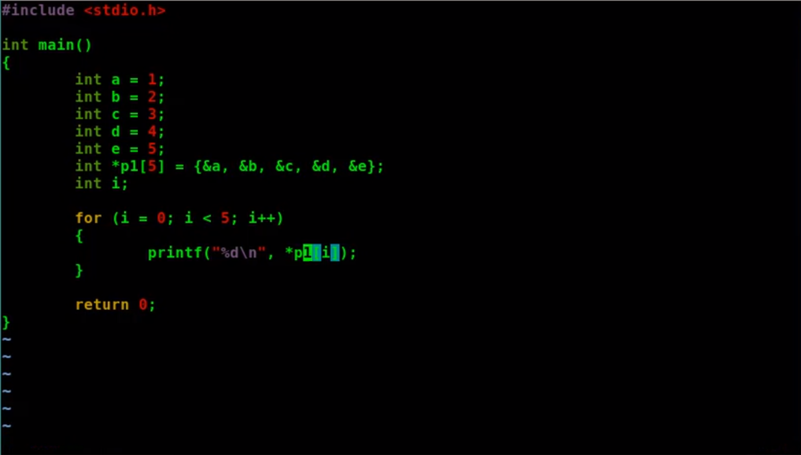


指向字符指针就非常实用了  %s输出的是字符串......这里每个P1[ ]相当于一个一维数组。所以他们的名字代表首地址，不需要&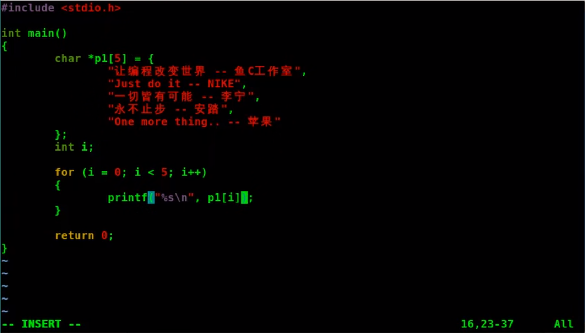

#### 数组指针

数组指针是一个指针, 他指向的是一个数组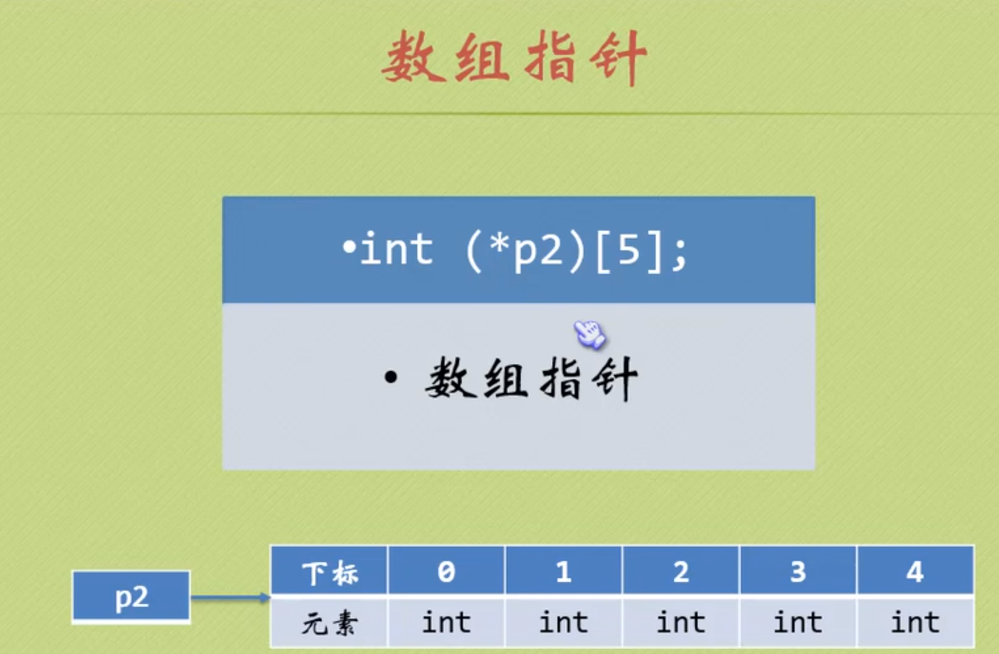

错误定义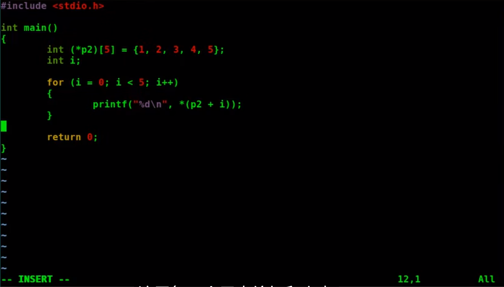

数组名不就是数组的第一个元素的地址吗? 你指针变量要的不就是地址吗?怎么就不一致了

来让我们回忆一下是如何将==指针指向数组==的, 我们是不是这样写的,这样是对的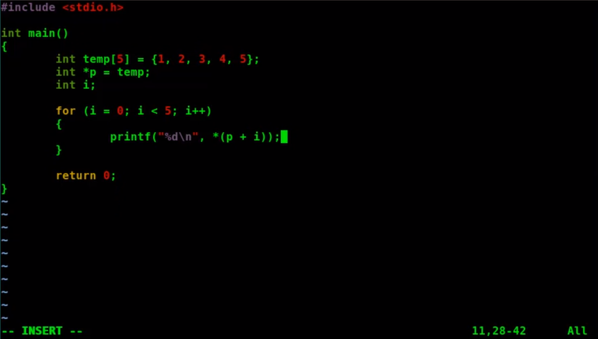

所以为什么这个数组指针这么麻烦, 我们之前学的时候认为指针变量p他就是指向数组的指针, 事实上他不是!!!

这个*p指向的是数组的第一个元素的地址, 事实上这是指向数组第一个元素(的地址), 而不是指向数组(的地址)

因为==数组第一个元素的地址==等于==数组名==也是等于==数组的地址== 他们虽然相等, 但是概念不同! 

因为数组是挨个存放的只需要知道第一个元素的地址然后遍历数组其他元素的过程也是没有问题的

但是这个*p指向的是一个变量, 而不是指向数组这个整体

所以我们现在学的数组指针,才是名正言顺的指向数组的指针

正确定义

```c
#include <stdio.h>
int main(){
	int temp[5]={1,2,3,4,5};
    int (*p2)[5] = &temp;
    int i;
    for(i = 0; i < 5; i++){
        printf("%d\n", *(*p2+i));
    }
    return 0;
}
```

- 数组指针是指向数组首元素地址的指针，不是指向首元素，所以要取两遍值即要两个*

## 指针和二维数组

```c
#include <stdio.h>
void main()
{
    int array[4][5] = {};
    printf("sizeof int: %d\n", sizeof(int));
    printf("array: %p\n", array);
    printf("array + 1: %p\n", array + 1);
    // sizeof int : 4
    // array : 000000000061FDC0
    // array + 1 : 000000000061FDD4
    // array表示的是社么?
    // 相减结果是14->十进制的20 -> 20个字节空间 -> 一个int元素=4字节 -> array+1 跨越了5个元素 -> array指向包含5个元素的数组的指针

    //*(array+1)的和解引用表示的是什么 array是一个指针+1后还是个指针, *()取出里面指针存的地址, 这里表示的还是一个地址是第二行第一个元素的地址
    // 解引用是社么, 取出指针存的地址
    // 语法糖array[1] == *(array+1)
    int k = 0;
    for (int i = 0; i < 4; i++)
    {
        for (int j = 0; j < 5; j++)
        {

            array[i][j] = k++;
            printf("%d ", array[i][j]);
        }
        printf("\n");
    }
    printf("*(array + 1): %p\n", *(array + 1));
    printf("array[1]: %p\n", array[1]);
    printf("&array[1][0]: %p\n", &array[1][0]);
    printf("**(array+1): %d\n", array[1][0]);
    printf("array[1][0]: %d\n", array[1][0]);
    // *(array + 1): 000000000061FDC4
    // array[1] : 000000000061FDC4
    // &array[1][0] : 000000000061FDC4
    // **(array+1) : 5
    // array[1][0] : 5

    //*(*(array + 1) + 3)又是什么
    printf("*(*(array + 1)+3): %p\n", &*(*(array + 1) + 3));
    printf("array[1][3]: %p\n", &array[1][3]);
}
```


结论

*是取值运算符, 给一个地址, 就给你取出那个地址的数据(把你存的取出来);

每一个变量都有 地址与值 的概念, 运行时可以理解成变量的位置变成了地址!

 *指针 把指针存的地址取出来 *普通变量 把普通变量的值取出来

&是取地址符, 可以理解为被它修饰的变量, 不去取出地址对应的值, 而是直接返回地址

二维数组本质上是一维数组的线性扩展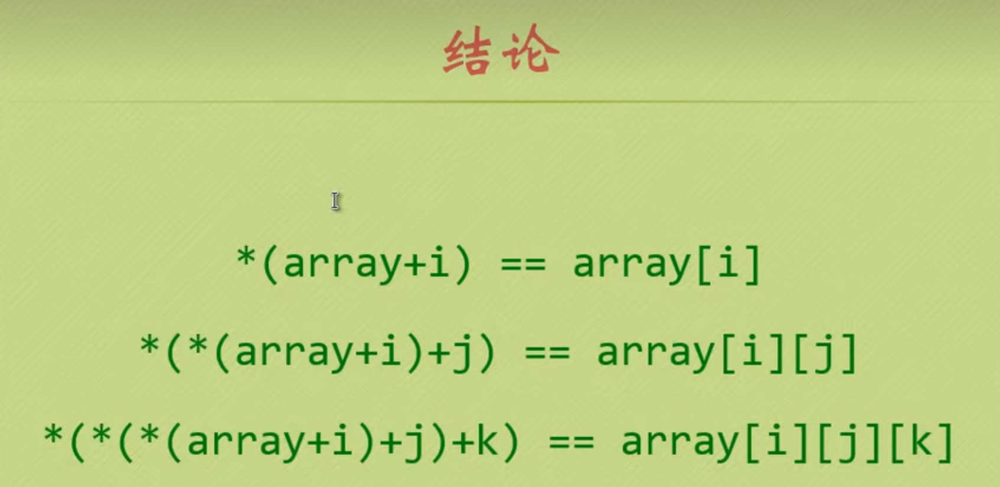

### 数组指针和二维数组

初始化二维数组是可以偷懒的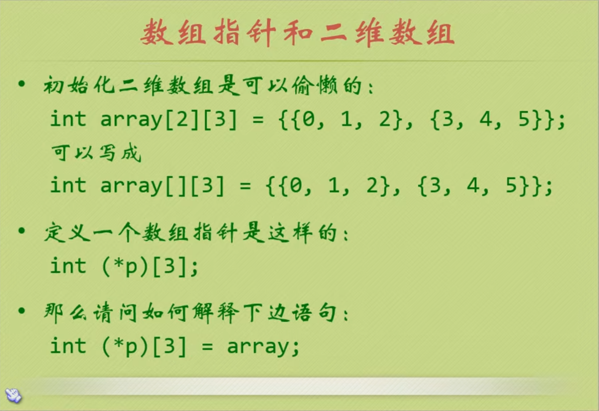

```c
int array[2][3] = { {0, 1, 2},
                        {3, 4, 5} };

int (*p)[3] = array;

printf("**(p+1): %d\n", **(p+1));
printf("**(array+1): %d\n", **(array+1));
printf("array[1][0]: %d\n", array[1][0]);
printf("*(*(p+1)+2): %d\n", *(*(p + 1) + 2));
printf("*(*(array+1)+2): %d\n", *(*(array + 1) + 2));
printf("array[1][2]: %d\n", array[1][2]);
// **(p + 1) : 3
//  **(array + 1) : 3 
// array[1][0] : 3 
// *(*(p + 1) + 2) : 5 
// *(*(array + 1) + 2) : 5 
// array[1][2] : 5
```


## void指针和NULL指针

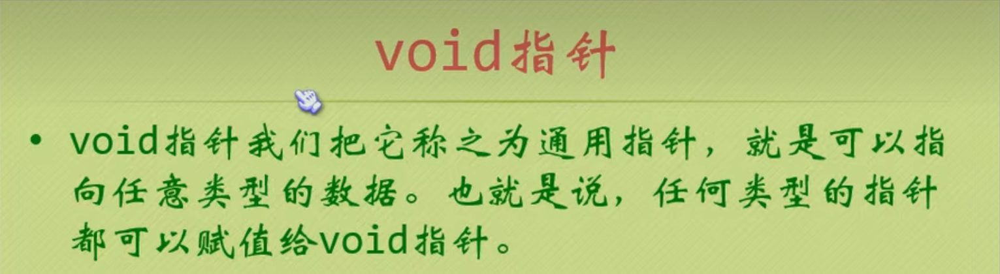

- 类型强制转换 (类型 *)指针     容易出错,比如如果你把char转成int, 编译器不会给你报错, 但是运行不起来
- 不要对void指针进行解引用
- 字符串在c语言中有一个特殊约定, 只需要指向这个字符串的起始地址, 它就会一个字节一个字节读下去直到读到`\0`为止

NULL指针

如果一个指针不指向任何数据, 称之为空指针, 用NULL表示, NULL其实是宏定义#define NULL ((void *)0) 把0定义成一个指针, 如果一个指针指向NULL 表示该指针不指向任何东西

如果你不知道这个指针指向哪里, 可以先指向NULL; 因为你写了一个指针却不给初始值, 编译器会给你分配随机地址作为你的值, 这类指针成为野指针(迷途指针); 如果指向合法地址, 又进行解引用,会发生意想不到的bug