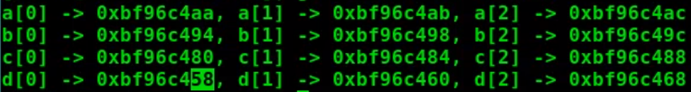

## 指针

普通变量存的是数值，同时这个变量有一个独一无二的地址。访问变量都只是访问数值，除非你用取地址符拿到的才是地址

指针变量存的是地址


定义指针变量: `类型名 *指针变量名` 例如 int *p;

如果需要获取某个变量的地址,可以使用取地址运算符`&`

如果需要访问指针变量指向的数据, 可以使用取值运算符`*`

避免访问未初始化的指针

## 指针与数组

### 两者关系

- 指针和数组关系密切但不是相等关系

### 数组的本质

- 输入流sanf时, 如果你要将读到的值给某一个变量, 你需要&取址运算符修饰; 数组抑或是字符数组不需要&修饰就可以完成相同功能

- 数组名其实是数组第一个元素的地址; 数组元素的内存地址是紧密排列在一起的有序

例如

数组是一口气向操作系统申请了很多内存

char a[] = "FishC";长度为5,会向操作系统一口气申请5个连续char空间占用==5*sizeof(char)=1个字节==

每一个空间类似于以下的表格, 每一行就代表占用一个字节

| 地址   | char空间 |
| :----- | :------- |
| 0x1000 | F        |
| 0x1001 | i        |
| 0x1002 | s        |
| 0x1003 | h        |
| 0x1004 | C        |

int b[5] = {1,2,3,4,5};长度为5,会向操作系统一口气申请5个连续int空间占用==5*sizeof(int)=4个字节==

| 地址        | int空间           |
| ----------- | ----------------- |
| 0x1000      | 1                 |
| 0x1001      | 1所占用的其余空间 |
| 0x1002      | 1所占用的其余空间 |
| 0x1003      | 1所占用的其余空间 |
| 0x1004      | 2                 |
| 0x1005      | 2所占用的其余空间 |
| 0x1006      | 2所占用的其余空间 |
| 0x1007      | 2所占用的其余空间 |
| ...以此类推 | ...以此类推       |

float c[5] = {1.1, 2.2, 3.3, 4.4, 5.5};长度为5,会向操作系统一口气申请5个连续float空间占用==5*sizeof(float)=4个字节== 

double d[5] = {1.1, 2.2, 3.3, 4.4, 5.5};长度为5,会向操作系统一口气申请5个连续double空间占用==5*sizeof(double)=8个字节==

输出

### 指针指向数组

- 新的方式取数组元素, `*(数组指针+1) 等价于 arr[1]` ==注意默认的指针指向数组第一个元素的地址== 

- 如果用一个指针指向数组应该怎么做呢?

```c
//a是数组名也就是数组第一个元素的地址
char *p;
p = a;
p = &a[0];
```

### 指针运算

- 当指针指向数组元素的时候，我们可以对指针变量进行加减运算，这样做的意义相当于指向距离指针所在位置向前或向后第n个元素。

- 对比标准的下标法访问数组元素，这种使用指针进行间接访问的方法叫做指针法。

- 需要郑重强调的是: p+1并不是简单地将地址加1而是指向数组的下一个元素。

  ```c
  //为什么编译器这么聪明呢?
  //其实是因为你已经告诉编译器了
  char *p = arr; //你告诉他一个单位是1字节 char
  int *p = arr; //你告诉他一个单位是4个字节 int
  //这样编译器就知道p+几, 再给地址做加法的时候实际上加的是几个单位的积(几*单位)
  ```

  

## 指针数组和数组指针

指针和数组到底有什么区别

>左值是地址且可以改变，数组地址不可以改变，所以他不是左值，右值是操作数据可以改变

数组名只是一个地址常量, 不是左值

指针是左值

### 什么是指针数组和数组指针


注意从运算符优先级来分辩, *取值运算符优先级是2, [ ]数组下标运算符优先级是1, ()运算符优先级也是1;

1优先级的结合性是左->右

2优先级的结合性是右->左


#### 指针数组

指针数组是一个数组, 其元素全为指针(数组元素全为指针的数组称为指针数组)

正确定义


指向字符指针就非常实用了  %s输出的是字符串......这里每个P1[ ]相当于一个一维数组。所以他们的名字代表首地址，不需要&

#### 数组指针

数组指针是一个指针, 他指向的是一个数组

错误定义

数组名不就是数组的第一个元素的地址吗? 你指针变量要的不就是地址吗?怎么就不一致了

来让我们回忆一下是如何将==指针指向数组==的, 我们是不是这样写的,这样是对的

所以为什么这个数组指针这么麻烦, 我们之前学的时候认为指针变量p他就是指向数组的指针, 事实上他不是!!!

这个*p指向的是数组的第一个元素的地址, 事实上这是指向数组第一个元素(的地址), 而不是指向数组(的地址)

因为==数组第一个元素的地址==等于==数组名==也是等于==数组的地址== 他们虽然相等, 但是概念不同! 

因为数组是挨个存放的只需要知道第一个元素的地址然后遍历数组其他元素的过程也是没有问题的

但是这个*p指向的是一个变量, 而不是指向数组这个整体

所以我们现在学的数组指针,才是名正言顺的指向数组的指针

正确定义

```c
#include <stdio.h>
int main(){
	int temp[5]={1,2,3,4,5};
    int (*p2)[5] = &temp;
    int i;
    for(i = 0; i < 5; i++){
        printf("%d\n", *(p2+i));
    }
    return 0;
}
```

- 数组指针是指向数组首元素地址的指针，不是指向首元素，所以要取两遍值即要两个*