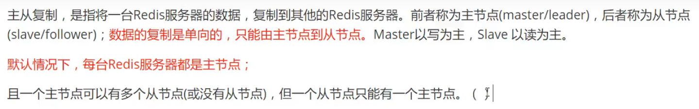
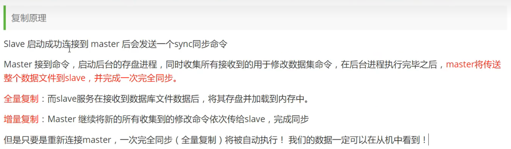

## Redis 启停

- 宝塔
- ps aux | grep 和 kill -9

## 异常处理

- NOAUTH Authentication required.

  去配置文件搜requirepass 密码

  然后需要auth命令或者设置密码

- 阿里云端口， 防火墙都要放行端口

## 配置允许远程连接

```
# 允许任何主机连接、访问
bind 127.0.0.1 改为 bind 0.0.0.0
 
# 关闭保护模式
protected-mode yes 改为 protected-mode no
 
# 允许启动后在后台运行，即关闭命令行窗口后仍能运行
daemonize no 改为 daemonize yes
```

## windows命令行远程连接

```bash
redis-cli -h 120.79.139.31
auth [password]
```

## 切换/查看数据库指令

```bash
//切换数据库
select [0,1,2...]
//查看数据库
第一个数据库是不会显示的 120.79.139.31:6379>
其他的会显示为 120.79.139.31:6379[1]>
```

## 控制台消息清除

```bash
clear
```


## Redis命令

```bash
set key value
get key
move key db
del key
keys *
expire key seconds
ttl key
flushall
flushdb //清除当前数据库的数据
exists key
type key
```

### 字符串

```bash
append key value
strlen key
-- 自增
incr key
decr key
incrby key 10
decrby key 10
-- 截取字符串
getrange key start end
setrange key offset value
-- setex 设置键过期时间，setnx 如果不存在就设置
setex key seconds value
setnx key value
-- 批量设置
mset k1 v1 k2 v2 ...
-- :
set user:1:name root 
-- 获取旧值然后设置新值
getset key value
```

### List

使用场景：可以作为栈，队列，阻塞队列（出口入口相同 则为栈  出口入口不同 则为队列）

```bash
所有的list命令都以l开头或者r开头
end可以是-1, 表示最后一个
lpush表示从左边给list添加元素
lrange表示从左边开始遍历list

lpush list 1
lrange key start end

lpop list
rpop list
//通过下标获取值
lindex list 0
//获取list的长度
llen list
//移除n个指定的元素
lrem list n one
//截取下标1开始,终点下标为2作为新的list(改变了原来的list)
ltrim list 1 2

//移除列表最后一个元素添加到另一个数组种
rpoplpush mylist myotherlist 

//设置list第0索引为item(理解成更新操作,如果list和下标不存在都会报错)
lset list 0 item

//
linsert list before "world" "other"
```

### Set

```bash
//给set添加元素
sadd set ""
//查看set的所有成员
smembers set
//是否在set中存在world
sismember set world
//获取长度
scard set
//移除set中的hello元素
srem set hello
//随机抽出一个元素
srandmember set
//随机移除一个元素
spop set
//移动hello元素,从myset到otherset
smove myset otherset hello
//差集找出不同的
sdiff key1 key2
//交集
sinter key1 key2
//并集
sunion key1 key2 
```

### Hash

>hset myhash key重复的话 后面写的会覆盖前面写的val

```bash
//添加一个键值对
hset myhash field1 kuangshen
//获取值
hget myhash field1
//同时多个键值对
hmset myhash field1 hello field2 world
//同时取多个键值对
hmget myhash field1 field2
//获取所有的键值对
hgetall myhash
//删除
hdel myhash field1
//获取hash的长度
hlen
//判断某个字段是否存在
hexists myhash field1
//只获得所有的key
hkeys myhash
//只获得所有的value
hvals myhash
//value是数字时, 给他自增多少
hincrby myhash field1 5
//不存在则创建
hsetnx myhash field1 hello
```

### Zset

```bash
//添加一个/多个zset元素, 数组是用于排序的标记
zadd myset 1 one
zadd myset 2 two 3 three
//排序从小到大
zrangebyscore myset -inf +inf
//倒序从大到小
zrevrange myset 0 -1
//遍历部分的zset/切片
zrange salary 0 -1
//获取有序集合中的个数
zcard salary
//获取指定区间的成员数量
zcount myset 1 3
```

### Geospatial

```
用于计算地理空间
当你给定好两个点的经纬度，redis可以算出这两点的距离
```

### Hyperloglog

```
用于计算基数！
比如网页的UV(一个人访问一个网站多次,但是还是算作一个人)
```

### Bitmaps

```
用于统计用户信息，活跃，不活跃，登录，未登录，打卡，365打卡两个状态的都可以用bitmaps
位图数据结构，操作二进制位来进行记录，只有0和1两个状态
```

## Redis事务

redis事务本质：一组命令的集合！一个事务中所有的命令都会被序列化，在事务执行过程中，会按照顺序执行


- redis单条命令是保证原子性的，事务不保证原子性

- Redis事务没有隔离级别的概念

- 所有的命令在事务中，并没有立马执行，只要发起执行命令才会执行


事务步骤

1. 开启事务
2. 命令入队
3. 执行事务

事务命令

multi

exec

discard

## Redis乐观锁

悲观锁：做什么都会加锁

乐观锁：

- 认为什么时候都不会出问题，所以不会上锁，更新数据的时候取判断一下，再次期间是否有人修改过这个数据 version
- 获取version
- 更新时比较version

监视命令 watch unwatch

```
watch money 
multi
decrby money 10
incrby out 10
exec # 执行之前，如果有另一个线程取修改了money，watch比较version失败，事务会自动取消/执行失败
```

如果事务的命令失败, unwatch一下, 再重新watch一下


## Jedis

导入

```
<dependency>
    <groupId>redis.clients</groupId>
    <artifactId>jedis</artifactId>
    <version>3.0.1</version>
</dependency>
```

使用

```
public static void main(String[] args) {
        //连接redis
        Jedis jedis = new Jedis("127.0.0.1", 6379);
        System.out.println(jedis.ping());
        //Jedis所有的方法都是之前的redis命令！！！

        //验证密码
        jedis.auth("");
        //开启事务
        Transaction multi = jedis.multi();
        jedis.watch("");
        multi.exec();
    }
```


## springboot整合 自定义RedisTemplate

1. 导入

```
<dependency>
    <groupId>org.springframework.boot</groupId>
    <artifactId>spring-boot-starter-data-redis</artifactId>
</dependency>
```

说明在springboot2.x之后, 原来使用jedis被替换为了lettuce

jedis: 采用直连, 多个线程操作的话,是不安全的, 如果要避免不安全,使用jedispool连接池 BIO

lettuce: 采用netty, 实例可以在多个线程中进行共享, 不存在线程不安全的情况

2. 书写配置

```
//1.Springboot 所有的配置类，都有一个自动配置类，RedisAutoConfiguration
//自动配置类都会绑定一个properties配置文件 RedisProperties
//2.@ConditionOnMissingBean(name="redisTemplate")
//如果没有这个名字的实例, 则会创建springboot默认的redistemplate对象
//3.配置redis
spring.redis.host=127.0.0.1
spring.redis.port=6379
```

3. 操作redis

```
@Resource
private RedisTemplate redisTemplate

test(){
	//opsForList
	//opsForSet
	//opsForHash
	//opsForZset
	//opsForGeo
	//opsForHyperLoglog
	redisTemplate.opsForValue()
	
}
```

4. 序列化配置 (编写自己的RedisTemplate)

```
//为什么要序列化: 当你需要通过媒介(网络)传输对象时, 对象不能直接传输, 需要序列化
//什么是序列化:
当你的pojo类去实现Serializable接口时, 当你去传输pojo对象时, 会把他进行序列化操作
//序列化操作有默认的jdk的序列化, 有json的序列化(开发一般使用json的序列化)
我们需要指定序列化方式
//小细节, 如果是jdk的序列化方式, keys * 在命令行是会有转义字符的!
```

### ==自己定义的RedisTemplate==

```java
@Bean
@ConditionalOnSingleCandidate
    public RedisTemplate<String, Object > myRedisTemplate(RedisConnectionFactory redisConnectionFactory) {
        RedisTemplate<String, Object> template = new RedisTemplate<>();
        template.setConnectionFactory(redisConnectionFactory);
        //序列化配置
        Jackson2JsonRedisSerializer jackson2JsonRedisSerializer = new Jackson2JsonRedisSerializer(Object.class);
        ObjectMapper om = new ObjectMapper();
        om.setVisibility(PropertyAccessor.ALL, JsonAutoDetect.Visibility.ANY);
        om.activateDefaultTyping(LaissezFaireSubTypeValidator.instance, ObjectMapper.DefaultTyping.NON_FINAL);
        jackson2JsonRedisSerializer.setObjectMapper(om);
        //String 的序列化方式
        StringRedisSerializer stringRedisSerializer = new StringRedisSerializer();
        //key 采用String的序列化方式
        template.setKeySerializer(stringRedisSerializer);
        //hash的key 采用String的序列化方式
        template.setHashKeySerializer(stringRedisSerializer);
        //value 采用jackon的序列化方式
        template.setValueSerializer(jackson2JsonRedisSerializer);
        //hash的value 采用jackon的序列化方式
        template.setHashValueSerializer(jackson2JsonRedisSerializer);
        template.afterPropertiesSet();
        return template;
    }
```

### ==封装RedisUtil==

```java
import org.springframework.beans.factory.annotation.Autowired;
import org.springframework.data.redis.core.*;
import org.springframework.stereotype.Component;

import java.util.*;
import java.util.concurrent.TimeUnit;

/**
 * @author 徐一杰
 * @date 2022/4/3
 * @description 对RedisTemplate进行封装
 */
@Component
@SuppressWarnings({"unchecked", "rawtypes"})
public class RedisUtils {

	@Autowired
    private RedisTemplate redisTemplate;

    /**
     * 根据key 获取过期时间
     *
     * @param key 键 不能为null
     * @return 时间(秒) 返回0代表为永久有效，-2代表键不存在
     */
    public <K> long getExpireTime(K key) {
        Long expire = redisTemplate.getExpire(key, TimeUnit.SECONDS);
        if (expire != null) {
            return expire;
        }
        return -2;
    }

    /**
     * 指定缓存失效时间
     *
     * @param key        键
     * @param expireTime 时间(秒)
     */
    public <K> void setExpireTime(K key, long expireTime) {
        try {
            if (expireTime > 0) {
                redisTemplate.expire(key, expireTime, TimeUnit.SECONDS);
            }
        } catch (Exception e) {
            e.printStackTrace();
        }
    }

    /**
     * 移除指定 key 的过期时间
     *
     * @param key 键
     */
    public <K> void removeExpireTime(K key) {
        redisTemplate.boundValueOps(key).persist();
    }

    /**
     * 获取缓存中所有的键
     *
     * @param key 键
     * @return 缓存中所有的键
     */
    public <K> Set<K> keys(K key) {
        return redisTemplate.keys(key);
    }

    /**
     * 判断key是否存在
     *
     * @param key 键
     * @return true 存在 false不存在
     */
    public <K> boolean hasKey(K key) {
        try {
            return Boolean.TRUE.equals(redisTemplate.hasKey(key));
        } catch (Exception e) {
            e.printStackTrace();
            return false;
        }
    }

    /**
     * 根据key删除缓
     *
     * @param keys 键
     */
    public <K> void delete(Collection<K> keys) {
        redisTemplate.delete(keys);
    }

    /**
     * 设置分布式锁
     *
     * @param key     键，可以用用户主键
     * @param value   值，可以传requestId，可以保证锁不会被其他请求释放，增加可靠性
     * @param expire  锁的时间(秒)
     * @return 设置成功为 true
     */
    public <K, V> Boolean setNx(K key, V value, long expire) {
        return redisTemplate.opsForValue().setIfAbsent(key, value, expire, TimeUnit.SECONDS);
    }

    /**
     * 设置分布式锁，有等待时间
     *
     * @param key     键，可以用用户主键
     * @param value   值，可以传requestId，可以保证锁不会被其他请求释放，增加可靠性
     * @param expire  锁的时间(秒)
     * @param timeout 在timeout时间内仍未获取到锁，则获取失败
     * @return 设置成功为 true
     */
    public <K, V> Boolean setNx(K key, V value, long expire, long timeout) {
        long start = System.currentTimeMillis();
        //在一定时间内获取锁，超时则返回错误
        for (; ; ) {
            // 获取到锁，并设置过期时间返回true
            if (Boolean.TRUE.equals(redisTemplate.opsForValue().setIfAbsent(key, value, expire, TimeUnit.SECONDS))) {
                return true;
            }
            //否则循环等待，在timeout时间内仍未获取到锁，则获取失败
            if (System.currentTimeMillis() - start > timeout) {
                return false;
            }
        }
    }

    /**
     * 释放分布式锁
     * @param key 锁
     * @param value 值，可以传requestId，可以保证锁不会被其他请求释放，增加可靠性
     * @return 成功返回true, 失败返回false
     */
    public <K, V> boolean releaseNx(K key, V value) {
        Object currentValue = redisTemplate.opsForValue().get(key);
        if (String.valueOf(currentValue) != null && value.equals(currentValue)) {
            return Boolean.TRUE.equals(redisTemplate.opsForValue().getOperations().delete(key));
        }
        return false;
    }

    /***********      String 类型操作           **************/
    /**
     * 普通缓存放入
     *
     * @param key   键
     * @param value 值
     */
    public <K, V> void set(K key, V value) {
        try {
            redisTemplate.opsForValue().set(key, value);
        } catch (Exception e) {
            e.printStackTrace();
        }
    }

    /**
     * 普通缓存放入并设置时间
     *
     * @param key   键
     * @param value 值
     * @param time  时间(秒) time要大于0 如果time小于等于0 将设置无限期
     */
    public <K, V> void set(K key, V value, long time) {
        try {
            if (time > 0) {
                redisTemplate.opsForValue().set(key, value, time, TimeUnit.SECONDS);
            } else {
                redisTemplate.opsForValue().set(key, value);
            }
        } catch (Exception e) {
            e.printStackTrace();
        }
    }

    /**
     * value增加值
     *
     * @param key    键
     * @param number 增加的值
     * @return 返回增加后的值
     */
    public Long incrBy(String key, long number) {
        return (Long) redisTemplate.execute((RedisCallback<Object>) connection -> connection.incrBy(key.getBytes(), number));
    }

    /**
     * value减少值
     *
     * @param key    键
     * @param number 减少的值
     * @return 返回减少后的值
     */
    public Long decrBy(String key, long number) {
        return (Long) redisTemplate.execute((RedisCallback<Object>) connection -> connection.decrBy(key.getBytes(), number));
    }

    /**
     * 根据key获取value
     *
     * @param key 键
     * @return 返回值
     */
    public <K, V> V get(K key) {
        BoundValueOperations<K, V> boundValueOperations = redisTemplate.boundValueOps(key);
        return boundValueOperations.get();
    }

    /***********      list 类型操作           **************/

    /**
     * 将value从右边放入缓存
     *
     * @param key   键
     * @param value 值
     */
    public <K, V> void listRightPush(K key, V value) {
        ListOperations<K, V> listOperations = redisTemplate.opsForList();
        //从队列右插入
        listOperations.rightPush(key, value);
    }

    /**
     * 将value从左边放入缓存
     *
     * @param key   键
     * @param value 值
     */
    public <K, V> void listLeftPush(K key, V value) {
        ListOperations<K, V> listOperations = redisTemplate.opsForList();
        //从队列右插入
        listOperations.leftPush(key, value);
    }

    /**
     * 将list从右边放入缓存
     *
     * @param key   键
     * @param value 值
     */
    public <K, V> void listRightPushAll(K key, List<V> value) {
        try {
            redisTemplate.opsForList().rightPushAll(key, value);
        } catch (Exception e) {
            e.printStackTrace();
        }
    }

    /**
     * 将list从左边放入缓存
     *
     * @param key   键
     * @param value 值
     */
    public <K, V> void listLeftPushAll(K key, List<V> value) {
        try {
            redisTemplate.opsForList().leftPushAll(key, value);
        } catch (Exception e) {
            e.printStackTrace();
        }
    }

    /**
     * 通过索引 获取list中的值
     *
     * @param key   键
     * @param index 索引 index>=0时， 0 表头，1 第二个元素，依次类推；index<0时，-1，表尾，-2倒数第二个元素，依次类推
     * @return 返回列表中的值
     */
    public <K, V> V listGetWithIndex(K key, long index) {
        ListOperations<K, V> listOperations = redisTemplate.opsForList();
        return listOperations.index(key, index);
    }

    /**
     * 从list左边弹出一条数据
     *
     * @param key 键
     * @return 队列中的值
     */
    public <K, V> V listLeftPop(K key) {
        ListOperations<K, V> listOperations = redisTemplate.opsForList();
        return listOperations.leftPop(key);
    }

    /**
     * 从list左边定时弹出一条
     *
     * @param key     键
     * @param timeout 弹出时间
     * @param unit    时间单位
     * @return 队列中的值
     */
    public <K, V> V listLeftPop(K key, long timeout, TimeUnit unit) {
        ListOperations<K, V> listOperations = redisTemplate.opsForList();
        return listOperations.leftPop(key, timeout, unit);
    }

    /**
     * 从list右边弹出一条数据
     *
     * @param key 键
     * @return 队列中的值
     */
    public <K, V> V listRightPop(K key) {
        ListOperations<K, V> listOperations = redisTemplate.opsForList();
        return listOperations.rightPop(key);
    }

    /**
     * 从list左边定时弹出
     *
     * @param key     键
     * @param timeout 弹出时间
     * @param unit    时间单位
     * @return 队列中的值
     */
    public <K, V> V listRightPop(K key, long timeout, TimeUnit unit) {
        ListOperations<K, V> listOperations = redisTemplate.opsForList();
        return listOperations.leftPop(key, timeout, unit);
    }

    /**
     * 获取list缓存的内容
     *
     * @param key   键
     * @param start 开始下标
     * @param end   结束下标  0 到 -1 代表所有值
     * @return list内容
     */
    public <K, V> List<V> listRange(K key, long start, long end) {
        try {
            ListOperations<K, V> listOperations = redisTemplate.opsForList();
            return listOperations.range(key, start, end);
        } catch (Exception e) {
            e.printStackTrace();
            return null;
        }
    }

    /**
     * 获取list缓存的长度
     *
     * @param key 键
     * @return list长度
     */
    public <K> long listSize(K key) {
        Long size = redisTemplate.opsForList().size(key);
        return Objects.requireNonNullElse(size, 0).longValue();
    }

    /**
     * 根据索引修改list中的某条数据
     *
     * @param key   键
     * @param index 下标
     * @param value 值
     */
    public <K, V> void listSet(K key, long index, V value) {
        try {
            redisTemplate.opsForList().set(key, index, value);
        } catch (Exception e) {
            e.printStackTrace();
        }
    }

    /**
     * 从lit中移除N个值为value的值
     *
     * @param key   键
     * @param count 移除多少个
     * @param value 值
     * @return 移除的个数
     */
    public <K, V> long listRemove(K key, long count, V value) {
        Long count1 = redisTemplate.opsForList().remove(key, count, value);
        if (count1 != null) {
            return count1;
        }
        return 0;
    }

    /***********      hash 类型操作           **************/

    /**
     * 根据key和键获取value
     *
     * @param key  键 不能为null
     * @param item 项 不能为null
     * @return 值
     */
    public <K, HK, HV> HV hashGet(K key, String item) {
        HashOperations<K, HK, HV> hashOperations = redisTemplate.opsForHash();
        return hashOperations.get(key, item);
    }

    /**
     * 获取key对应的所有键值
     *
     * @param key 键
     * @return 对应的多个键值
     */
    public <K, HK, HV> Map<HK, HV> hashMGet(K key) {
        HashOperations<K, HK, HV> hashOperations = redisTemplate.opsForHash();
        return hashOperations.entries(key);
    }

    /**
     * 添加map到hash中
     *
     * @param key 键
     * @param map 对应多个键值
     */
    public <K> void hashMSet(K key, Map<String, Object> map) {
        try {
            redisTemplate.opsForHash().putAll(key, map);
        } catch (Exception e) {
            e.printStackTrace();
        }
    }

    /**
     * 添加map到hash中，并设置过期时间
     *
     * @param key        键
     * @param map        对应多个键值
     * @param expireTime 时间(秒)
     */
    public <K> void hashMSet(K key, Map<String, Object> map, long expireTime) {
        try {
            redisTemplate.opsForHash().putAll(key, map);
            if (expireTime > 0) {
                redisTemplate.expire(key, expireTime, TimeUnit.SECONDS);
            }
        } catch (Exception e) {
            e.printStackTrace();
        }
    }

    /**
     * 向hash表中放入一个数据
     *
     * @param key   键
     * @param hKey  map 的键
     * @param value 值
     */
    public <K, HK, HV> void hashPut(K key, HK hKey, HV value) {
        try {
            HashOperations<K, HK, HV> hashOperations = redisTemplate.opsForHash();
            hashOperations.put(key, hKey, value);
        } catch (Exception e) {
            e.printStackTrace();
        }
    }

    /**
     * 向hash表中放入一个数据，并设置过期时间
     *
     * @param key        键
     * @param hKey       map 的键
     * @param value      值
     * @param expireTime 时间(秒) 注意:如果已存在的hash表有时间,这里将会替换原有的时间
     */
    public <K, HK, HV> void hashPut(K key, HK hKey, HV value, long expireTime) {
        try {
            redisTemplate.opsForHash().put(key, hKey, value);
            if (expireTime > 0) {
                redisTemplate.expire(key, expireTime, TimeUnit.SECONDS);
            }
        } catch (Exception e) {
            e.printStackTrace();
        }
    }

    /**
     * 判断hash表中是否有该项的值
     *
     * @param key  键 不能为null
     * @param hKey map 的键 不能为null
     * @return true 存在 false不存在
     */
    public <K, HK, HV> boolean hashHasKey(K key, HK hKey) {
        HashOperations<K, HK, HV> hashOperations = redisTemplate.opsForHash();
        return hashOperations.hasKey(key, hKey);
    }

    /**
     * 取出所有 value
     *
     * @param key 键
     * @return map 中所有值
     */
    public <K, HK, HV> List<HV> hashValues(K key) {
        HashOperations<K, HK, HV> hashOperations = redisTemplate.opsForHash();
        return hashOperations.values(key);
    }

    /**
     * 取出所有 hKey
     *
     * @param key 键
     * @return map 所有的键
     */
    public <K, HK, HV> Set<HK> hashHKeys(K key) {
        HashOperations<K, HK, HV> hashOperations = redisTemplate.opsForHash();
        return hashOperations.keys(key);
    }

    /**
     * 删除hash表中的键值，并返回删除个数
     *
     * @param key      键
     * @param hashKeys 要删除的值的键
     * @return 删除个数
     */
    public <K, HK, HV> Long hashDelete(K key, Object... hashKeys) {
        HashOperations<K, HK, HV> hashOperations = redisTemplate.opsForHash();
        return hashOperations.delete(key, hashKeys);
    }

    /***********      set 类型操作           **************/
    /**
     * 将数据放入set缓存
     *
     * @param key    键
     * @param values 值 可以是多个
     */
    public <K, V> void setAdd(K key, V... values) {
        redisTemplate.opsForSet().add(key, values);
    }

    /**
     * 将set数据放入缓存，并设置过期时间
     *
     * @param key        键
     * @param expireTime 时间(秒)
     * @param values     值 可以是多个
     */
    public <K, V> void setAdd(K key, long expireTime, V... values) {
        redisTemplate.opsForSet().add(key, values);
        if (expireTime > 0) {
            redisTemplate.expire(key, expireTime, TimeUnit.SECONDS);
        }
    }

    /**
     * 获取set缓存的长度
     *
     * @param key 键
     * @return set缓存的长度
     */
    public <K> long setSize(K key) {
        Long size = redisTemplate.opsForSet().size(key);
        if (size != null) {
            return size;
        }
        return 0;
    }

    /**
     * 根据key获取Set中的所有值
     *
     * @param key 键
     * @return Set中的所有值
     */
    public <K, V> Set<V> setValues(K key) {
        SetOperations<K, V> setOperations = redisTemplate.opsForSet();
        return setOperations.members(key);
    }

    /**
     * 根据value从一个set中查询,是否存在
     *
     * @param key   键
     * @param value 要查询的值
     * @return true 存在 false不存在
     */
    public <K, V> boolean setHasKey(K key, V value) {
        return Boolean.TRUE.equals(redisTemplate.opsForSet().isMember(key, value));
    }

    /**
     * 根据value删除，并返回删除的个数
     *
     * @param key   键
     * @param value 要删除的值
     * @return 删除的个数
     */
    public <K, V> Long setDelete(K key, Object... value) {
        SetOperations<K, V> setOperations = redisTemplate.opsForSet();
        return setOperations.remove(key, value);
    }

    /***********      zset 类型操作           **************/
    /**
     * 在 zset中插入一条数据
     *
     * @param key   键
     * @param value 要插入的值
     * @param score 设置分数
     */
    public <K, V> void zSetAdd(K key, V value, long score) {
        ZSetOperations<K, V> zSetOperations = redisTemplate.opsForZSet();
        zSetOperations.add(key, value, score);
    }

    /**
     * 得到分数在 score1，score2 之间的值
     *
     * @param key    键
     * @param score1 起始分数
     * @param score2 终止分数
     * @return 范围内所有值
     */
    public <K, V> Set<V> zSetValuesRange(K key, long score1, long score2) {
        ZSetOperations<K, V> zSetOperations = redisTemplate.opsForZSet();
        return zSetOperations.range(key, score1, score2);
    }

    /**
     * 根据value删除，并返回删除个数
     *
     * @param key   键
     * @param value 要删除的值，可传入多个
     * @return 删除个数
     */
    public <K, V> Long zSetDeleteByValue(K key, Object... value) {
        ZSetOperations<K, V> zSetOperations = redisTemplate.opsForZSet();
        return zSetOperations.remove(key, value);
    }

    /**
     * 根据下标范围删除，并返回删除个数
     *
     * @param key   键
     * @param size1 起始下标
     * @param size2 结束下标
     * @return 删除个数
     */
    public <K, V> Long zSetDeleteRange(K key, long size1, long size2) {
        ZSetOperations<K, V> zSetOperations = redisTemplate.opsForZSet();
        return zSetOperations.removeRange(key, size1, size2);
    }

    /**
     * 删除分数区间内元素，并返回删除个数
     *
     * @param key    键
     * @param score1 起始分数
     * @param score2 终止分数
     * @return 删除个数
     */
    public <K, V> Long zSetDeleteByScore(K key, long score1, long score2) {
        ZSetOperations<K, V> zSetOperations = redisTemplate.opsForZSet();
        return zSetOperations.removeRangeByScore(key, score1, score2);
    }

}
```


## Redis.conf配置详解

- 网络

  ```
  //服务器的redis, 主要改这三个公网ip, 不保护, 改端口
  bind 0.0.0.0 # 是绑定到本机的所有IP上
  protected-mode yes # 一般不保护
  port 6379
  ```

- 通用

  ```conf
  daemonize yes # 以守护进程的方式进行, 默认是no. 不yes的话, 一退出redis就关掉啦
  pidfile # 如果以后台的方式运行，需要指定一个进程文件
  loglevel notice
  logfile "" # 日志文件的位置
  databases 16 # 数据库的数量,默认16个
  always-show-logo yes # 启动是否显示logo
  ```

- 快照( ==持久化==用到的, 在规定时间内, 执行了多少次操作, 则会持久化到文件 )

  redis是内存数据库, 如果没有持久化, 那么数据断电就没

  ```
  save 900 1 # 如果900秒内, 如果至少有 1个key进行了修改, 我们即使进行持久化操作
  dir ./ # rdb文件保存的目录
  dbfilename dump.rdb # rdb文件名
  stop-writes-on-bgsave-error yes # 持久化出错是否继续工作
  rdbcompression yes # 是否压缩rdb文件,需要消耗一些cpu资源
  rdbchecksum yes # 保存rdb文件的时候, 进行错误的检查校验
  ```

- REPLICATION 主从复制相关的

  ```
  info replication # redis连接环境命令
  replicaof host port # 连接主机，自己作为从机
  masterauth # 主机连接redis密码
  ```

- SECURITY

  ```
  requirepass 
  # 通过命令设置
  config set requirepass ""
  # 通过命令,使用密码, 才能使用命令
  auth [password]
  ```

- CLIENTS

  ```
  maxclients 1000 # 设置能连接上redis的最大客户端的数量
  maxmemory <bytes> # 设置最大的内存容量
  maxmemory-policy noeviction # 内存到达上限之后的处理策略
  1、volatile-lru: 只对设置了过期时间的key进行LRU(默认值)
  2、allkeys-lru : 删除lru算法的key
  3、volatile-random: 随机删除即将过期key
  4、allkeys-random: 随机删除
  5、volatile-ttl : 删除即将过期的
  6、noeviction : 永不过期，返回错误
  ```

- APPEND ONLY

  ```
  appendonly no # 默认是不开启aof模式的, 默认使用rdb方式持久化,在大部分情况下rdb够用了
  appendfilename "appendonly" # aof文件名
  appendsync everysec # everysec每秒执行一次同步| always每次修改就同步 | no操作系统自己同步数据,速度最快
  配置了no-appendfsync-on-rewrite则使得在持久化过程中的操作不会被记录，提高主进程的性能（但是开了不安全）
  auto-aof-rewrite-percentage 100 #
  auto-aof-rewrite-min-size 64mb #如果aof大于64mb，fork新进程来重写文件
  ```
  
  

## Redis持久化

### RDB

>难理解的是因为没搞懂持久化的概念，所谓持久化就是讲二进制写入文件，所以写入临时文件和写入正式RDB文件都是持久化，这样就理解了
>
>默认配置已经基本够用的

- 什么时候redis会持久化生成rdb
  1. save规则满足
  2. 执行flushall命令
  3. 关机redis

- 如何恢复rdb到内存中

  1. 只需要rdb文件放在redis启动目录就可以，在当前目录下启动redis, 会自动检查dump.rdb恢复其中的数据

  2. ```
     在连接reids状态下
     config get dir #得到的就是redis启动目录
     ```

- 优点
  1. 适合大规模的数据恢复
  2. 对数据的完整性要求不高
- 缺点
  1. 需要一定时间间隔进程操作,如果当中宕机,最后一次时间间隔的数据就丢失了
  2. fork进程的时候会占用一定的内存空间

### AOF( Append Only File)

>和mysql的备份类似, 记录所有写的操作

- 什么时候触发AOF的持久化?
  1. 根据你的配置规则
- 什么时候恢复?
  1. 当你启动redis的时候会自动读取aof文件,自动恢复数据
- 存在被破坏的可能, redis提供有aof修复工具
- 优点
  1. 每一次修改都同步, 文件的完整会更好
  2. 每秒同步一次, 最坏也就会丢失一秒的数据
  3. 从不同步,效率最高
- 缺点
  1. 相对于数据文件来说, aof远远大于rdb, 恢复速度页慢于rdb
  2. aof运行效率也慢于rdb, 所有默认不开启aof

### 两者一起使用


## Redis发布订阅

发布者 频道 订阅者

- publish channel message
- subscribe channel
- unsubscribe channel


使用场景

1. 实时消息系统
2. 事实聊天
3. 订阅, 关注


## Redis主从复制



主机写, 从机读; 顺序只能这样

- 一台主机上模拟集群
  1. 端口
  2. pid文件
  3. 日志文件名字
  4. rdb文件名字

### 一主二从

默认情况下redis都是主机, 只需要把某些redis变从机即可

- 如何让redis去切换从机身份

  - ```
    slaveof host port #这是命令的
    ```

- 主机有密码的小伙伴，在从机的配置文件conf里加上：masterauth 密码

- 只有主机才可以写入, 从机写入会报错; 主机写入了数据, 从机可以读到


- 如果主机断了, 从机会怎么样吗?
  - 会保持连接,等待主机上限 => 没有写的操作了; 这是主机如果回来了, 从机又可以进行读到新写入的数据
- 从机断了, 在重新连接主机, 数据任然和主机同步


同步原理: 




连接模型

1. 一个主机对多台从机
2. 主机=>从机(有是主机又是从机, 但是只能读)=>从机


### 哨兵模式

>其实就是主从复制的升级, 主从复制主机断了,在产生一个主机变得自动了

手动: 如果主机断了, 从机可以通过`slaveof no one`使自己变成主机(哨兵没有出来之前)

1. 配置哨兵配置文件

   sentinel.conf

   ```conf
   sential monitor myredis 127.0.0.1 6379 1 #1是 只要有一个哨兵认为redis宕机了，就开始投票把MAster转给slave
   # 哨兵集群配置， 还至少需要配置端口
   ```

2. 启动哨兵


如果主机回来, 只能归到新的主机下做从机


## Redis缓存穿透和学崩( 工作常用)

缓存穿透: 没查到

​	解决方案

​		布隆过滤器

​		缓存空对象

缓存击穿: 所有人去访问热点数据, 差太多了

​	解决方案: 

​		设置热点数据永不过期

​		分布式锁( setnx ), 一个key同一时间只能1个线程访问

缓存雪崩:  缓存集中过期

​	解决方案:

​		redis高可用( 就是集群)

​		限流降级( 某个key只允许一个线程查询数据和写缓存,其他线程等待)

​		数据预热(在大量访问之前前, 将数据预先访问一遍)

## 关键词

定时删除, 惰性删除, 内存淘汰

布隆过滤器: 缓存穿透, 缓存击穿, 缓存雪崩 (过期时间均匀分布, 热点数据永不过期)

## Springboot中集成Redis步骤

1. 修改application.yml配置文件

2. 配置基本参数 host port password

3. 定义自己的RedisTemplate, @Resource(name = "指定自己的bean名")

4. 使用RedisTemplate


## 使用redis

1. 测试rdb,能不能恢复
2. 搭建伪集群看看效果
   - 搭建伪集群环境
   - 命令式认老大
   - 配置式认老大
   - 当主机挂了, 从机只可以读挂之前的数据, 当主机重新上线后, 主机和从机又可用继续正常工作, 主机新写入的数据式同步的

#### window下的redis有两个配置文件，默认使用window-service.conf

