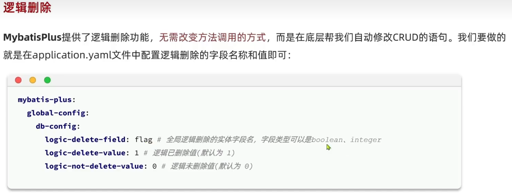

## 快速入门

快速测试注解

​	快速测试实在内存中映射了数据库， 可以理解为在内存中有了一个一模一样的数据库，所以@MybatisPlusTest测试的时候，不会对原来的数据库有修改操作！

```java
//@MybatisPlusTest
//@AutoConfigureTestDatabase(replace = AutoConfigureTestDatabase.Replace.NONE)

//@Test
//void test(){}
```

​	mybatis-plus在我没有指定@TableName的时候，居然对对应的表进行处理， 很可能是因为我的pojo名字按照了大驼峰命名和数据库中的表做到了对应；@TableName只有在实体类上才有用


​	无条件 queryWrapper可以null

​	spring

## MybatisPlus环境配置

1. 导入依赖

   ```xml
   <dependency>
       <groupId>com.baomidou</groupId>
       <artifactId>mybatis-plus-boot-starter</artifactId>
       <version>3.5.5</version>
   </dependency>
   <dependency>
       <groupId>mysql</groupId>
       <artifactId>mysql-connector-java</artifactId>
       <version>8.0.33</version>
   </dependency>
   ```

2. 配置数据库信息和mybatisplus的配置

3. 创建实体类和Mapper接口继承BaseMapper

4. 配置MapperScan扫描


## 常用设置

### 设置表映射规则(表名和实体类名之间)

>mybatisplus是如何知道操作哪个表的?
>
>就是通过你的实体类, 默认是这样的例如: TUser -> t_user, User -> user

1. 单独设置

   在实体类上加 ==@TableName("指定这实体类对应的表名")==

2. 全局设置表名前缀

   ```yml
   mybatis-plus:
    global-config:
     db-config:
     	# 表名前缀
     	table-prefix: tb_
   ```

### 设置主键生成策略

​	默认情况下, mp插入的id(如果没有传id)是通过雪花算法生成的; 分布式系统下, 自增策略就会出问题

`AUTO NONE INPUT ASSIGN_ID ASSIGN_UUID`

1. 单独设置

   在属性上加 ==`@TableId(type=IdType.AUTO)`==

2. 全局设置主键策略

   ```yml
   mybatis-plus:
    global-config:
     db-config:
      #主键策略
      id-type: auto
   ```

### 设置字段和列名的驼峰映射

>java的属性写法规范是小驼峰, 而数据库则是下划线小写连接风格
>
>mybatis通过属性去找列时, 如果没有开启驼峰映射, 会找不到数据库中的列

​	默认情况下MP会开启字段名列名的驼峰映射，即从经典数据库列名 A COLUMN (下划线命名) 到经典java属性名 aColumn (峰命名) 的类似映射。
​	如果需要关闭我们可以使用如下配置进行关闭

```yml
mybatis-plus :
 configuration:
  #是否开启自动驼峰命名规则(came1 case) 映射，即从经典数据库列名 A_COLUMN (下划线命名) 到经典Java 属性名 aColumn (驼峰命名) 的类似映射
  map-underscore-to-cameT-case: false
```

### 设置字段映射关系

>mybatisplus是通过属性名去映射列的, 当你需要手动设置 字段映射到哪个列时使用 ==@TableField==
>
>以及当你某个属性不是数据库字段时请使用==@TableField(exist=false)==

### 设置日志, 打印sql语句

```yml
mybatis-plus :
 configuration:
  log-impl: org.apache.ibatis.logging.stdout.StdOutImpl
```

## 基本使用

### Insert

```java
// 插入一条记录
int insert(T entity);
```

### Delete

```java
// 根据 entity 条件，删除记录
int delete(@Param(Constants.WRAPPER) Wrapper<T> wrapper);
// 删除（根据ID 批量删除）
int deleteBatchIds(@Param(Constants.COLLECTION) Collection<? extends Serializable> idList);
// 根据 ID 删除
int deleteById(Serializable id);
// 根据 columnMap 条件，删除记录
int deleteByMap(@Param(Constants.COLUMN_MAP) Map<String, Object> columnMap);
```

### Update

```java
// 根据 whereWrapper 条件，更新记录
int update(@Param(Constants.ENTITY) T updateEntity, @Param(Constants.WRAPPER) Wrapper<T> whereWrapper);
// 根据 ID 修改
int updateById(@Param(Constants.ENTITY) T entity);
```

### Select

```java
// 根据 ID 查询
T selectById(Serializable id);
// 根据 entity 条件，查询一条记录
T selectOne(@Param(Constants.WRAPPER) Wrapper<T> queryWrapper);

// 查询（根据ID 批量查询）
List<T> selectBatchIds(@Param(Constants.COLLECTION) Collection<? extends Serializable> idList);
// 根据 entity 条件，查询全部记录
List<T> selectList(@Param(Constants.WRAPPER) Wrapper<T> queryWrapper);
```

## 条件构造器

AbstractWrapper下有很多方法，基本上就是sql语句命令缩写或者单词

多条件默认and连接，and方法会加括号

###  常用AbstractWrapper方法

```java
/**
 * AbstractWrapper案例2
 */
@Test
public void testAbstractWrapper03() {
    QueryWrapper<User> userQueryWrapper = new QueryWrapper<>();
    userQueryWrapper.select(Arrays.asList("id", "user_name","password", "name","age","address"))
        .in("id", Arrays.asList(1,2,3))
        .gt("age", 10)
        .orderByDesc("age");
    List<User> users = userMapper.selectList(userQueryWrapper);

    LambdaQueryWrapper<Object> objectLambdaQueryWrapper = Wrappers.lambdaQuery();
    objectLambdaQueryWrapper.select();
}

/**
 * AbstractWrapper案例2
 */
@Test
public void testAbstractWrapper02() {
    QueryWrapper<User> userQueryWrapper = new QueryWrapper<>();
    //        String[] cols = {"id","user_name","password","name","age","address"};
    userQueryWrapper.select("id","user_name","password","name","age","address");
    userQueryWrapper.in("id", 1,2,3);
    userQueryWrapper.between("age",12,29);
    userQueryWrapper.like("address", "山");

    List<User> users = userMapper.selectList(userQueryWrapper);
}

/**
 * AbstractWrapper案例1
 */
@Test
public void testAbstractWrapper01(){
    QueryWrapper<User> userQueryWrapper = new QueryWrapper<>();
    userQueryWrapper.select("id","user_name", "password", "name", "age", "address");
    userQueryWrapper.gt("age", 18);
    userQueryWrapper.eq("address", "狐山");
    List<User> users = userMapper.selectList(userQueryWrapper);
}
```


### 常用QueryWrapper方法

```java
@Test
public void testSelect3(){
    QueryWrapper<User> userQueryWrapper = new QueryWrapper<>(new User());
    userQueryWrapper.select(new Predicate<TableFieldInfo>() {
        @Override
        public boolean test(TableFieldInfo tableFieldInfo) {
            return "address".equals(tableFieldInfo.getColumn());
        }
    });

    List<User> users = userMapper.selectList(userQueryWrapper);
}

@Test
public void testSelect2(){
    QueryWrapper<User> userQueryWrapper = new QueryWrapper<>();
    userQueryWrapper.select(User.class, new Predicate<TableFieldInfo>() {
        @Override
        public boolean test(TableFieldInfo tableFieldInfo) {
            return "user_name".equals(tableFieldInfo.getColumn());
        }
    });

    List<User> users = userMapper.selectList(userQueryWrapper);
}

@Test
public void testSelect1(){
    QueryWrapper<User> userQueryWrapper = new QueryWrapper<>();
    userQueryWrapper.select("id","user_name");

    List<User> users = userMapper.selectList(userQueryWrapper);
}
```


### 常用UpdateWrapper方法

```java
@Test
public void testSet(){
    UpdateWrapper<User> userUpdateWrapper = new UpdateWrapper<User>();
    userUpdateWrapper.set("age", 99)
        .gt("id", 1);
    int update = userMapper.update(userUpdateWrapper);
}
```


### Lambda条件构造器

>​	我们前面在使用条件构造器时列名都是用字符串的形式去指定。这种方式无法在编译期确定列名的合法性。
>
>​	所以MP提供了一个Lambda条件构造器可以让我们直接以实体类的方法引用的形式来指定列名。这样就可以弥补上述缺陷。

使用步骤

1. `new LambdaQueryWrapper<User>()`
2. column写方法引用!

## 自定义SQL

>自定义sql就是使用mybatis开发方式


### Mybatis方式 结合 条件构造器

和自定义方法不同的是, 有Wrapper参数, 有@Param 给参数指定名字

mp构建完的sql的片段: `wrapper对象.getCustomSqlSegment()`

1. 方法定义中添加Warpper类型的参数
   添加Warpper类型的参数，并且要注意给其指定参数名

   ```java
   @Param(Constants.WRAPPER) Wrapper<User> wrapper //到时候这个对象可以${ew}获取到
   ```

   

2. 在SQL语句中获取Warpper的SQL片段进行拼接 (必须使用==${ }==)

   ```xml
   <select id="xx" resultType="xx">
   	select * from user ${ew.customSqlSegment}
   </select>
   ```


Mybatisplus 删除的条件使用lambdaQueryWrapper


## 默认规则

其实就是假设你自己再写动态sql差不多去理解

1. 不写select()或者set()指定列, 默认全部列
2. 如果不加condition判断条件, 默认为true, 此条件必定有; 例如当你`"tyep!=null"`时,才有这条件相当于动态sql的if标签的用法
3. insert的时候, 数据是空的列, 则不会插入数据
4. @TableId, 注解的属性名是id. 就不用写


## MybatisPlus测试

1. 导入依赖

   ```xml
   <dependency>
       <groupId>com.baomidou</groupId>
       <artifactId>mybatis-plus-boot-starter</artifactId>
       <version>${mybatisplus}</version>
   </dependency>
   
    <dependency>
        <groupId>junit</groupId>
        <artifactId>junit</artifactId>
        <version>4.13.2</version>
        <scope>test</scope>
   </dependency>
   ```

2. 测试类添加两个注解

   ```
   @MybatisPlusTest
   @AutoConfigureTestDatabase(replace = AutoConfigureTestDatabase.Replace.NONE)
   @RunWith(SpringRunner.class)
   ```

3. 如果用的数据源是druid等等第三方的, 你需要在datasource下(jdbc数据源)再写一遍url username password driver-class-name

## Idea使用

debug的evaluate按钮，可以调试对象的方法


## 常用注解

@TableName @TableId @TableField


## 常用配置


## mp拓展

### 分页插件

一般使用PageHelper

PageHelper分页插件

使用步骤

- 导入依赖

```xml
<dependency>
    <groupId>com.github.pagehelper</groupId>
    <artifactId>pagehelper-spring-boot-starter</artifactId>
    <version>2.1.0</version>
</dependency>
```

1. ```
   //开始分页
   PageHelper.startPage(current, pageSize);
   ```

2. ```
   PageInfo<User> info = new PageInfo<User>(查询后的list)
   ```

>如果你要使用mybatisplus + PageHelper, pageHelper要使用高版本例如2.1.0

### 自动填充 TODO


### 代码生成器

mybatis-x: 根据数据库生成mp的pojo, mapper接口, service

### Wrappers.lambda TODO


### DB静态工具类

大部分方法和IService接口方法名字用法一样, 只不过因为静态每个方法额外需要传入你类的字节码


### 逻辑删除

1.配置



2.在你删除和查询的使用mp会自动处理那个逻辑删除字段

- 删除: 将此字段改为已删除值
- 查询: 自动添加查询条件->查未删除的数据

### 枚举处理器

>处理状态信息, 就可以使用枚举

定义枚举

属性使用枚举类型

但是存数据库还是存01数字, 所以怎么把`java的枚举类型`相互转换`数据库的int类型`

**使用枚举处理器**

1. 标记 @EnumValue 和 @JsonValue

2. 配置java到数据库的处理器

   ```yml
   mybatis-plus:
    configuration:
   default-enum-type-handler: com.baomidou.mybatisplus.core.handlers.MybatisEnumTypeHandler
   ```

3. 配置java到前端的处理器(默认返回枚举项的名字, @JsonValue可以指定返回哪个成员变量)

   ```java
   @Bean
   public Jackson2ObjectMapperBuilderCustomizer customizer(){
       return builder -> builder.featuresToEnable(SerializationFeature.WRITE_ENUMS_USING_TO_STRING);
   }
   ```

### JSON处理器 (字段类型处理器)

>数据库JSON数据类型  <->  java的String类型

使用JSON处理器( 没有全局的配置 )

1. 创建一个json的实体类用于接收
2. 标记json实力类型成员 @TableField(typeHandler = JacksonTypeHandler.class)
3. @TableName(autoResultMap = true)

### 自带的分页插件

1. 配置

    ```java
    @Configuration
    public class MybatisConfig {
        @Bean
        public MybatisPlusInterceptor mybatisplusInterceptor() {

            // 1初始化核心插件
            MybatisPlusInterceptor interceptor = new MybatisPlusInterceptor();
            // 2添加分页插件
            PaginationInnerInterceptor pageInterceptor = new 		     PaginationInnerInterceptor(DbType,MYSOL);
            pageInterceptor.setMaxLimit(1000L); // 设置分页上限
            interceptor.addInnerInterceptor(pageInterceptor);
            return interceptor;
    }
    ```

2. 使用IPage的实现类, 传入page对象

   ```
   //创建page对象
   Page<User> page = Page.of(pageNo, pageSize)
   //还可以排序
   page.addOrder(new OrderItem("balance", true))
   //调用mp的方法返回也是page
   Page<User> p = userService.page(page)
   //获取分页后的数据
   p.getRecords()
   //获取total
   p.getTotal()
   ```


3. 封装可分页, 可排序的工具类

   ```
   ```

   

