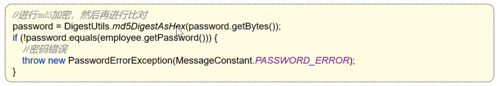
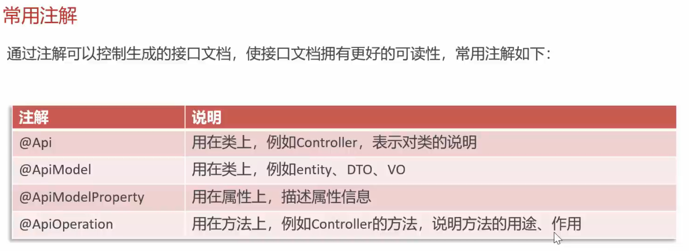
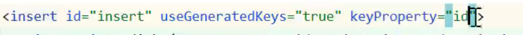
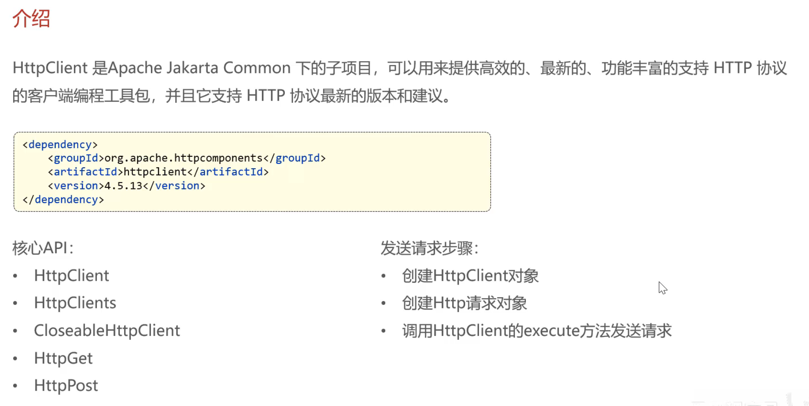
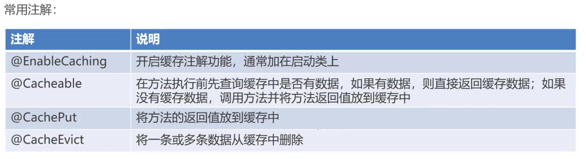
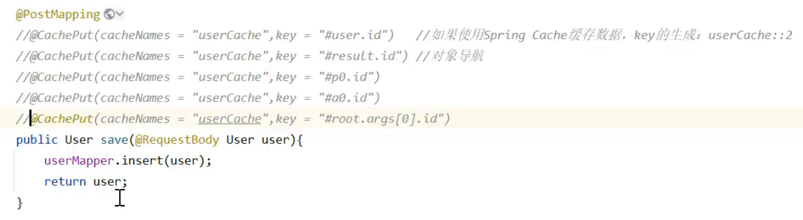
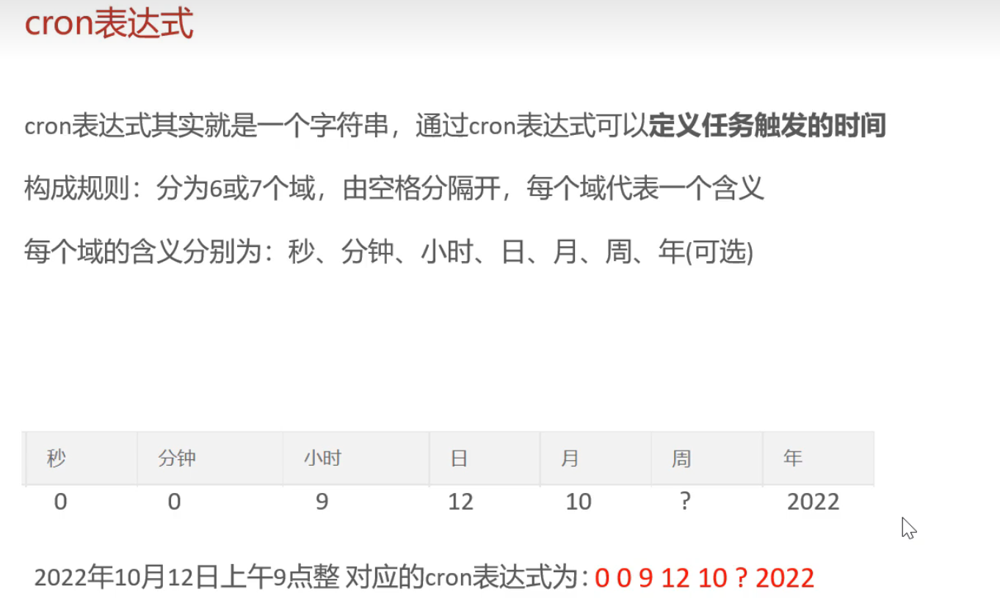
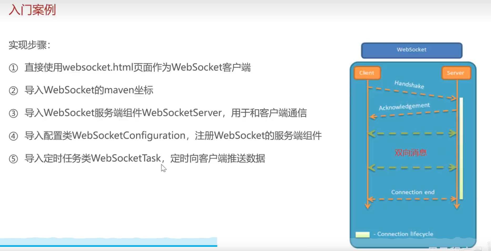

==使用git进行版本控制==

1. 创建本地仓库

   VCS->create git repository -> 当前idea目录 -> commit -> push


每一次请求的过程

​	浏览器发起请求, 过滤器->拦截器->controller


苍穹外卖没有使用 springsecurity, 而是自定义拦截器去控制的

==jwt使用的是这个依赖==JwtUtil

```xml
<dependency>
	<groupId>io.jsonwebtoken</groupId>
	<artifactId>jjwt</artifactId>
	<version>${jjwt}</version>
</dependency>
```


==@Slf4j 和 log.info("")==比普通日志好太多了没有打印太多东西[Lombok/slf4j介绍及使用方法_lombok.extern.slf4j.slf4j-CSDN博客](https://blog.csdn.net/qq_40435659/article/details/114370663)


## 登录功能(打断点跟踪)

1. EmployeeController -> login的方法(查询数据库的密码根据用户名) -> 生成token -> 封装响应数据vo -> 封装到result

2. 完善登录

   明文密码, 使用md5加密( md5是单向的, 只能从原文加密成密文, 密文不能算出原文)
   
   ==DigestUtils.md5DigestAsHex("123456".getBytes())==


@ConfigurationProperties(prefix="sky.jwt")

@ApiModel 和 @ApiModelProperty




@ExceptionHandler[Spring的@ExceptionHandler注解使用方法-CSDN博客](https://blog.csdn.net/lkforce/article/details/98494922)


接口文档-接口管理平台 [YApi Pro-高效、易用、功能强大的可视化接口管理平台](https://yapi.pro/group/306676)


## Swagger

Knife4j是java mvc框架继承swagger的增强封装

Knife4j使用步骤

1. 导入依赖

   ```xml
    <dependency>
    	<groupId>com.github.xiaoymin</groupId>
    	<artifactId>knife4j-spring-boot-starter</artifactId>
    	<version>${knife4j}</version>
    </dependency>
   ```

2. 配置 (==在WebMvcConfiguration配置类中配置==)

   ```java
   /**
   * 通过knife4j生成接口文档
   * @return
   */
   @Bean
   public Docket docket() {
       ApiInfo apiInfo = new ApiInfoBuilder()
           .title("苍穹外卖项目接口文档")
           .version("2.0")
           .description("苍穹外卖项目接口文档")
           .build();
       Docket docket = new Docket(DocumentationType.SWAGGER_2)
           .apiInfo(apiInfo)
           .select()
           //指定生成接口需要扫描的包
           .apis(RequestHandlerSelectors.basePackage("com.sky.controller"))
           .paths(PathSelectors.any())
           .build();
       return docket;
   }
   ```

3. 设置静态资源映射， 否则接口文档页面无法访问

   ```java
   /**
   * 设置静态资源映射
   * @param registry
   */
   protected void addResourceHandlers(ResourceHandlerRegistry registry) {
           registry.addResourceHandler("/doc.html").addResourceLocations("classpath:/META-INF/resources/");
           registry.addResourceHandler("/webjars/**").addResourceLocations("classpath:/META-INF/resources/webjars/");
   }
   ```

Swagger常用注解




编写一个功能的基本流程: 需求分析和设计(参照产品原型)->代码开发->功能测试->代码完善


```
log.info("新增员工: {}", employeeDTO);//{}是占位符， 后面东西会打印到{}中
```


设置当前时间: ==`LocalDateTime.now()`==


- [ ] dto po 之间如何维护

- [ ] 设置日期创建人的注解， 打在mapper方法上有无作用？


令牌校验拦截接口文档的测试请求：全局参数设置


## PageHelper分页插件

使用步骤

1. ```
   //开始分页
   PageHelper.startPage(current, pageSize);
   ```

2. ```
   PageInfo<User> info = new PageInfo<User>(查询后的list)
   ```

[Springboot+Mybatis-plus并使用PageHelper插件时的冲突问题和分页不生效问题_jsqlparser3.2对应pagehelper哪个版本-CSDN博客](https://blog.csdn.net/weixin_46247788/article/details/117364612)


## 日期转换

- 加注解`@JsonFormat(pattern = "yyyy-MM-dd HH:mm:ss")`
- WebMvcConfiger配置中, ==拓展消息转换器==, 统一对日期进行处理


## 自动填充createTime createUser updateTime updateUser

1. 写注解, 标记是insert还是update
2. 写切入点
3. 写前置通知(JoinPoint->getSignature()->MethodSignature->getMethod()->getAnnotation()->调注解的方法->joinPoint.getArgs()->判断执行反射代码)


mvc的文件上下传, 参数名要和前端一致


读取boot配置文件


mybatis获取自增主键的值: 

mybatisplus就把生成的自增主键值, 重新赋值给到那个对象的id属性


>@Transactional可以作用于接口、接口方法、类以及类方法上。当作用于类上时，该类的所有 public 方法将都具有该类型的事务属性，同时，我们也可以在方法级别使用该标注来覆盖类级别的定义。因此可以在Service层和Controller层使用
>
>虽然 @Transactional 注解可以作用于接口、接口方法、类以及类方法上，但是 Spring 建议不要在接口或者接口方法上使用该注解，因为这只有在使用基于接口的代理时它才会生效。另外， @Transactional 注解应该只被应用到 public 方法上，这是由 Spring AOP 的本质决定的。如果你在 protected、private 或者默认可见性的方法上使用 @Transactional 注解，这将被忽略，也不会抛出任何异常。
>
>原文链接：https://blog.csdn.net/MinggeQingchun/article/details/119579941


分出两个页面来管理接口文档：groupName("用户端接口")


## HttpClient：java构造请求


微信小程序开发：

开发环境

步骤


## 后端微信登录


[解决报错InvalidDefinitionException Java 8 date/time type LocalDateTime not supported by default jsr310_com.fasterxml.jackson.databind.exc.invaliddefiniti-CSDN博客](https://blog.csdn.net/HO1_K/article/details/129675462)


## spring cache框架

1. 导入spring-cache

   ```xml
   <dependency>
       <groupId>org.springframework.boot</groupId>
       <artifactId>spring-boot-starter-cache</artifactId>
       <version>2.7.3</version>
   </dependency>
   ```

2. 常用注解

   `@CachePut(cacheNames="userCache", key="#user.id")`

   spring EL 可以·用于· @CachePut(cacheNames="userCache", key = "#user.id")// cacheNames +::+key 就是最终redis中的key(userCache::1) => 动态生成key

​    `@Cacheable(cacheNames="userCache", key="#id")`

​    开启后会先去通过生成的key去缓存中找, 生成了代理对象

​	找到了方法都不走, 直接返回缓存中的数据 

​	没找到,就会把方法执行后的返回值放入名为key的缓存中.

​    `@CacheEvict(cacheNames="userCache", key="#id")`

​    方法执行完后就会删除对应key的缓存数据

​	`@CacheEvict(cacheNames="userCache", allEntries=true)`删除userCache下的所有数据

[Spring缓存报错Cannot find cache named xxx 的解决方法-CSDN博客](https://blog.csdn.net/qq_42168543/article/details/110667683)


建议先阶段查询可以使用并行流, 添加, 修改删除, 不允许使用


微信支付


## Spring Task 和 cron表达式

定时自动执行某段java代码



cron有在线生成器！


WebSocket




mybatis返回map的list


前端项目需要不同的node版本，nvm工具帮助切换node版本

[使用 nvm管理 node.js（windows版本） - 知乎 (zhihu.com)](https://zhuanlan.zhihu.com/p/337663452)

WebSocket connection to 'ws://localhost/ws/e1xvf7zwe5g' failed:`你应该思考协议是否一样 http对应ws https对应wss`

[解决：VUE nginx 部署 SSL https访问 WebSocket 问题-CSDN博客](https://blog.csdn.net/weixin_39255905/article/details/127434626)


以下都是苍穹外卖前端课程部分！

